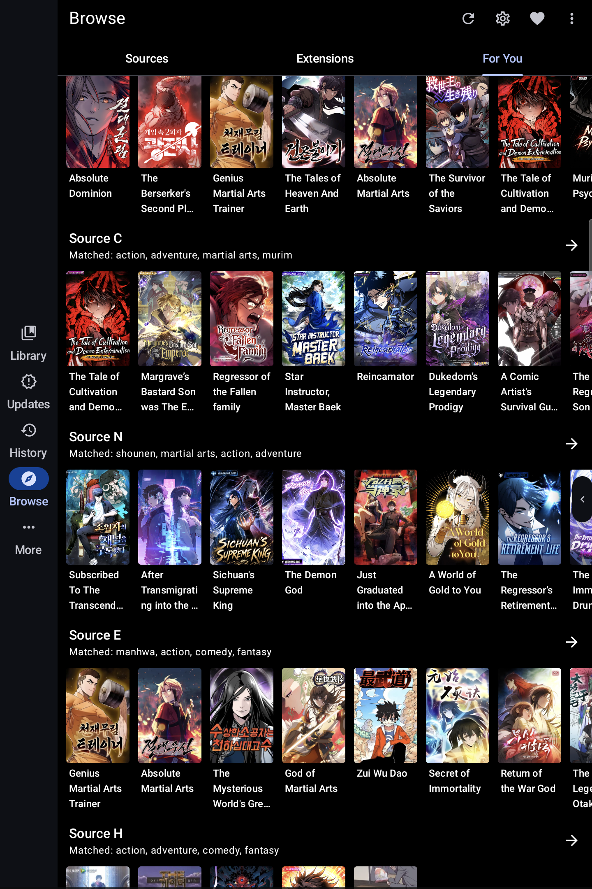
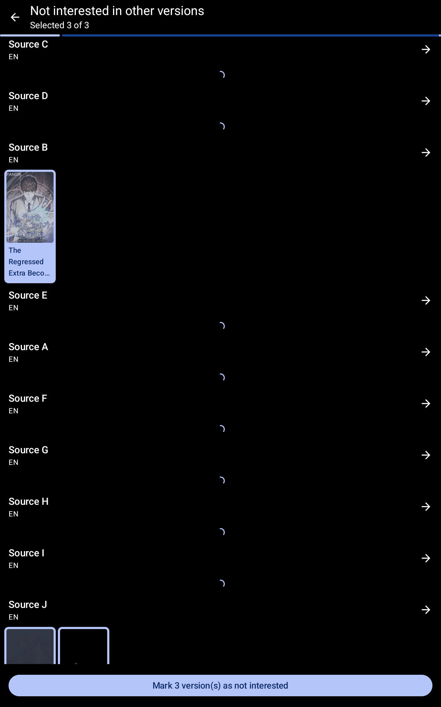

# Komikku KMK

**An independent, unofficial Komikku fork focused on personal discovery, source evaluation, and reader tools.**

Komikku KMK is based on [Komikku](https://github.com/komikku-app/komikku), TachiyomiSY, and Mihon. It is maintained independently and is not an official Komikku release. It retains Komikku's original visual identity while using a separate package name, launcher name, update source, issue tracker, and release channel.

## Download

Official KMK builds, when available, are published on this fork's [Releases page](https://github.com/FancyCorey/komikku-KMK/releases). Until then, follow the [build guide](docs/kmk/build-and-verify.md) to make your own. Avoid builds labeled Komikku KMK when they come from somewhere else.

Requires Android 8.0 or higher. The release application ID is `app.komikku.kmk`, so it can coexist with official Komikku.

## Features

### KMK additions

KMK keeps Komikku's library, browsing, reader, themes, tracking, backup, and extension features, then adds a larger set of tools for discovery and personal recommendations.

#### A more personal For You page

  

- `For You` builds personalized recommendation rows from the sources you choose while keeping useful results visible when one source fails.
- `Recent discovery` adds a configurable selection from each source's latest catalogue. These manga still have to pass your language, genre, tag, source, and minimum-chapter rules.
- `Recommendation rotation` moves repeatedly shown, untouched manga lower after a configurable number of days instead of removing them completely.
- `Recommendation settings` organize source order, languages, blocked genres and tags, minimum chapters, result limits, recent discovery, matching, cache, and diagnostics into clear sections.
- `Source Evaluation` checks whether installed sources can provide useful recommendations and shows short, privacy-aware explanations when they cannot.
- `Sources to try` suggests compatible sources that are not installed and opens Android's normal installation flow when you choose one.
- `Love`, `Like`, `Dislike`, and `Not Interested` work as equal manga preferences, each with its own collection and visible marker.
- `Action History` can undo supported local preference and management changes without overwriting something you changed later.
- `Find other versions` links matching manga across sources, while `Best Version` helps compare them before using Komikku's normal migration flow.
- `Reader tools` add an optional reading schedule and timer, a clearer completion-rating flow, linked-version rating, and `Jump to last read` for long chapter lists.
- `OCR Search Downloads` builds a local, searchable text index from downloaded pages without adding the recognized text to backup or sync.
- `Evaluation Mode` hides source and repository names in screenshots without changing saved data, requests, or actions.
- `Safer exports and extension actions` use Android's supported flows and can remove only the exact exported file created by the current action.
- `KMK backup support` includes ratings, recommendation settings, linked versions, source quality, and source evaluation data in Komikku's normal backup flow.

#### Settings and source tools

| Recommendation settings | Source Evaluation |
| --- | --- |
|  |  |
| Five clear sections keep the main settings page easy to scan. | Check source quality, review progress, and reassess sources after changes. |

| Management and diagnostics | Evaluation Mode in Browse |
| --- | --- |
|  |  |
| Maintenance tools and short status summaries stay together. | Source names can be hidden for screenshots without changing normal Browse navigation. |

#### Preferences and source discovery

| Sources to try | Not Interested across versions |
| --- | --- |
|  |  |
| Explore ranked source suggestions, sort the list, and choose which ones to install. | Apply Not Interested as a visible preference to the matching versions you select. |

  

Linked-version actions can find matching manga across sources and apply a preference to the versions you choose. Evaluation Mode keeps the source names private in this example.

The [KMK documentation](docs/kmk/README.md) includes step-by-step instructions, larger screenshots, feature explanations, privacy details, and implementation references.

## Documentation

| I want to... | Start here |
| --- | --- |
| Learn how to use KMK | [User guide](docs/kmk/user-guide.md) |
| Understand how a feature behaves and where it is implemented | [Feature explanations](docs/kmk/features/README.md) |
| View the current reviewed app screens | [Screenshots](docs/kmk/screenshots/README.md) |
| Understand how KMK fits into Komikku | [How KMK works](docs/kmk/how-kmk-works.md) |
| Find the code owner and supported states for a feature | [Feature map](docs/kmk/feature-map.md) |
| Build and verify a local APK | [Build and verification](docs/kmk/build-and-verify.md) |
| Review privacy or security behavior | [Privacy and data](docs/kmk/privacy-and-data.md) and [Security and integration](docs/kmk/security-and-integration.md) |

KMK is an ongoing fork rather than a replacement for upstream Komikku. The documentation separates KMK additions from inherited Komikku and TachiyomiSY behavior, and implementation links point to the current source files responsible for each addition.

## Inherited feature set

KMK retains the broad feature set provided by Komikku and TachiyomiSY. The lists below separate those inherited capabilities from the KMK additions shown above.

  
Additional Komikku features

- Source-provided suggestions and related manga on manga pages.
- Hidden categories for keeping selected library content out of ordinary views.
- Cover-based theme colors for manga details and the reader.
- Custom application themes and color palettes.
- Bulk library actions, source and language indicators, and faster browsing for large libraries.
- A multi-source Feed with saved searches, reordering, backup, restore, and sync support.
- Grouped update entries, manga-cover notifications, and a view of entries selected by smart update.
- Two-way tracker progress sync.
- Saved-search chips in source Browse.
- Panorama cover display.
- Bulk merging and migration range selection.
- Repository enable and disable controls, extension and source search, and quick adult-source filters.
- Update-error management and migration actions.
- Long-press library actions from supported lists.
- Configurable Read or Resume button placement.
- Progress banners for library sync, backup restore, and library updates.
- Automatic application update installation and configurable downloaded-storage refresh intervals.
- Additional themes and interface refinements inherited from the upstream application.

  
Features from Mihon / Tachiyomi

### Mihon and Tachiyomi features

* Online reading from a variety of sources
* Local reading of downloaded content
* A configurable reader with multiple viewers, reading directions and other settings.
* Tracker support: [MyAnimeList](https://myanimelist.net/), [AniList](https://anilist.co/), [Kitsu](https://kitsu.app/), [MangaUpdates](https://mangaupdates.com), [Shikimori](https://shikimori.one), [Bangumi](https://bgm.tv/)
* Categories to organize your library
* Light and dark themes
* Schedule updating your library for new chapters
* Create backups locally to read offline or to your desired cloud service
* Continue reading button in library

  
Features from Tachiyomi SY

### TachiyomiSY features
* Feed tab, where you can easily view the latest entries or saved search from multiple sources at same time.
* Automatic webtoon detection, allowing the reader to switch to webtoon mode automatically when viewing one
* Manga recommendations, uses MAL and Anilist, as well as Neko Similar Manga for Mangadex manga (Thanks to Az, She11Shocked, Carlos, and Goldbattle)
* Lewd filter, hide the lewd manga in your library when you want to
* Tracking filter, filter your tracked manga so you can see them or see non-tracked manga, made by She11Shocked
* Search tracking status in library, made by She11Shocked
* Custom categories for sources, liked the pinned sources, but you can make your own versions and put any sources in them
* Manga info edit
* Manga Cover view + share and save
* Dynamic Categories, view the library in multiple ways
* Smart background for reading modes like LTR or Vertical, changes the background based on the page color
* Force disable webtoon zoom
* Hentai features enable/disable, in advanced settings
* Quick clean titles
* Source migration, migrate all your manga from one source to another
* Saving searches
* Autoscroll
* Page preload customization
* Customize image cache size
* Batch import of custom sources and featured extensions
* Advanced source settings page, searching, enable/disable all
* Click tag for local search, long click tag for global search
* Merge multiple of the same manga from different sources
* Drag and drop library sorting
* Library search engine, includes exclude, quotes as absolute, and a bunch of other ways to search
* New E-Hentai/ExHentai features, such as language settings and watched list settings
* Enhanced views for internal and integrated sources
* Enhanced usability for internal and delegated sources

Custom sources:
* E-Hentai/ExHentai

Additional features for some extensions, features include custom description, opening in app, batch add to library, and a bunch of other things based on the source:
* 8Muses (EroMuse)
* Mangadex
* NHentai
* Puruin
* LANraragi

## Issues, Feature Requests and Contributing

Report KMK-specific problems through this repository's [issue tracker](https://github.com/FancyCorey/komikku-KMK/issues). Use upstream Komikku support only after confirming that the behavior is not specific to this fork.

Pull requests are welcome. For major changes, please open an issue first to discuss what you would like to change.

Issues

Before reporting a new fork issue, review the [KMK guide](docs/kmk/README.md), [release notes](docs/kmk/release-notes.md), and [open issues](https://github.com/FancyCorey/komikku-KMK/issues). Use upstream Komikku support only after confirming the behavior is not specific to KMK.

Bugs

* Include the complete version from **More → About**. If it is not the latest release, update first because the problem may already be fixed.
* Give the shortest reliable steps from a named starting screen, followed by the expected and actual results.
* Include the Android version and device model when the behavior may depend on the device.
* Add a screenshot, recording, or checked crash log when it makes the problem easier to understand.
* Remove credentials, source URLs, storage paths, device identifiers, notifications, and private library or reader content before uploading an attachment.
* Keep unrelated problems in separate reports so each one can be reproduced, discussed, and closed independently.

Use this fork's [issue forms](https://github.com/FancyCorey/komikku-KMK/issues/new/choose) to submit a bug.

Feature Requests

* Explain the current problem or limitation before describing the preferred result.
* Include examples, alternatives, or privacy-safe mockups when they clarify the request; a technical implementation is not required.
* Search open and closed requests first. React to an existing request and add useful context there instead of opening a duplicate.

Contributing

See [CONTRIBUTING.md](./CONTRIBUTING.md).

Code of Conduct

See [CODE_OF_CONDUCT.md](./CODE_OF_CONDUCT.md).

### Credits

Thank you to the Komikku, TachiyomiSY, Mihon, and KMK contributors whose work makes this fork possible.

### Disclaimer

The developer(s) of this application does not have any affiliation with the content providers available, and this application hosts zero content.

## License

    Copyright 2015 Javier Tomás

    Licensed under the Apache License, Version 2.0 (the "License");
    you may not use this file except in compliance with the License.
    You may obtain a copy of the License at

    http://www.apache.org/licenses/LICENSE-2.0

    Unless required by applicable law or agreed to in writing, software
    distributed under the License is distributed on an "AS IS" BASIS,
    WITHOUT WARRANTIES OR CONDITIONS OF ANY KIND, either express or implied.
    See the License for the specific language governing permissions and
    limitations under the License.
