

# Komikku KMK

**An independent, unofficial Komikku fork focused on personal discovery, source evaluation, and reader tools.**

Komikku KMK is based on [Komikku](https://github.com/komikku-app/komikku), TachiyomiSY, and Mihon. It is maintained independently and is not an official Komikku release. It retains Komikku's original visual identity while using a separate package name, launcher name, update source, issue tracker, and release channel.

## Download

Official KMK builds, when available, are published on this fork's [Releases page](https://github.com/FancyCorey/komikku-KMK/releases). Until then, follow the [build guide](docs/kmk/build-and-verify.md) to make your own. Avoid builds labeled Komikku KMK when they come from somewhere else.

Requires Android 8.0 or higher. The release application ID is `app.komikku.kmk`, so it can coexist with official Komikku.

## Features

### KMK additions

KMK keeps Komikku's library, browsing, reader, themes, tracking, backup, and extension features, then adds a larger set of tools for discovery and personal recommendations.

#### A more personal For You page

  

**Personalized discovery**

- `For You` builds personalized rows from eligible installed sources, preserves useful partial results when one source fails, and explains empty or filtered states without exposing raw source errors.
- `Top Picks` combines the strongest current matches into a dedicated view. Per-source rows remain available for deeper browsing.
- `Recent discovery` contributes a configurable number of candidates from each supported source's latest catalogue. They still pass the same language, genre, tag, source-quality, known-manga, rating, and minimum-chapter rules as personalized matches.
- `Recommendation rotation` moves repeatedly shown, untouched manga lower after a configurable exposure window instead of deleting them. Library, rated, and tracked manga are exempt.
- `Group recommendations` find related manga from a rated or linked group, load source rows progressively, bound concurrent work, and isolate a slow or failing source.
- Long-press selection on For You supports Love, Like, Dislike, Not Interested, Clear Rating, opening a selected manga, and continuing to version comparison when the action applies.
- `Recommendation bundles` can export Top Picks, an individual source row, or a rated collection and import a reviewed bundle through a validation screen, with source resolution and an explicit library-add step.

| Top Picks and preference actions | Related manga across sources |
| --- | --- |
| 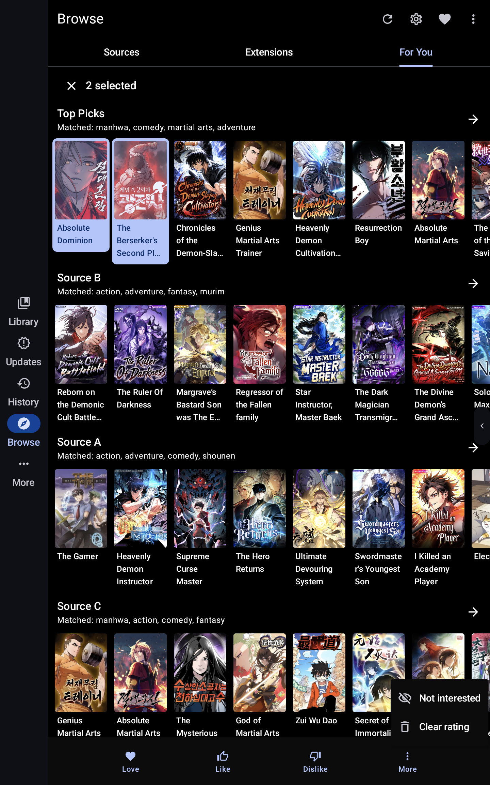 | 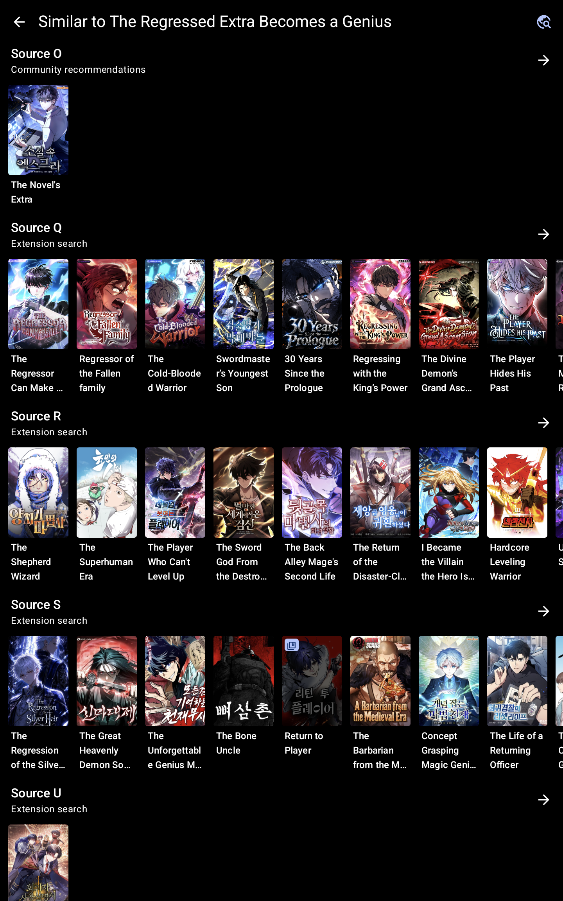 |
| Select one or more recommendations, then apply Love, Like, Dislike, Not Interested, or clear an existing preference. | Explore related manga from several sources while one incomplete source remains isolated from the useful results. |

  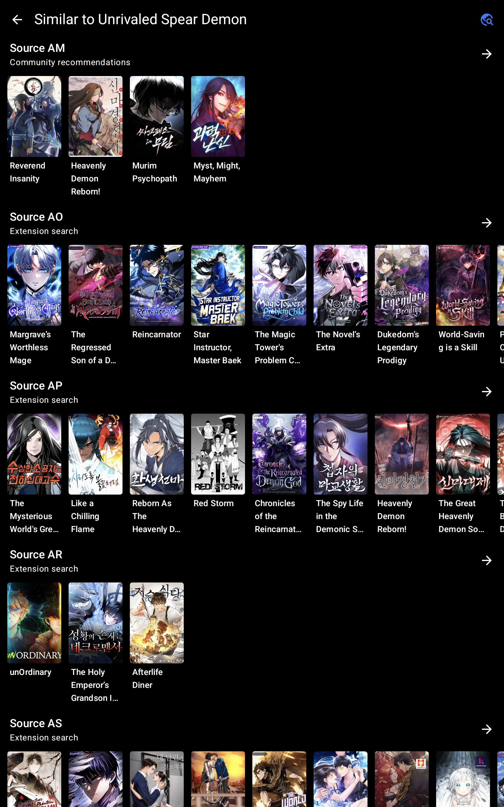

Confirmed multi-version groups can seed a separate recommendation search, combining community suggestions and extension search results while keeping each source lane independent.

  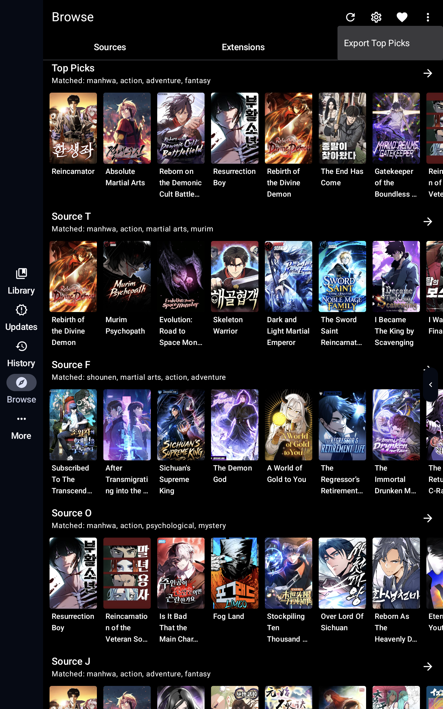

Top Picks, individual source rows, and rated collections can be shared as recommendation bundles. Import uses a separate review screen and adds manga to the library only after explicit confirmation.

**Taste, sources, and settings**

- `Recommendation settings` are split into For You sources, Taste and filters, Source Evaluation, Sources to try, and Management and diagnostics. Search and quick-access navigation reach individual controls without one oversized settings page.
- Taste controls cover languages, known and rated manga, preferred, disliked, and blocked tags, blocked genres, minimum chapters, result limits, recent discovery, matching behavior, and cache or history maintenance.
- Rating-derived tag suggestions require support from multiple rated manga before they are offered. Taste diagnostics explain which saved signals currently influence recommendations.
- Source priority lets readers enable, disable, reorder, boost, or lower sources. Separate source-quality marks can hide a poor or overly explicit catalogue without deleting its past evaluation history.
- `Source Evaluation` checks catalogue access, search compatibility, metadata coverage, confidence, and recommendation usefulness. It supports bounded batches, continuation, cancellation, detailed results, failure categories, and explicit reassessment when inputs become outdated.
- Source-quality history and diagnostics show aggregate observations and recovery actions without publishing sampled tags, raw responses, URLs, or exception text.
- `Sources to try` ranks compatible non-installed sources, supports search and sorting, explains limited evidence honestly, and opens Android's normal installation flow only after the reader chooses one.

**Preferences and versions**

- `Love`, `Like`, `Dislike`, and `Not Interested` are equal manga preference states, each with its own searchable collection, selected marker, bulk actions, and explicit clear or replacement behavior.
- `Action History` records supported local preference and management changes after success. Undo uses conflict checks so it cannot overwrite a newer choice; outside operations are labeled separately when no safe local inverse exists.
- Linked-version groups preserve separate source records while allowing the reader to add or remove members, choose a primary version, apply preferences to selected versions, and include valid group state in backup and restore.
- `Find other versions` searches across guarded sources and lets the reader confirm genuine matches before any link is saved.
- `Best Version` compares the current manga with confirmed alternatives, supports chapter selection, independent preview loading and retry, full-screen samples, keeping the current version, and a separate handoff to Komikku's migration confirmation.

**Reader and local-library tools**

- The active-reading timer supports preset or custom durations, warnings, pause and resume with reader lifecycle, and an optional current-chapter or one-extra-chapter allowance.
- The optional reading schedule supports recurring day and time windows, whole-day windows, editing and confirmed removal, device 12-hour or 24-hour formatting, and a reader shortcut to the same configuration.
- The final-chapter completion flow waits until the reader exits, then offers an unambiguous preference action and can continue to rating confirmed linked versions.
- `Jump to last read` moves a long chapter list to the resolved read position without opening a chapter or changing progress.
- `OCR Search Downloads` builds a cancellable, on-device text index from downloaded pages, ranks matching text, opens the corresponding reading context, and can clear selected index data without deleting downloaded pages. Recognized text is excluded from backup and sync.

**Privacy, portability, and maintenance**

- `Evaluation Mode` replaces supported source, extension, repository, and taste labels with neutral presentation text while leaving stored identifiers, requests, and actions unchanged.
- `Action History` distinguishes safe local undo from installs, migrations, downloads, and tracker writes that cross an outside boundary. Tracker restoration is offered only when the manga, track, login, and previous value can still be verified.
- Recommendation and extension exports use Android's document APIs and can remove only the exact document created by the current operation. Extension exports include package files, not ratings, history, or account data.
- `KMK backup support` extends Komikku's normal backup and restore flow with ratings, recommendation settings, linked groups and primary versions, source quality, and source evaluation state while reporting partial or malformed restores honestly.
- A grouped, searchable in-app `KMK What's New` history explains current and earlier feature changes without replacing Komikku's own release notes.
- Shared source-runtime and input-validation boundaries preserve cancellation, isolate ordinary extension failures, reject unsafe navigation, and keep raw URLs, local paths, private content, and exception objects out of ordinary diagnostics.

#### Settings and source tools

| Recommendation settings | Source Evaluation |
| --- | --- |
|  |  |
| Five clear sections keep the main settings page easy to scan. | Check source quality, review progress, and reassess sources after changes. |

| Management and diagnostics | Evaluation Mode in Browse |
| --- | --- |
|  |  |
| Maintenance tools and short status summaries stay together. | Source names can be hidden for screenshots without changing normal Browse navigation. |

  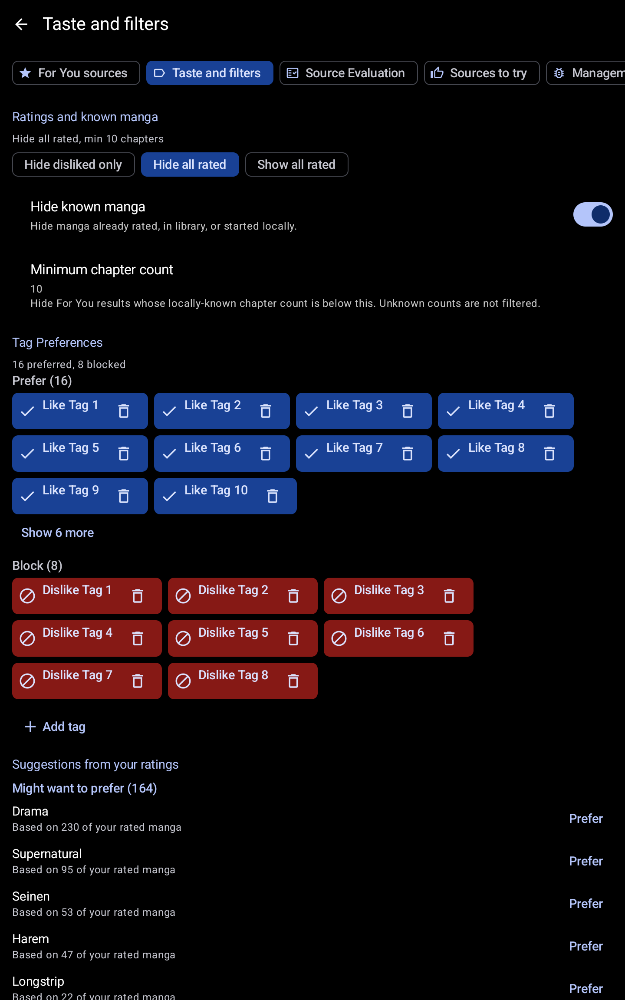

Taste and filters keeps recommendation rules visible and configurable, including known manga, minimum chapters, preferred tags, blocked tags, and suggestions learned from ratings.

  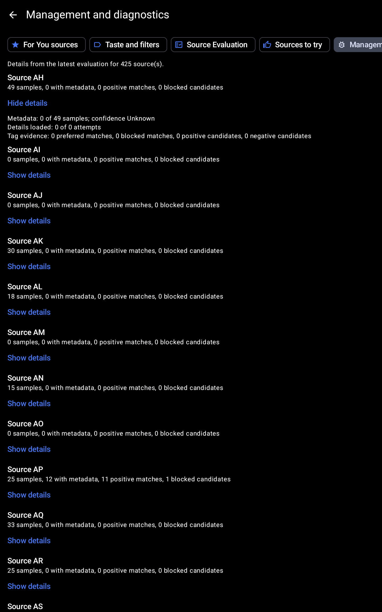

Source-quality diagnostics show how much evidence is available for each source and let the reader expand individual observations without exposing raw responses or source identities.

#### Action History

  

Supported local changes appear only after they succeed. Undo restores the earlier value when it still matches the recorded action; a newer conflicting change is left untouched.

#### Source discovery and linked versions

| Sources to try | Linked versions |
| --- | --- |
|  |  |
| Explore ranked source suggestions, sort the list, and choose which ones to install. | Review matching manga across sources before linking or applying an action. |

Love, Like, Dislike, and Not Interested are one preference system. The Top Picks selection example above shows all four choices in the same action surface instead of presenting one preference as though it represents the entire feature.

#### Best Version comparison

| Choose comparable chapters | Compare page previews |
| --- | --- |
|  |  |
| Select a useful chapter sample for each confirmed version. | Compare available previews before deciding whether to migrate. |

Best Version does not change the library while the reader is comparing options. Selecting another version continues through Komikku's existing migration flow, where the final change is confirmed separately.

#### Reader tools

| Reading schedule | Completion preference |
| --- | --- |
| 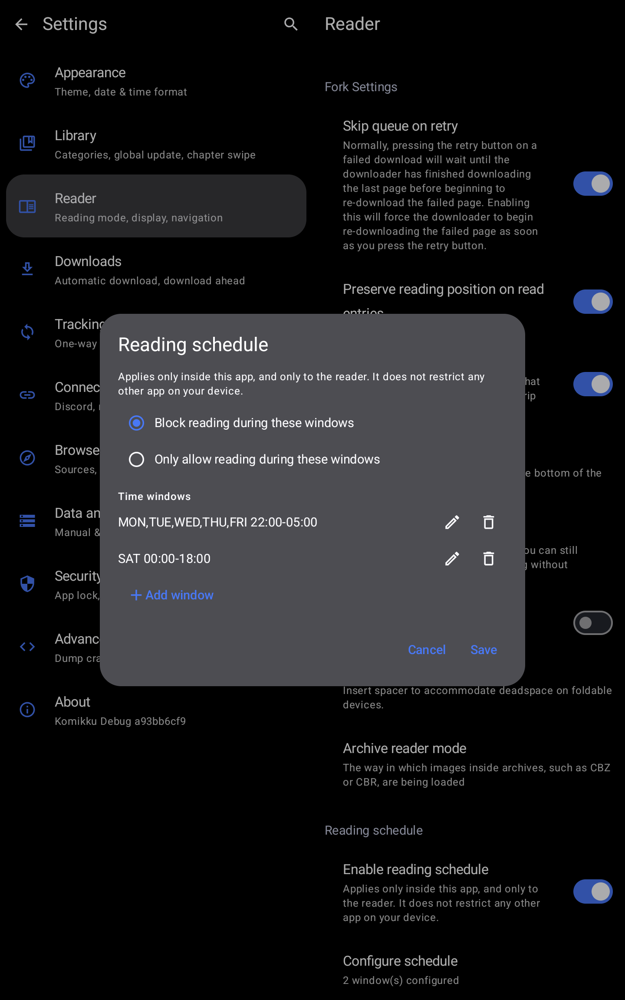 | 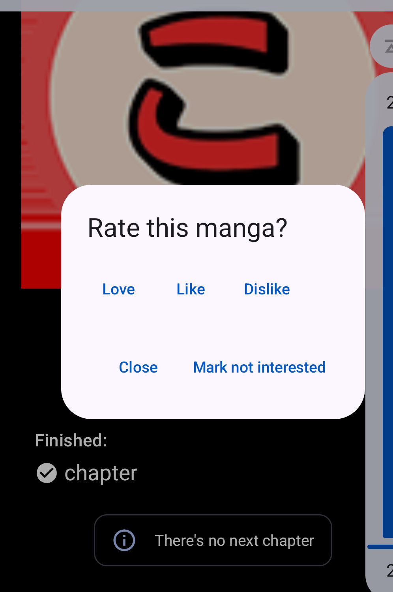 |
| Block reading or allow it only during recurring windows, with explicit add, edit, remove, cancel, and save controls. | Choose a preference after finishing the final chapter instead of leaving the reader without a clear result. |

  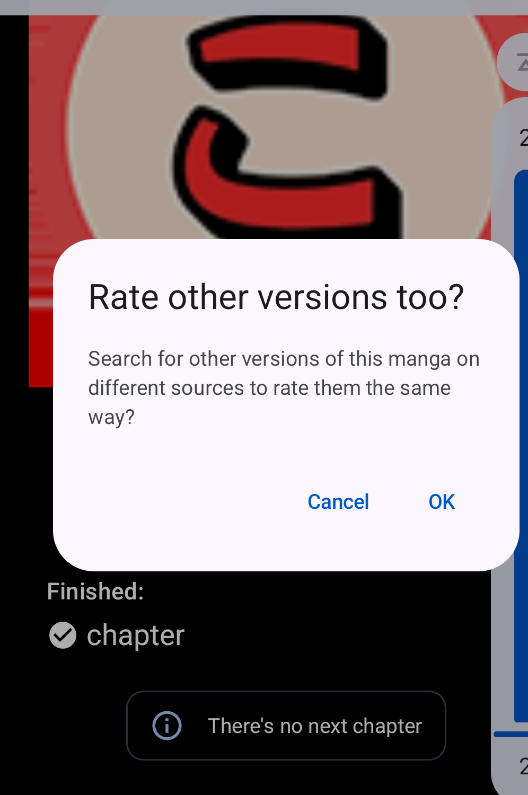

After a completion preference is chosen, the reader can continue to confirmed matching versions or close the flow without changing them.

#### Search downloaded pages with OCR

  

OCR Search Downloads keeps its recognized text on the device. The screen reports indexing progress and storage use, supports bounded or full indexing, and separates ordinary indexing from forced re-indexing and cleanup.

#### Extension export

  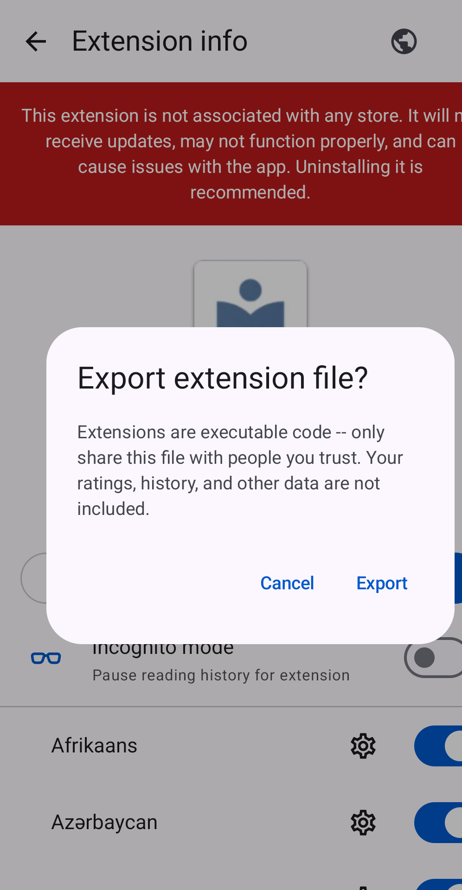

Extension export uses an explicit confirmation and explains that the package is executable code while ratings, history, and other app data are not included.

#### Backup and restore

  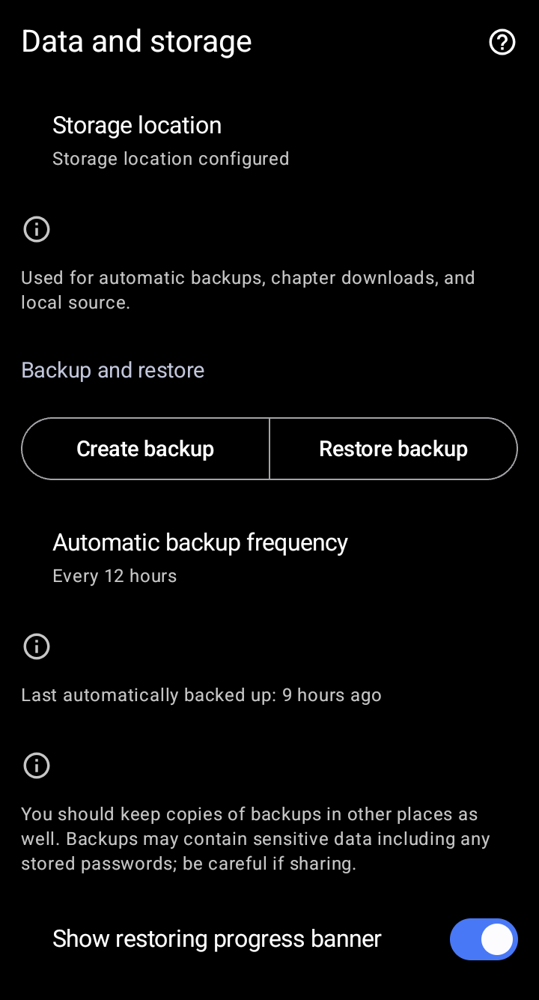

KMK uses Komikku's normal backup workflow and adds its recommendation, preference, linked-version, source-quality, and evaluation state. The destination summary stays generic, while a separate warning reminds readers that backups can contain sensitive data.

#### KMK What's New

  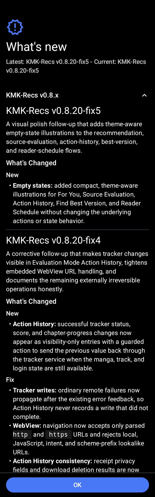

The in-app history groups KMK changes by release and separates new behavior from fixes. It complements Komikku's own release notes instead of replacing them.

The [KMK documentation](docs/kmk/README.md) includes step-by-step instructions, a visual feature tour, detailed feature guides, privacy information, diagrams, and implementation references.

## Documentation

| I want to... | Start here |
| --- | --- |
| Learn how to use KMK | [User guide](docs/kmk/user-guide.md) |
| Understand how a feature behaves and where it is implemented | [Feature guides](docs/kmk/feature-guides/README.md) |
| Tour the current reviewed app screens | [Visual feature guide](docs/kmk/visual-guide/README.md) |
| Understand how KMK fits into Komikku | [How KMK works](docs/kmk/how-kmk-works.md) |
| Find the code owner and supported states for a feature | [Feature and code map](docs/kmk/feature-and-code-map.md) |
| Build and verify a local APK | [Build and verification](docs/kmk/build-and-verify.md) |
| Review privacy or security behavior | [Privacy and data](docs/kmk/privacy-and-data.md) and [Security and integration](docs/kmk/security-and-integration.md) |

KMK is an ongoing fork rather than a replacement for upstream Komikku. The documentation separates KMK additions from inherited Komikku and TachiyomiSY behavior, and implementation links point to the current source files responsible for each addition.

## Inherited feature set

KMK retains the broad feature set provided by Komikku and TachiyomiSY. The lists below separate those inherited capabilities from the KMK additions shown above.

  
Additional Komikku features

- Source-provided suggestions and related manga on manga pages.
- Hidden categories for keeping selected library content out of ordinary views.
- Cover-based theme colors for manga details and the reader.
- Custom application themes and color palettes.
- Bulk library actions, source and language indicators, and faster browsing for large libraries.
- A multi-source Feed with saved searches, reordering, backup, restore, and sync support.
- Grouped update entries, manga-cover notifications, and a view of entries selected by smart update.
- Two-way tracker progress sync.
- Saved-search chips in source Browse.
- Panorama cover display.
- Bulk merging and migration range selection.
- Repository enable and disable controls, extension and source search, and quick adult-source filters.
- Update-error management and migration actions.
- Long-press library actions from supported lists.
- Configurable Read or Resume button placement.
- Progress banners for library sync, backup restore, and library updates.
- Automatic application update installation and configurable downloaded-storage refresh intervals.
- Additional themes and interface refinements inherited from the upstream application.

  
Features from Mihon / Tachiyomi

### Mihon and Tachiyomi features

* Online reading from a variety of sources
* Local reading of downloaded content
* A configurable reader with multiple viewers, reading directions and other settings.
* Tracker support: [MyAnimeList](https://myanimelist.net/), [AniList](https://anilist.co/), [Kitsu](https://kitsu.app/), [MangaUpdates](https://mangaupdates.com), [Shikimori](https://shikimori.one), [Bangumi](https://bgm.tv/)
* Categories to organize your library
* Light and dark themes
* Schedule updating your library for new chapters
* Create backups locally to read offline or to your desired cloud service
* Continue reading button in library

  
Features from Tachiyomi SY

### TachiyomiSY features
* Feed tab, where you can easily view the latest entries or saved search from multiple sources at same time.
* Automatic webtoon detection, allowing the reader to switch to webtoon mode automatically when viewing one
* Manga recommendations, uses MAL and Anilist, as well as Neko Similar Manga for Mangadex manga (Thanks to Az, She11Shocked, Carlos, and Goldbattle)
* Lewd filter, hide the lewd manga in your library when you want to
* Tracking filter, filter your tracked manga so you can see them or see non-tracked manga, made by She11Shocked
* Search tracking status in library, made by She11Shocked
* Custom categories for sources, liked the pinned sources, but you can make your own versions and put any sources in them
* Manga info edit
* Manga Cover view + share and save
* Dynamic Categories, view the library in multiple ways
* Smart background for reading modes like LTR or Vertical, changes the background based on the page color
* Force disable webtoon zoom
* Hentai features enable/disable, in advanced settings
* Quick clean titles
* Source migration, migrate all your manga from one source to another
* Saving searches
* Autoscroll
* Page preload customization
* Customize image cache size
* Batch import of custom sources and featured extensions
* Advanced source settings page, searching, enable/disable all
* Click tag for local search, long click tag for global search
* Merge multiple of the same manga from different sources
* Drag and drop library sorting
* Library search engine, includes exclude, quotes as absolute, and a bunch of other ways to search
* New E-Hentai/ExHentai features, such as language settings and watched list settings
* Enhanced views for internal and integrated sources
* Enhanced usability for internal and delegated sources

Custom sources:
* E-Hentai/ExHentai

Additional features for some extensions, features include custom description, opening in app, batch add to library, and a bunch of other things based on the source:
* 8Muses (EroMuse)
* Mangadex
* NHentai
* Puruin
* LANraragi

## Issues, Feature Requests and Contributing

Report KMK-specific problems through this repository's [issue tracker](https://github.com/FancyCorey/komikku-KMK/issues). Use upstream Komikku support only after confirming that the behavior is not specific to this fork.

Pull requests are welcome. For major changes, please open an issue first to discuss what you would like to change.

Issues

Before reporting a new fork issue, review the [KMK guide](docs/kmk/README.md), [release notes](docs/kmk/release-notes.md), and [open issues](https://github.com/FancyCorey/komikku-KMK/issues). Use upstream Komikku support only after confirming the behavior is not specific to KMK.

Bugs

* Include the complete version from **More → About**. If it is not the latest release, update first because the problem may already be fixed.
* Give the shortest reliable steps from a named starting screen, followed by the expected and actual results.
* Include the Android version and device model when the behavior may depend on the device.
* Add a screenshot, recording, or checked crash log when it makes the problem easier to understand.
* Remove credentials, source URLs, storage paths, device identifiers, notifications, and private library or reader content before uploading an attachment.
* Keep unrelated problems in separate reports so each one can be reproduced, discussed, and closed independently.

Use this fork's [issue forms](https://github.com/FancyCorey/komikku-KMK/issues/new/choose) to submit a bug.

Feature Requests

* Explain the current problem or limitation before describing the preferred result.
* Include examples, alternatives, or privacy-safe mockups when they clarify the request; a technical implementation is not required.
* Search open and closed requests first. React to an existing request and add useful context there instead of opening a duplicate.

Contributing

See [CONTRIBUTING.md](./CONTRIBUTING.md).

Code of Conduct

See [CODE_OF_CONDUCT.md](./CODE_OF_CONDUCT.md).

### Credits

Thank you to the Komikku, TachiyomiSY, Mihon, and KMK contributors whose work makes this fork possible.

### Disclaimer

The developer(s) of this application does not have any affiliation with the content providers available, and this application hosts zero content.

## License

    Copyright 2015 Javier Tomás

    Licensed under the Apache License, Version 2.0 (the "License");
    you may not use this file except in compliance with the License.
    You may obtain a copy of the License at

    http://www.apache.org/licenses/LICENSE-2.0

    Unless required by applicable law or agreed to in writing, software
    distributed under the License is distributed on an "AS IS" BASIS,
    WITHOUT WARRANTIES OR CONDITIONS OF ANY KIND, either express or implied.
    See the License for the specific language governing permissions and
    limitations under the License.
