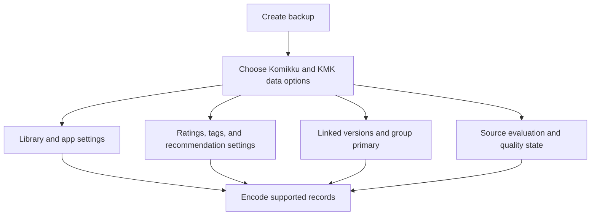
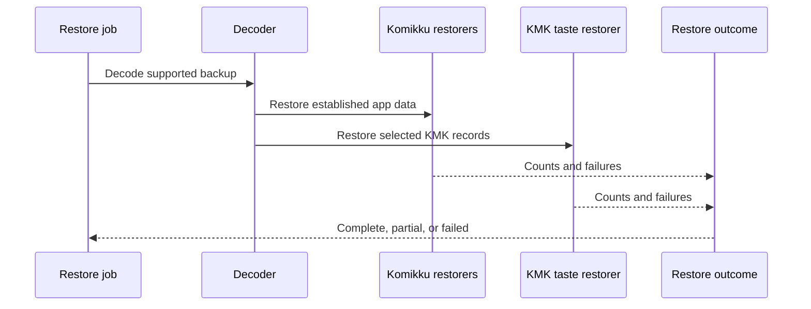
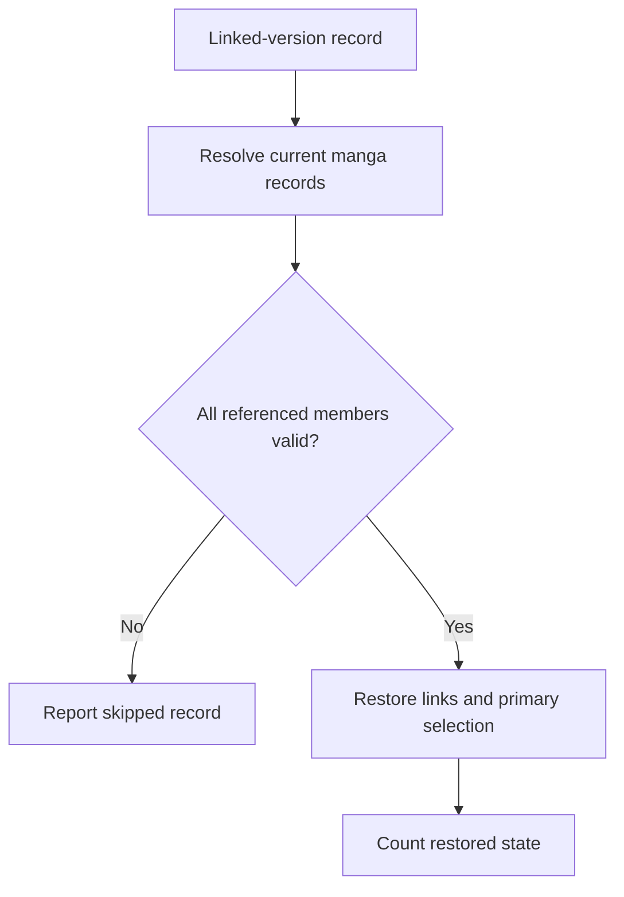
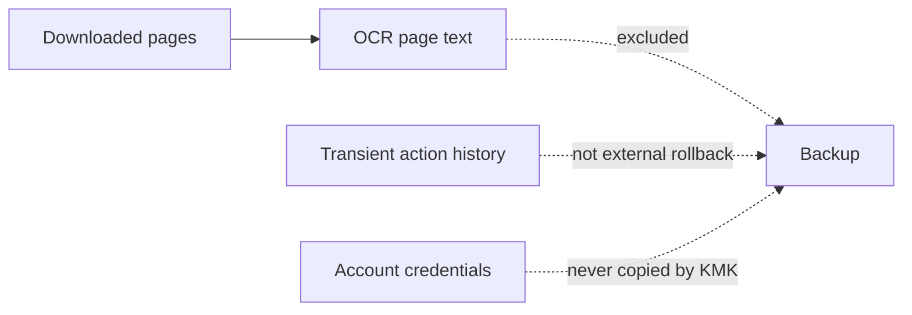

# Backup and portability diagrams

## Backup selection

KMK state is included through explicit backup options and established backup encoding, not a second independent archive format.

## Restore ownership

Core and KMK restorers contribute to one truthful result, so a partial restore cannot be presented as complete.

## Conflict-safe group restoration

Linked-version state is restored only after current records resolve consistently. Invalid references are skipped and reported.

## Deliberate exclusions

Regenerable or externally owned data is deliberately outside KMK backup ownership.
