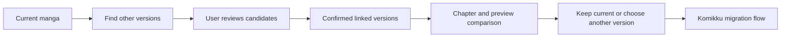
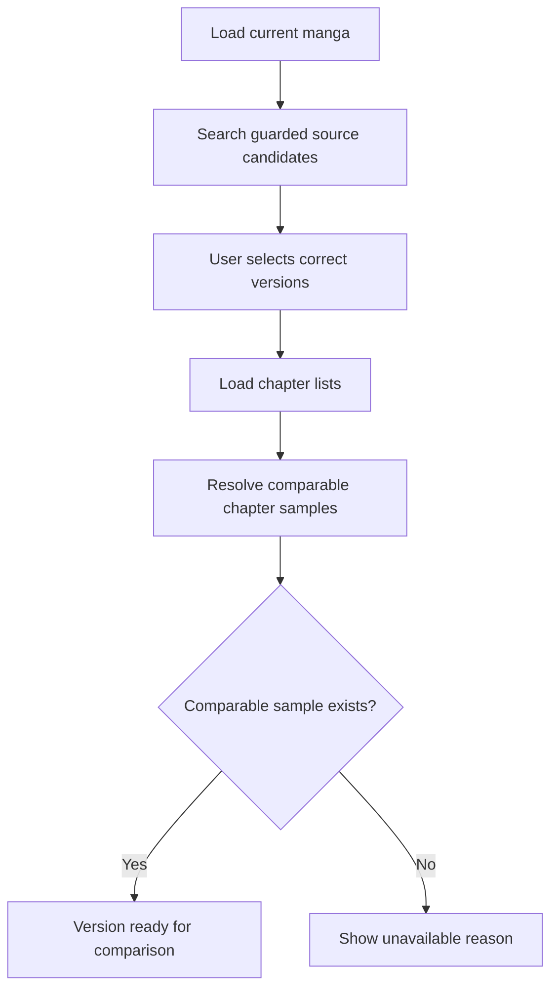
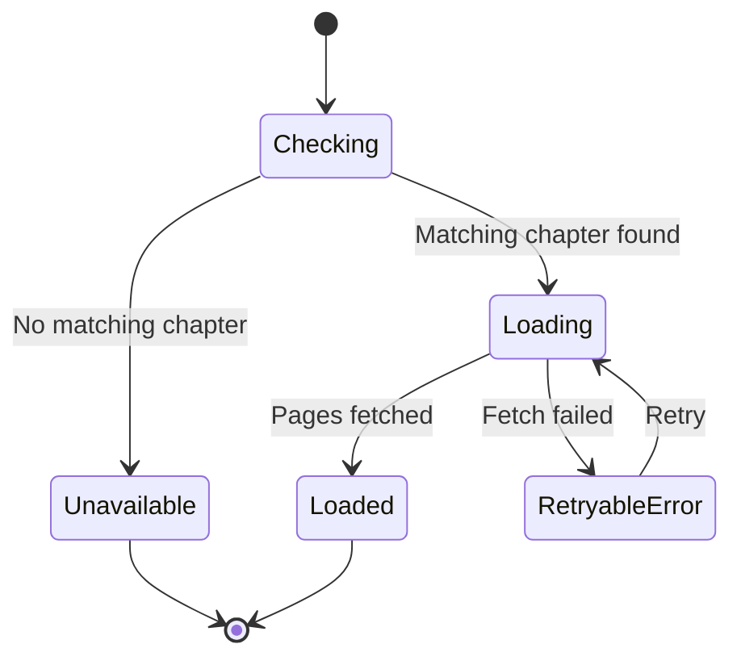
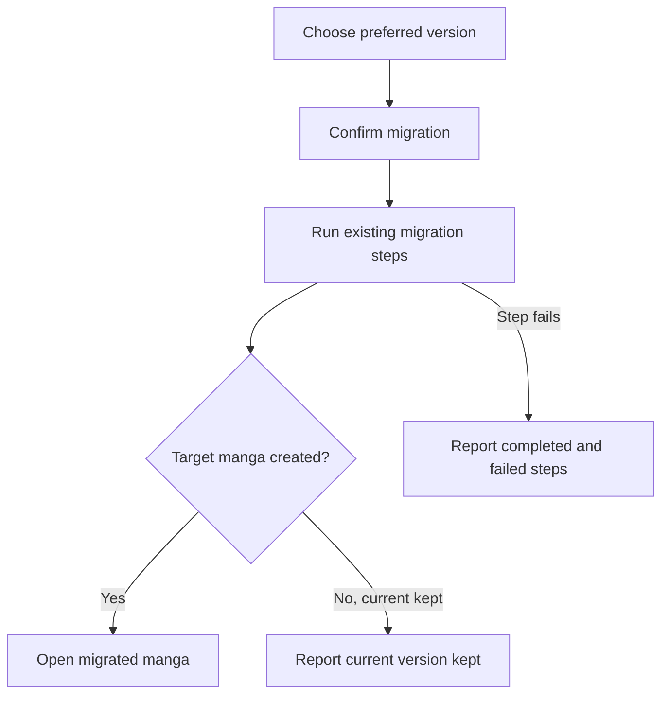

# Find other versions and Best Version diagrams

These diagrams follow a manga from cross-source matching through comparison and the existing Komikku migration flow.

## Matching and comparison overview

The user confirms matches before they become linked versions.

## Prepare comparable versions

A missing chapter or preview is displayed as unavailable; it is not treated as a failed migration.

## Preview state

Each linked version tracks its own preview. If one preview fails, the other comparisons remain visible.

## Migration result

The result clearly separates a successful migration, a decision to keep the current version, and a failure. It does not promise to undo changes that already finished outside this step.
