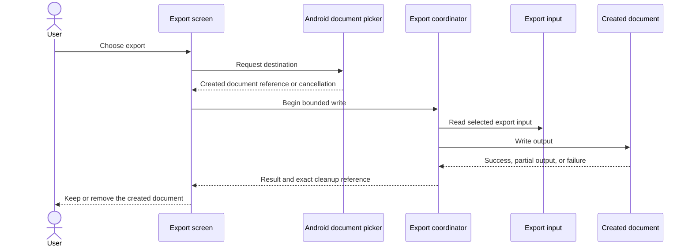
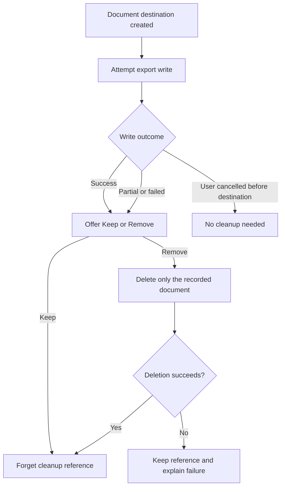
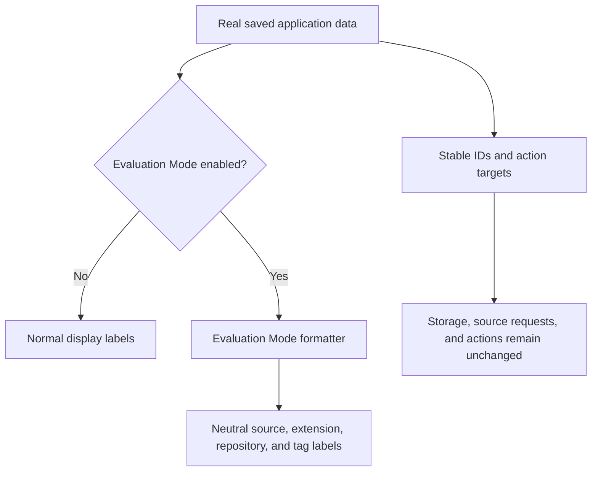
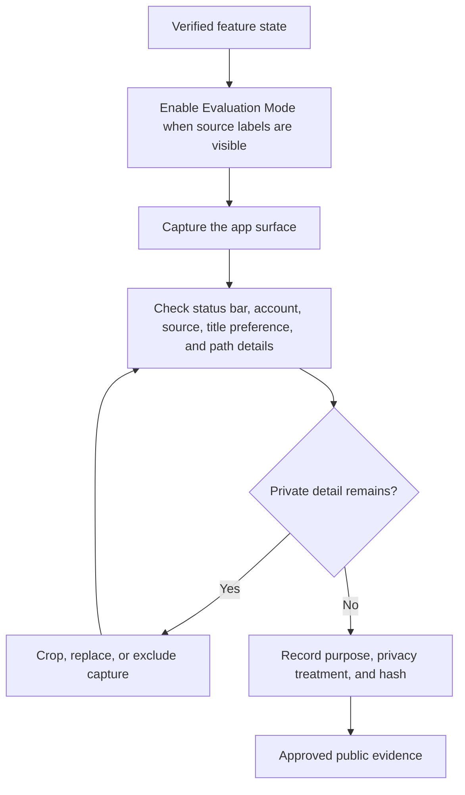

# Export, Evaluation Mode, and evidence diagrams

These diagrams explain safe document creation, exact-artifact cleanup, anonymized presentation, and the public evidence boundary.

## Export sequence

Android creates the destination before the app writes to it. The app therefore keeps an exact reference for cleanup after failed or partial writes.

## Exact-artifact cleanup

Cleanup never searches a folder or deletes unrelated files.

## Evaluation Mode boundary

Evaluation Mode changes presentation only. It is a screenshot aid, not a separate data mode.

## Evidence review

The public evidence set includes only images whose visible content matches the documented privacy treatment.
