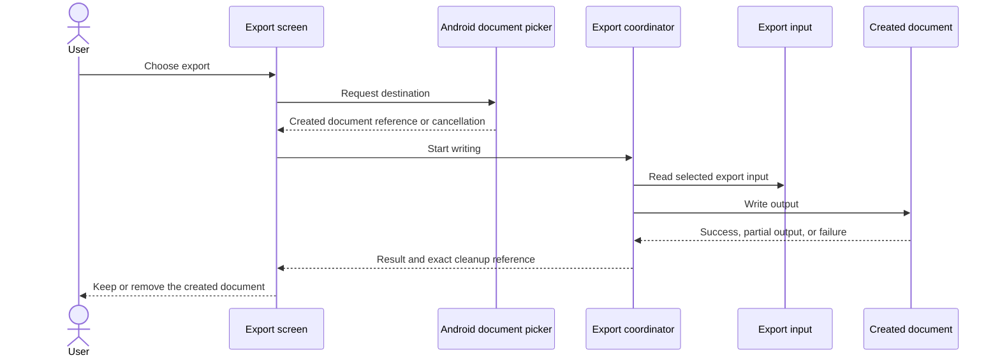
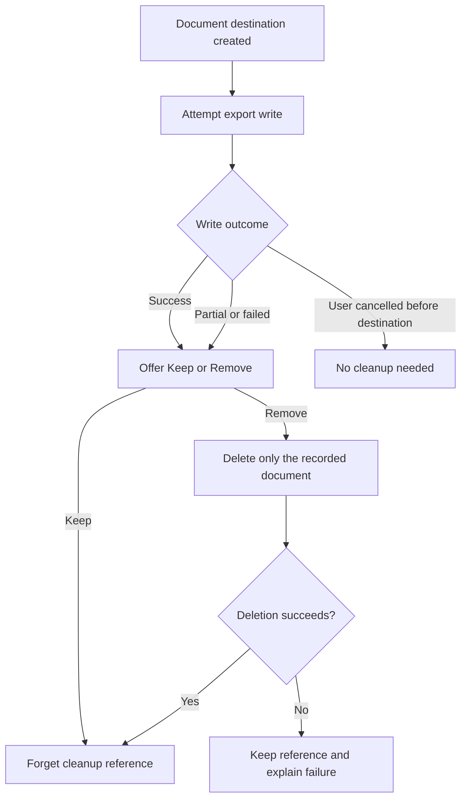
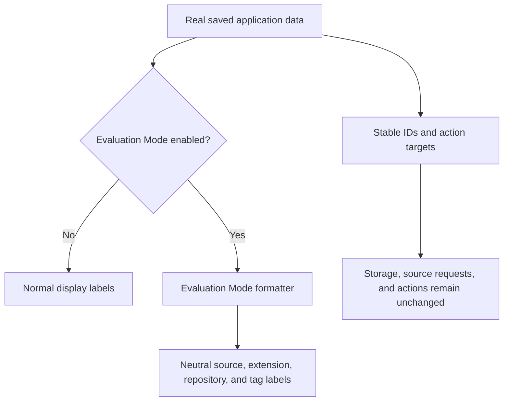
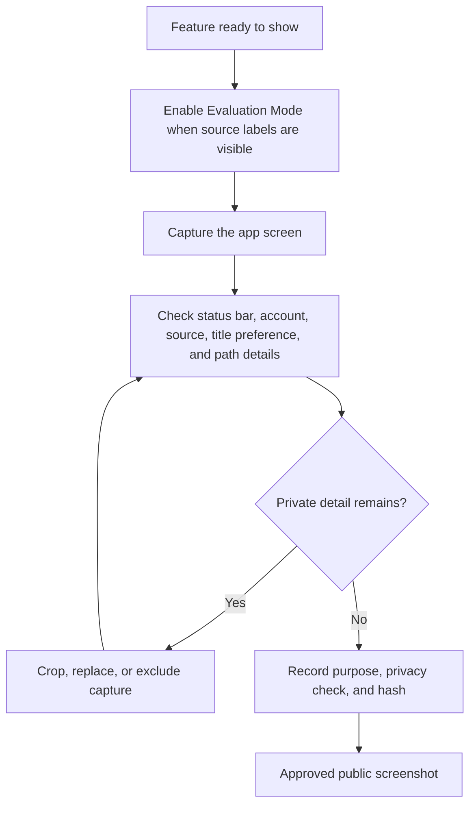

# Export, Evaluation Mode, and screenshot diagrams

These diagrams explain how the app creates and cleans up exported files, hides source names in Evaluation Mode, and decides which screenshots are safe to publish.

## Export sequence

Android creates the destination before the app writes to it. The app therefore keeps an exact reference for cleanup after failed or partial writes.

## Clean up the created file

Cleanup never searches a folder or deletes unrelated files.

## What Evaluation Mode changes

Evaluation Mode changes visible labels only. It helps with screenshots but does not create a separate set of app data.

## Review a screenshot

Only screenshots that pass the documented privacy check are included in the public guide.
