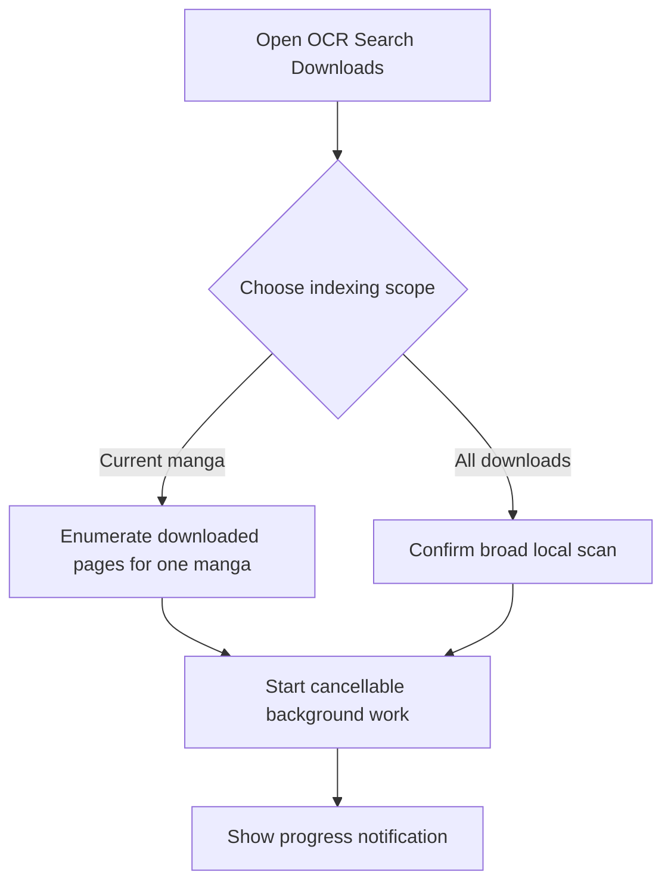
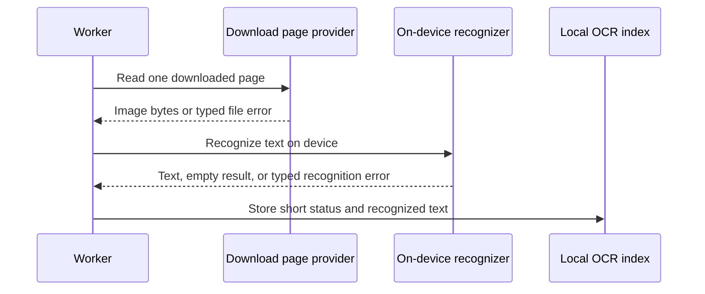
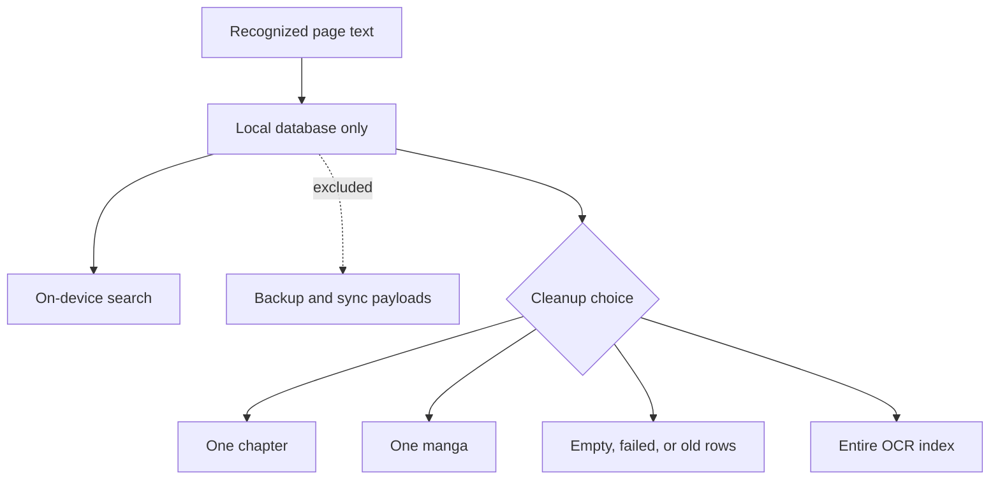

# OCR search diagrams

## Entry and indexing

The broad scan requires confirmation because it can use significant time, storage, CPU, and battery. Both scopes use the same cancellable worker path.

## Page processing

Each page receives a success, empty, or clear failure status. Diagnostics do not include raw error messages or page identities.

## Search and navigation

Search gives stronger word matches a higher position and keeps enough page information to open the correct place in the reader.

## Privacy and cleanup

The index is local and regenerable. Cleanup changes only index rows and does not delete the downloaded page files.
