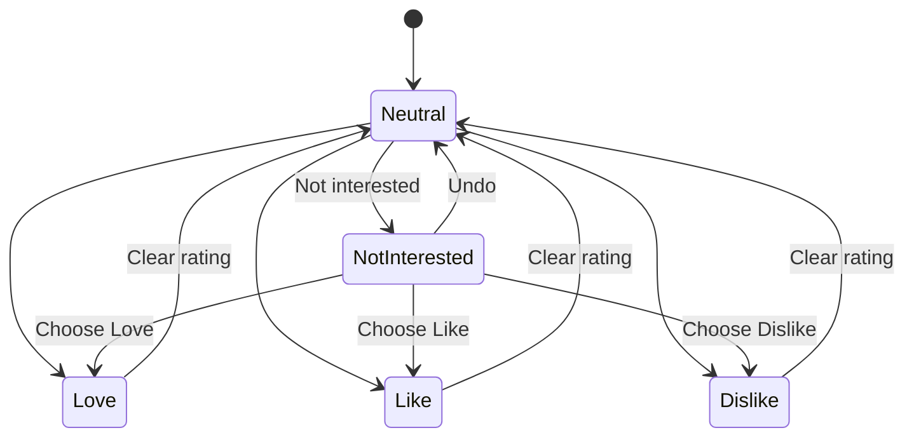
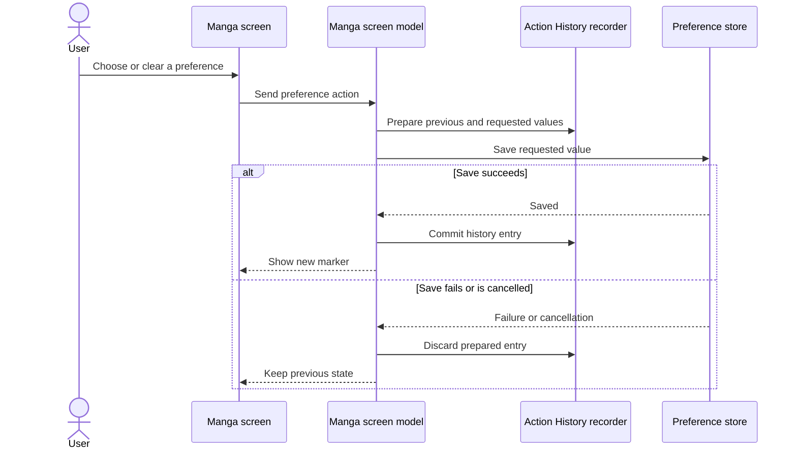
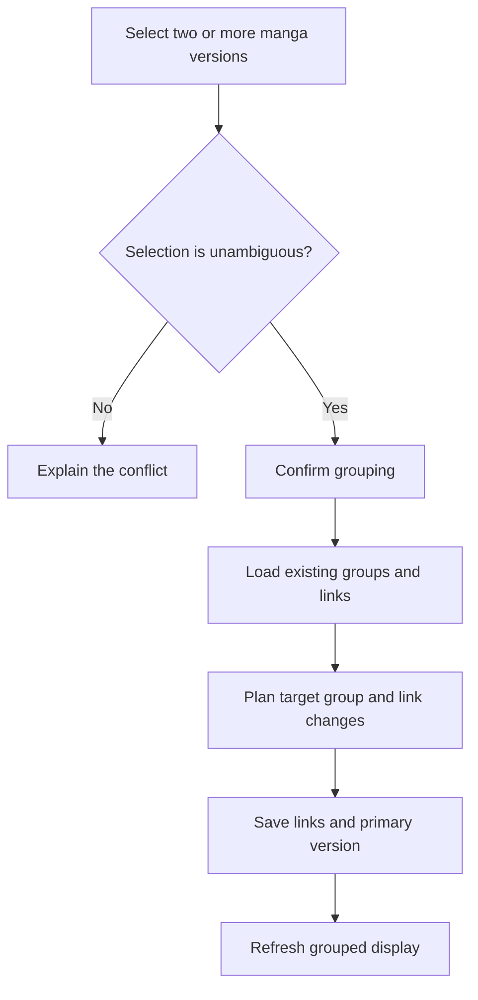
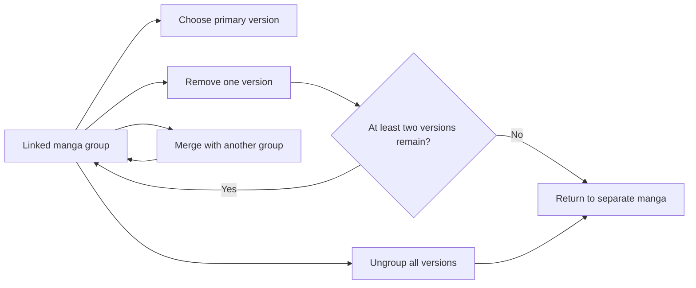
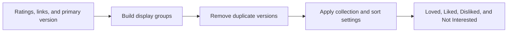

# Ratings and manga-group diagrams

These diagrams cover Love, Like, Dislike, Not Interested, linked versions, group maintenance, and reversible preference changes.

## Preference states

Not Interested is saved in the same way as Love, Like, and Dislike. Replacing it with another preference is recorded as one change.

## Reversible preference write

History is committed only after storage succeeds. Cancellation does not become a successful action.

## Create or merge a group

The app asks for confirmation before combining separate versions or existing groups.

## Maintain a group

Removing a version does not silently leave an invalid one-item group.

## Grouped display

Collections come from the saved preferences and linked versions, so they stay consistent across screens.
