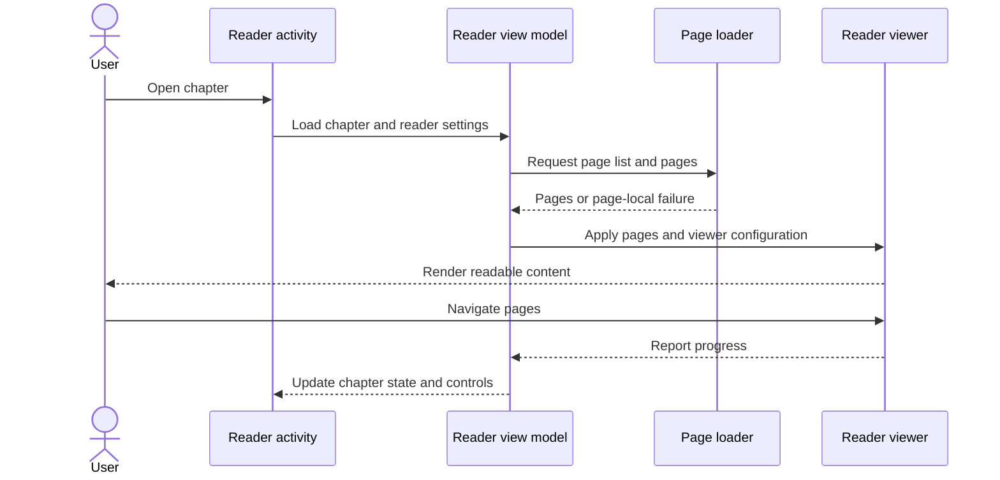
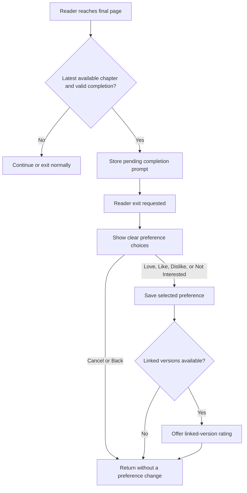
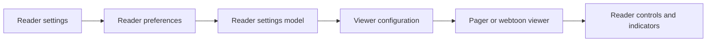
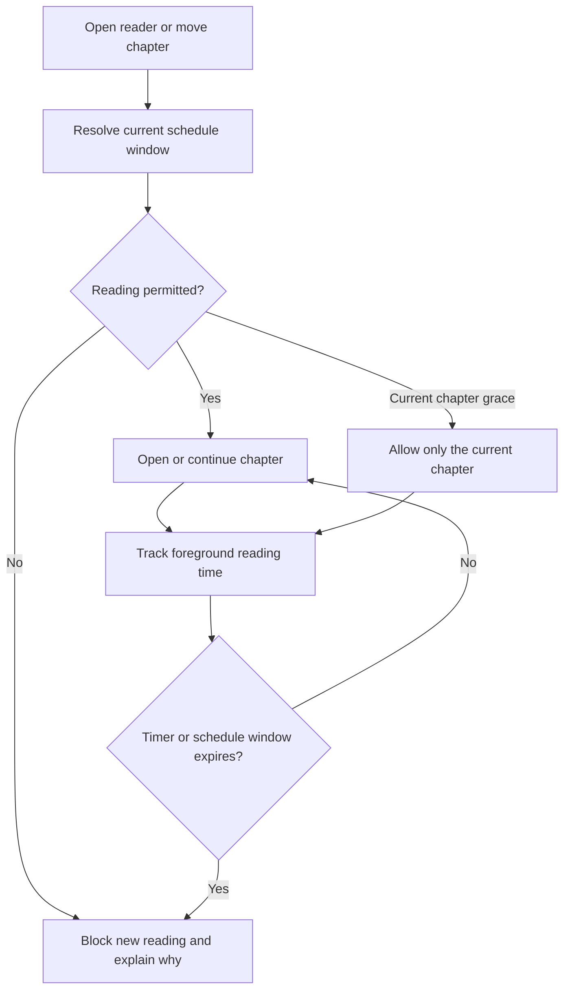
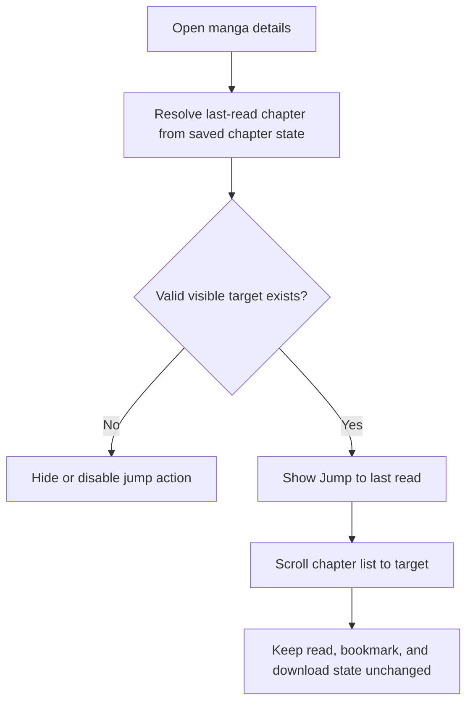

# Reader-control diagrams

These diagrams cover chapter loading, completion preferences, the optional schedule and timer, and Jump to last read.

## Chapter reading sequence

Page failures remain local to the affected load while reader progress continues through the existing Komikku ownership path.

## Completion preference

The prompt appears after reader exit, not over the final page. Cancel and confirmation remain separate actions.

## Reader settings flow

Optional KMK controls extend the existing settings and viewer configuration rather than replacing them.

## Timer and schedule enforcement

Alternate chapter navigation cannot bypass a restriction. The schedule remains local and off by default.

## Jump to last read

Jump to last read changes only the list position. It does not open a chapter or modify reading history.
