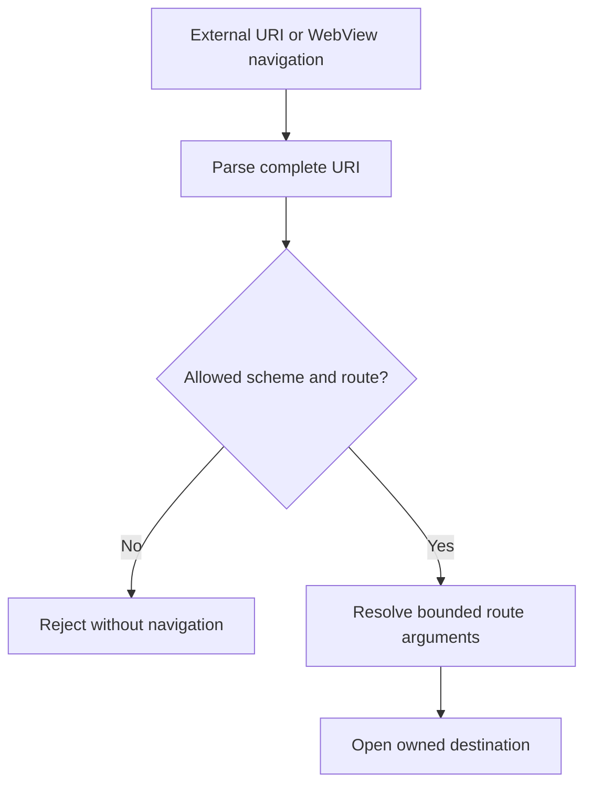
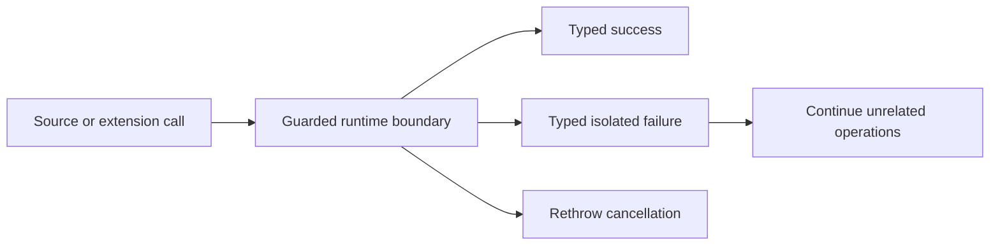
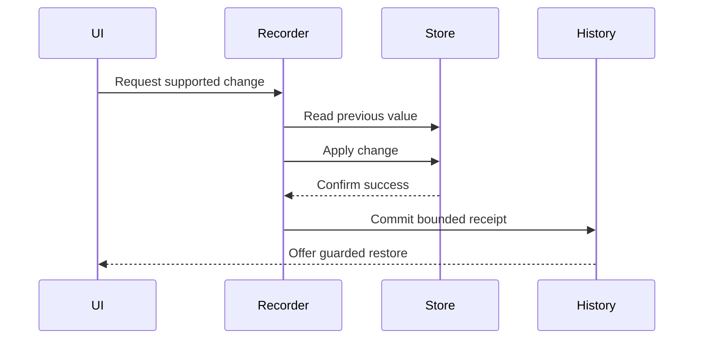
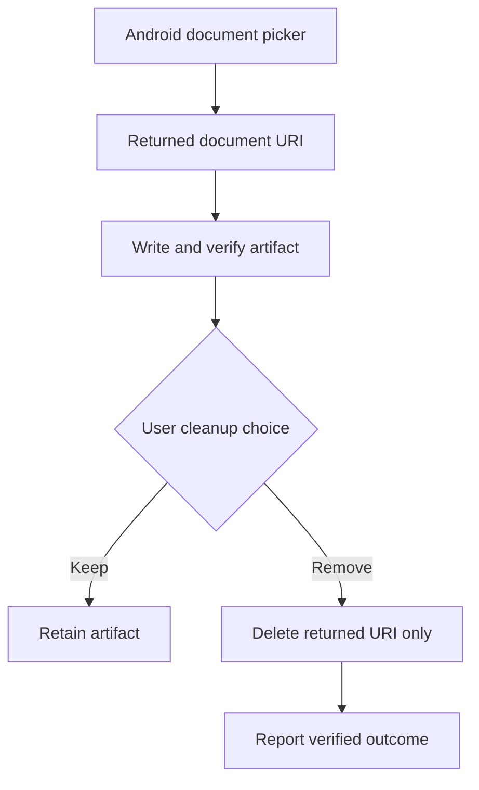

# Security and integration diagrams

## Navigation validation

Malformed values and scheme-prefix lookalikes do not reach application routes.

## Failure isolation

Cancellation keeps its control-flow meaning, while ordinary failures remain local to the operation that produced them.

## Reversible local mutation

A receipt is never committed for a failed write, and restoration refuses to overwrite a newer conflicting value.

## Scoped document cleanup

Cleanup operates on the exact artifact created by the current operation and never performs a broad folder sweep.
