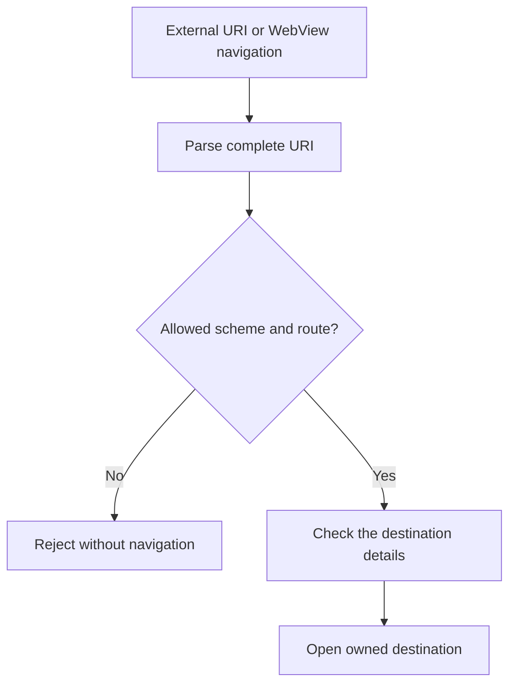
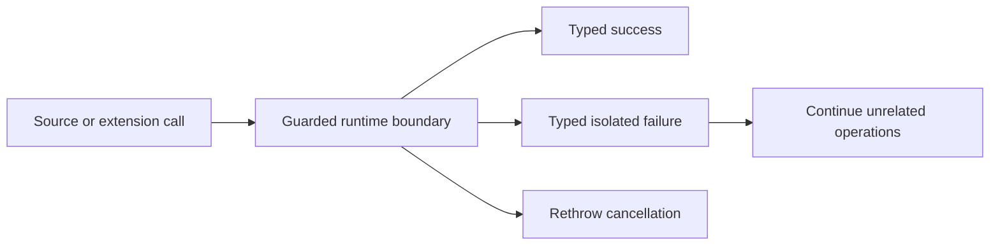
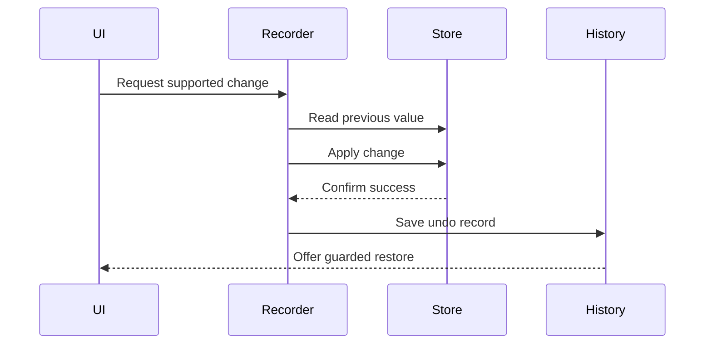
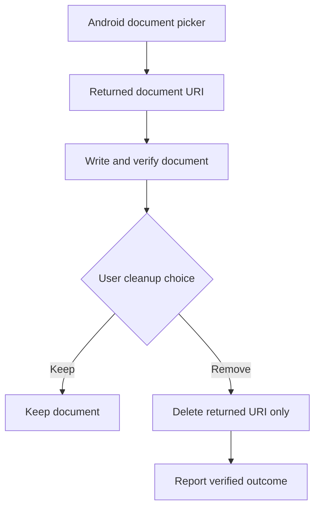

# Security and integration diagrams

## Navigation validation

Malformed values and scheme-prefix lookalikes do not reach application routes.

## Failure isolation

Cancelling an action stops it normally. Other failures stay with the action that caused them.

## Reversible local change

The app does not add an undo record when a change fails. Undo also refuses to overwrite a newer value.

## Clean up one document

Cleanup removes only the document created by the current action. It never searches and clears a whole folder.
