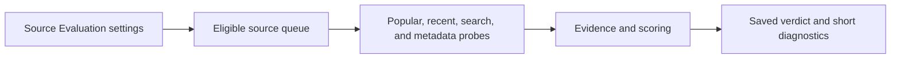
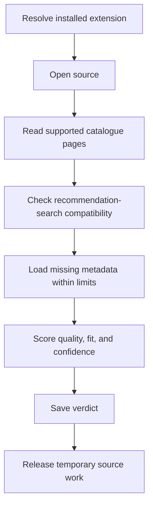
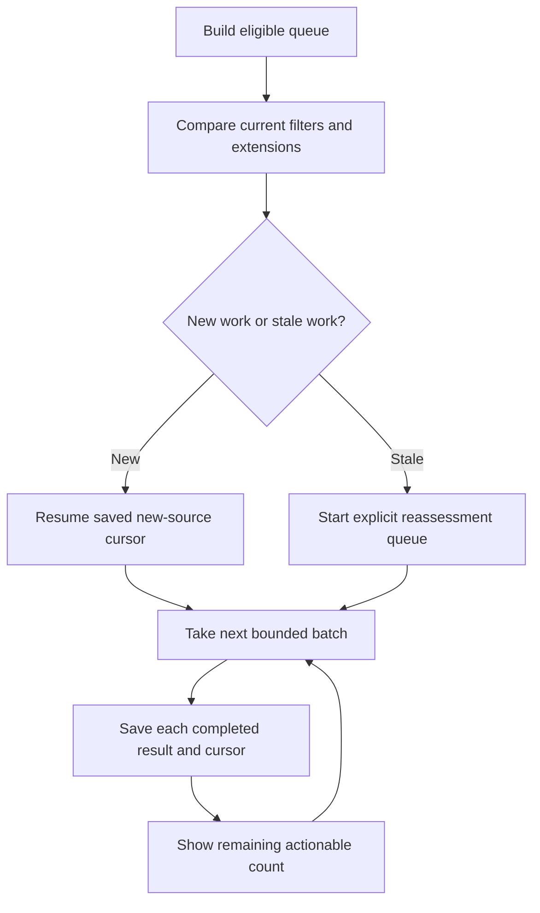
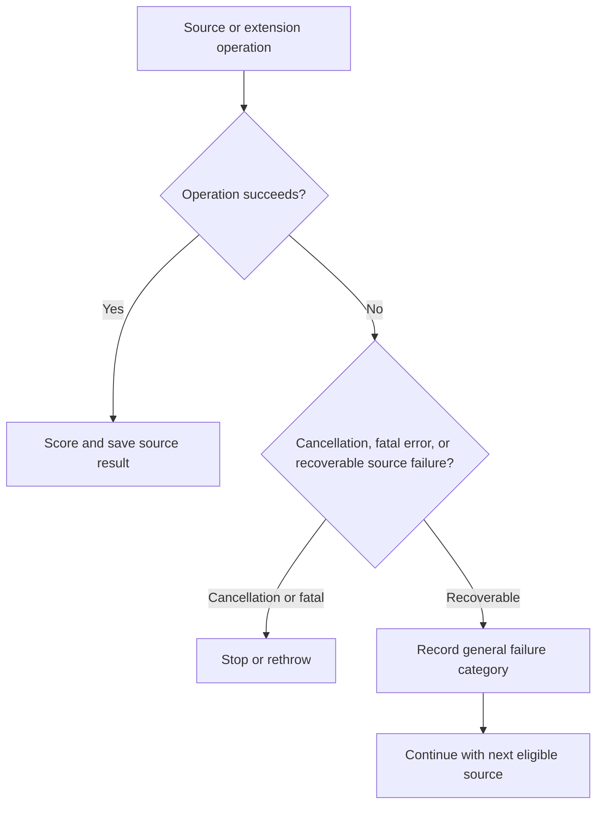
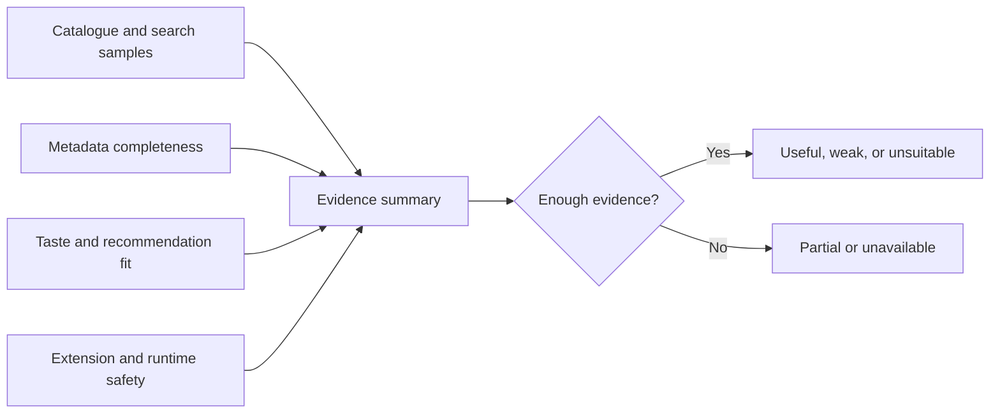

# Source Evaluation diagrams

Source Evaluation checks whether an installed source can provide useful, compatible recommendation data. It saves short verdicts and diagnostics instead of raw errors.

## Evaluation overview

Evaluation is bounded by the selected batch size and can continue after the screen is closed.

## Evaluate one source

Catalogue quality and recommendation-search compatibility are separate signals. A source can succeed at one and fail at the other.

## Continue or reassess

Changing filters or installed extensions does not silently mix old and new evaluation assumptions.

## Failure isolation

Recoverable failures remain local to one source. Cancellation is never converted into a successful result.

## Evidence to verdict

The visible result explains confidence and category without exposing requests, credentials, or exception text.
