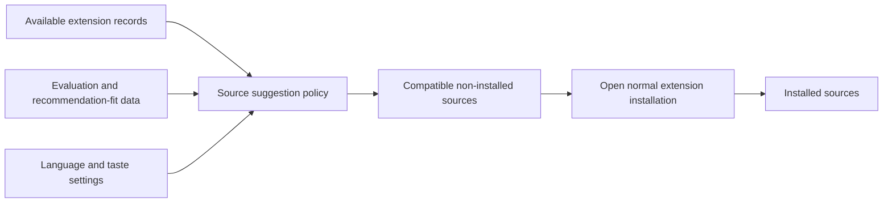
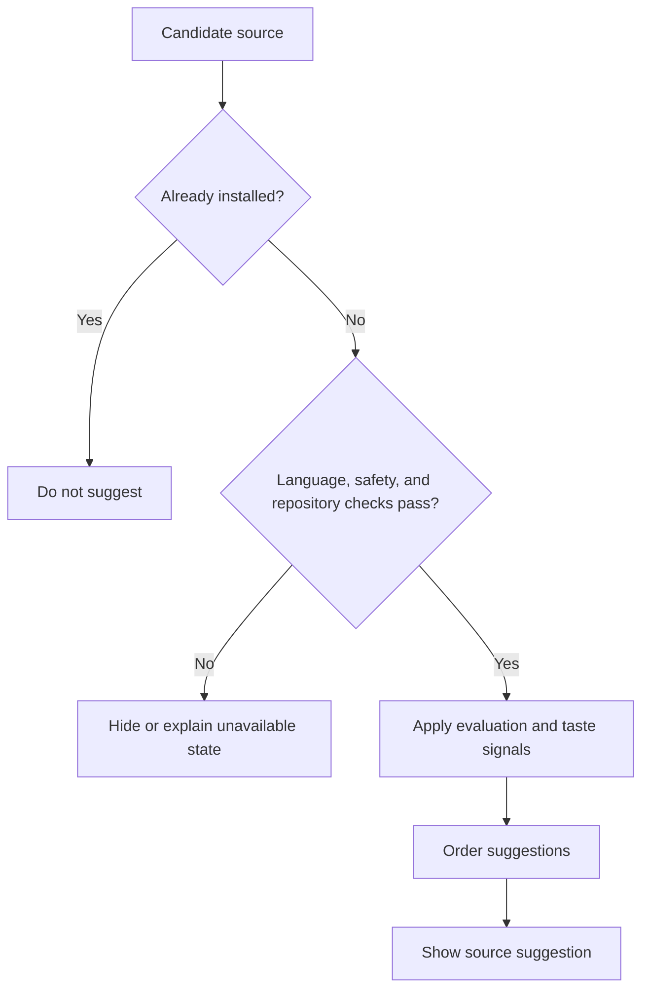
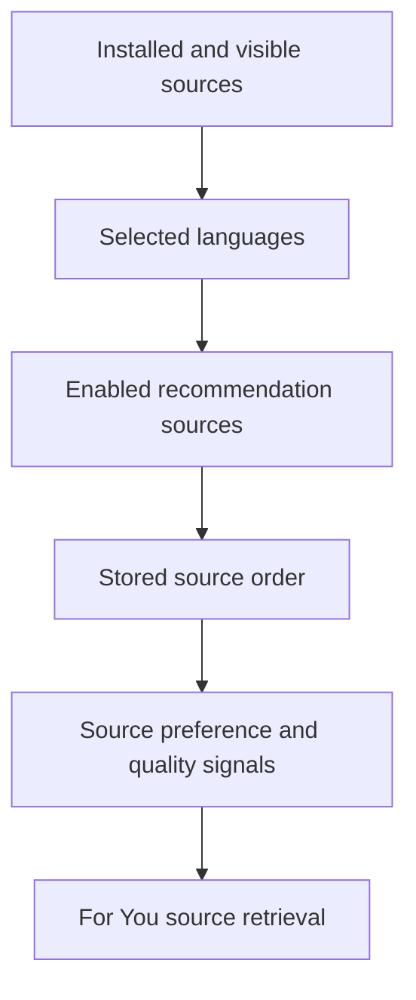
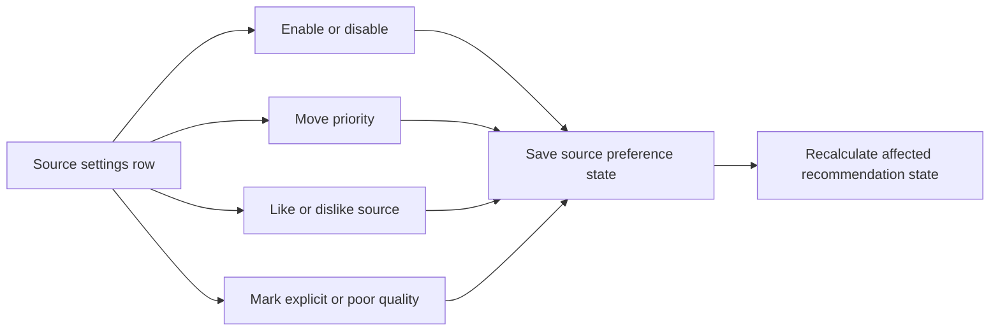

# Sources to try and source-priority diagrams

These flows explain how the app suggests additional sources and how source preferences influence For You.

## Sources to try

Suggestions do not install anything automatically. The normal extension flow remains responsible for confirmation and installation.

## Suggestion decision

Unavailable repository or network data produces an honest unavailable state rather than sample release data.

## Source priority in For You

Source order affects retrieval priority but does not bypass candidate-level filters.

## Change source preferences

The settings remain user-configurable and are validated before recommendation policies use them.
