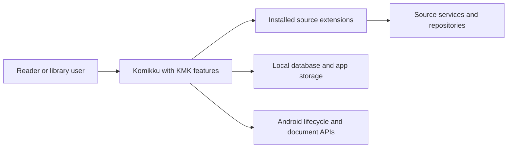
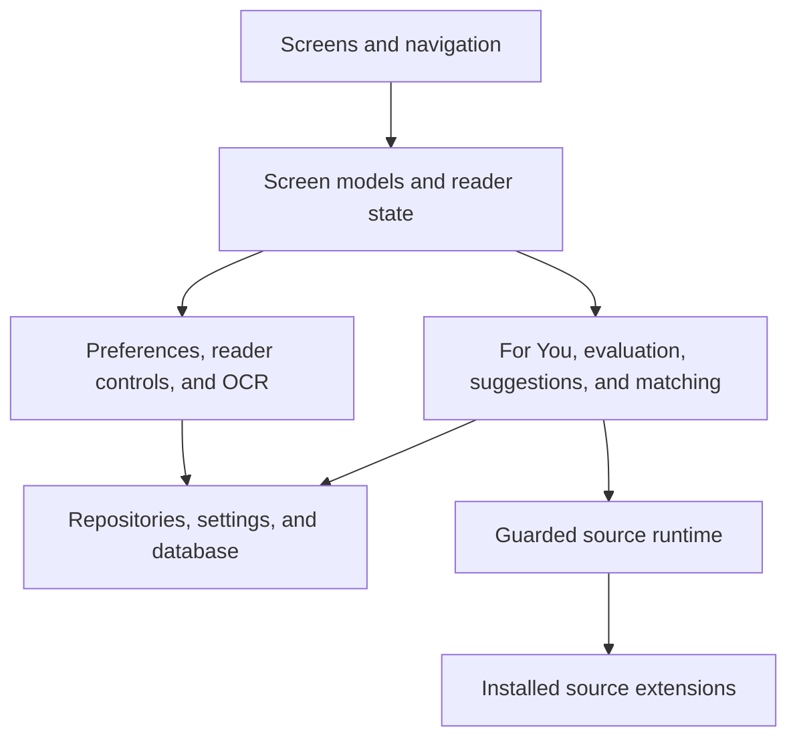
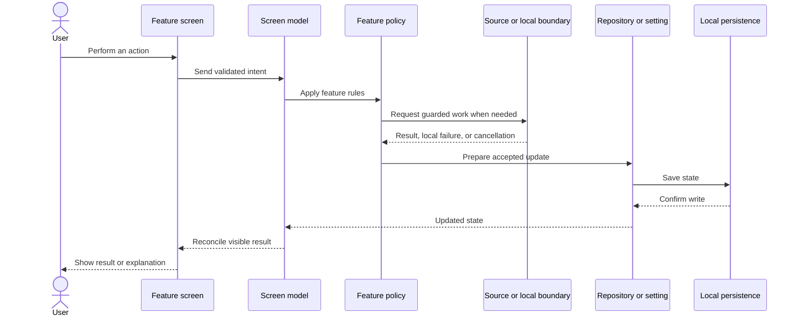
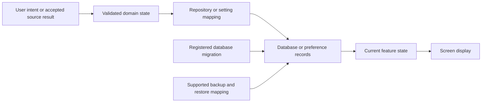
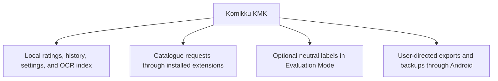

# System-wide architecture diagrams

These diagrams show how the feature pages share the app, save data, and keep private information within the boundaries chosen by the user.

## System context

KMK runs inside the Android app and uses installed extensions. It does not add a separate KMK server.

## Responsibilities

Screens decide what to display, policy classes make feature decisions, and repositories or settings save data that must survive a restart.

## User action to saved result

The visible result follows confirmed state. A failed or cancelled write does not become a successful screen message.

## Persistence and migration

New stored data uses registered migrations and explicit backup behavior where the feature supports backup and restore.

## Privacy boundaries

KMK has no separate recommendation account or server. Local preference and reading data stays in the app unless the user explicitly includes supported data in a backup or export. Evaluation Mode affects only what is displayed; it does not redirect requests or change which source or manga an action targets.
