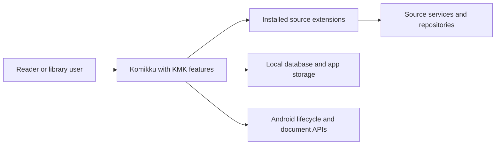
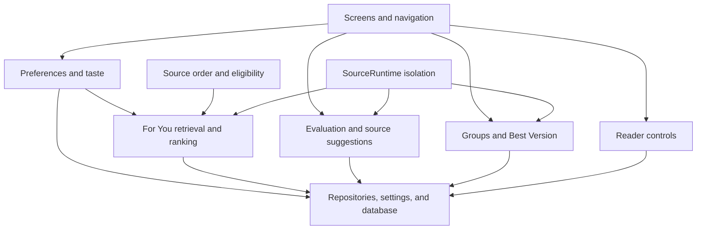
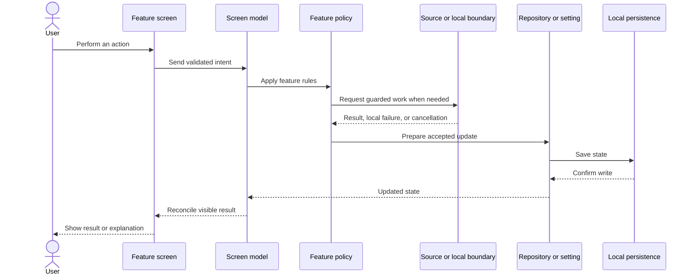
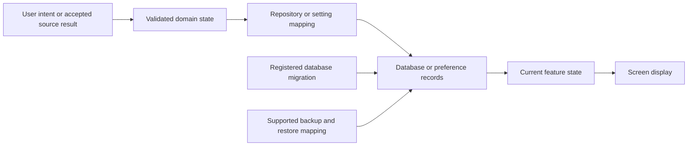
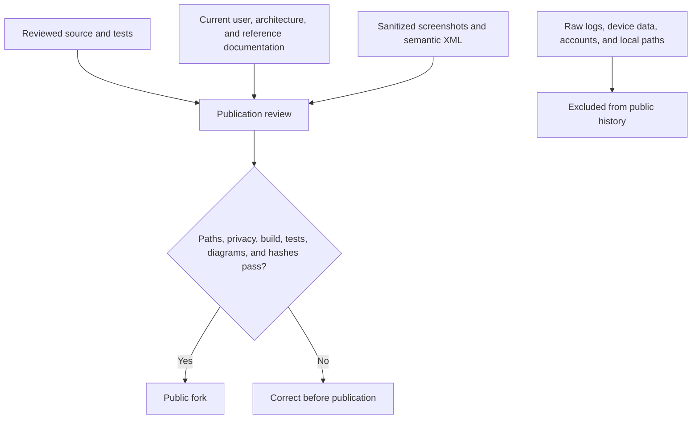

# System-wide architecture diagrams

These diagrams connect the feature pages and show the shared application, storage, and publication boundaries.

## System context

KMK runs inside the Android app and uses installed extensions. It does not add a separate KMK server.

## Feature ownership

Screens own presentation, policies own decisions, and repositories or settings own durable state.

## User action to saved result

The visible result follows confirmed state. A failed or cancelled write does not become a successful screen message.

## Persistence and migration

New stored data uses registered migrations and explicit backup behavior where the feature supports backup and restore.

## Public boundary

The publication check applies to both the final files and the Git history that would be pushed.
