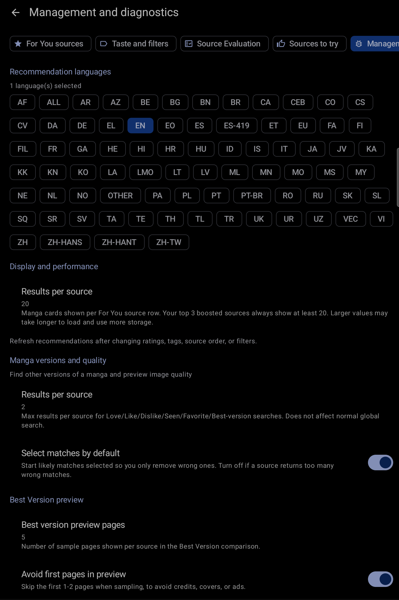

# Public UI evidence

These screenshots show the main KMK screens on a tablet. Each image is cropped to the app and reviewed for private information. The captions explain what to look for, so the images are still useful when viewed out of context.

## For You

The first visible area shows the main recommendation experience: topic shortcuts, personalized rows, matching tags, and manga cards. Evaluation Mode replaces source names with neutral labels. Manga artwork and titles remain visible because they are the result the feature is designed to present.

## Browse compatibility

This image shows that Evaluation Mode also applies to the existing Browse experience. Source labels are anonymized without changing the surrounding Komikku navigation.

## Recommendation settings

The settings page groups related controls into For You sources, taste and filters, source evaluation, sources to try, and management and diagnostics. Each row leads to a focused settings page.

## Management and diagnostics

This page keeps maintenance and diagnostic controls together. The visible summaries describe configuration state without exposing manga titles, source names, account details, or local paths.

## Source Evaluation

This partial-result state shows progress counts, readiness information, and reassessment actions. It uses general categories instead of raw source identities or error messages.

These captures exclude explicit preference choices, reading history, account state, reader pages, and menus that could reveal private manga activity.

## XML evidence

The XML files in `xml/` describe feature routes, states, implementation owners, privacy rules, and screenshot hashes. They are not raw Android screen dumps and do not include coordinates, device identifiers, titles, source names, URLs, account data, or local paths.

## Maintenance rule

Update an evidence record when its route, visible controls, privacy treatment, or screenshot changes. A code change that leaves those details unchanged does not require a new screenshot, but the linked implementation paths must stay accurate.
