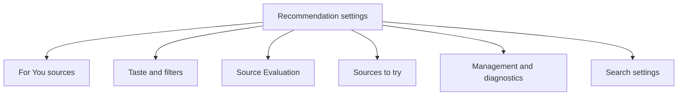
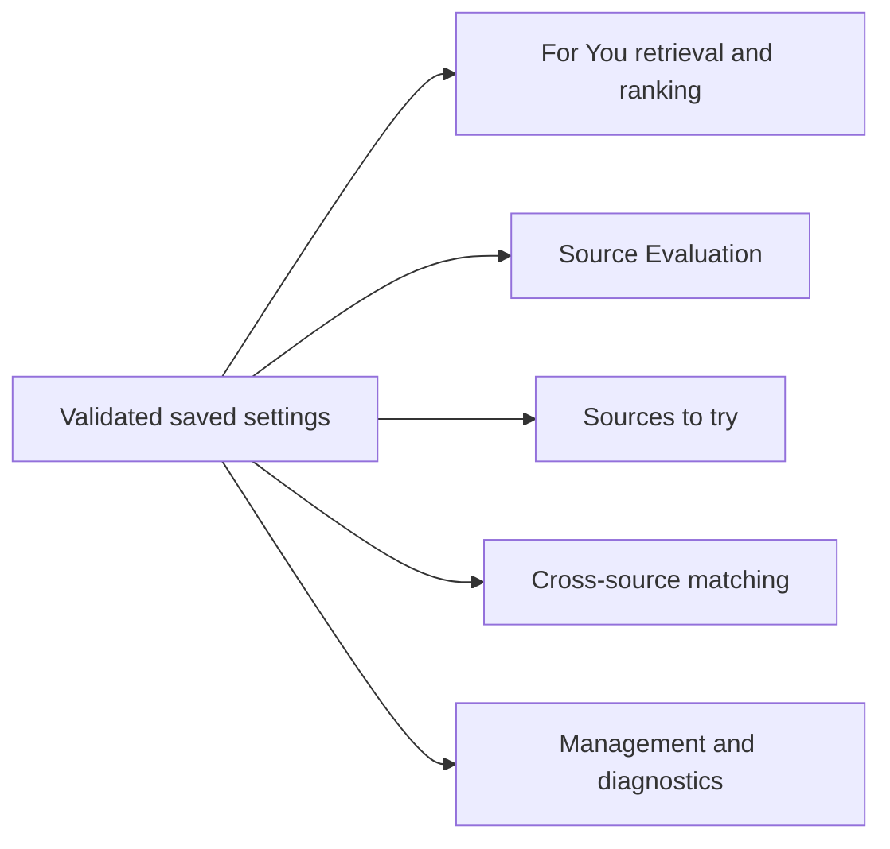
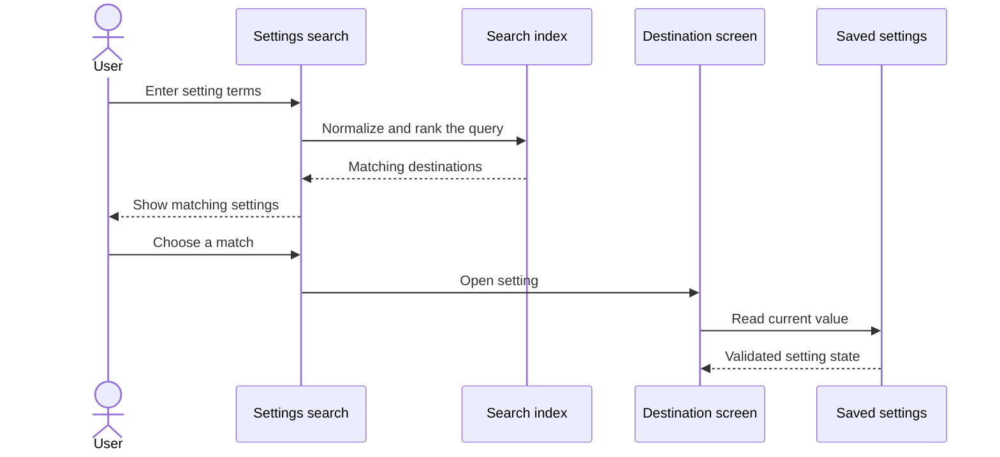
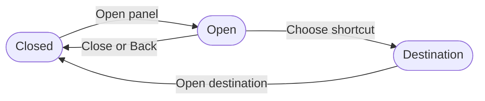

# Configuring personalized recommendations

Recommendation settings use the same lists, sections, search, and navigation patterns as the rest of Komikku.

## Where you find it

Open For You and select its settings action. On tablets, the quick-access panel reaches the same five destinations: For You sources, Taste and filters, Source Evaluation, Sources to try, and Management and diagnostics.

## How the settings are organized

The index follows Komikku's established settings pattern: short rows are grouped under visible section headings, each row opens a focused detail screen, and searchable terms include both the setting name and its concise summary. The index avoids placing long operational explanations under every control. Detail screens provide the additional context at the point where the reader is making the relevant choice.

| Section | Main decisions |
| --- | --- |
| For You sources | Eligible sources, source order, result limits, recent discovery, and rotation. |
| Taste and filters | Languages, ratings, blocked genres or tags, and minimum chapter count. |
| Source Evaluation | Evaluation limits, reassessment, and quality results. |
| Sources to try | Discovery suggestions and supported installation handoff. |
| Management and diagnostics | Cache, history cleanup, diagnostic summaries, and maintenance actions. |

Numeric settings are validated before persistence and before use. For example, the minimum-chapter setting affects every candidate lane, including recent discovery; a latest-catalogue candidate does not bypass it simply because it came from a different retrieval path.

## Expected interaction behavior

Changing a control updates saved preferences through the owning settings model. Returning to For You causes the affected retrieval or ranking policy to use the new value. Back navigation, configuration changes, theme, localization, and accessibility semantics remain those of the surrounding Komikku settings framework.

## Navigation map

The five visual sections group related controls and keep the first page short enough to scan.

## Settings affect features

Values are checked before use. Invalid stored numbers fall back to safe limits instead of reaching feature policies unchanged.

## Search for a setting

Search results explain both the setting and the section that contains it.

## Quick-access panel

The tablet quick-access panel provides the same destinations as the main settings index. Its handle and rows use stable touch targets and dismiss through normal Back behavior.

## Implementation reference

| Responsibility | Source |
| --- | --- |
| Build the five-section settings index and route each row | [`RecommendationSettingsIndexScreen`](../../../app/src/main/java/exh/recs/settings/RecommendationSettingsIndexScreen.kt) |
| Present For You source, taste, filter, discovery, and management settings | [`settings` package](../../../app/src/main/java/exh/recs/settings/) |
| Save recommendation preferences through Komikku's preference system | [`SourcePreferences`](../../../app/src/main/java/eu/kanade/domain/source/service/SourcePreferences.kt) and [`RecommendationsSettingsScreenModel`](../../../app/src/main/java/exh/recs/settings/RecommendationsSettingsScreenModel.kt) |

The index follows Komikku's existing settings components, so theme, localization, search, accessibility, and Back behavior remain consistent with the rest of the app.
