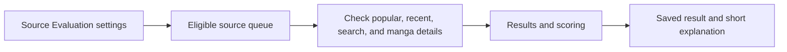
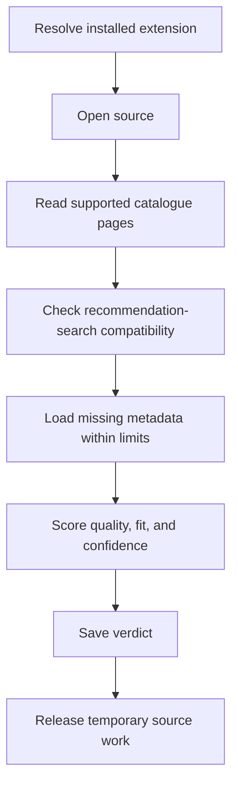
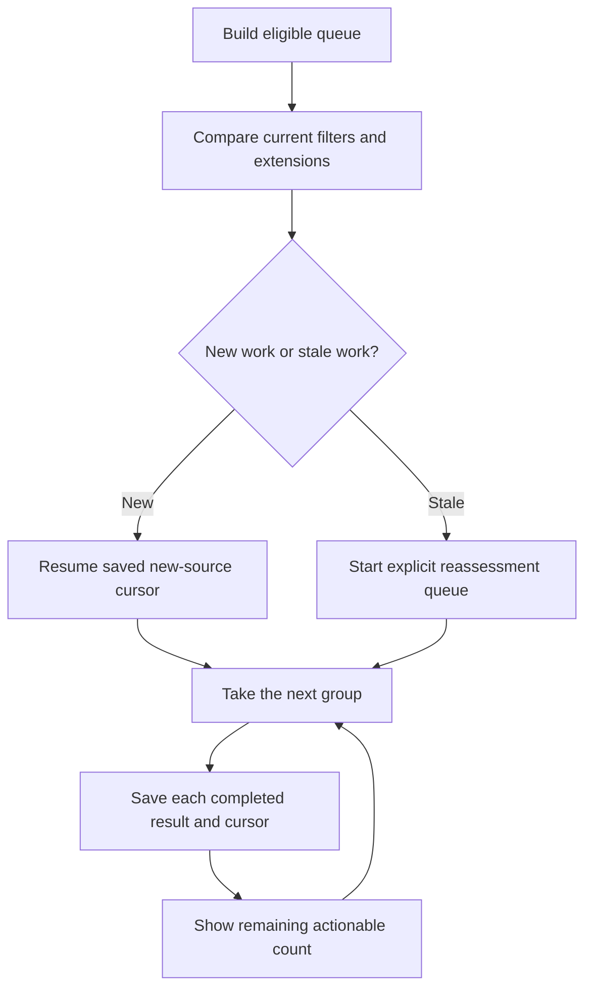
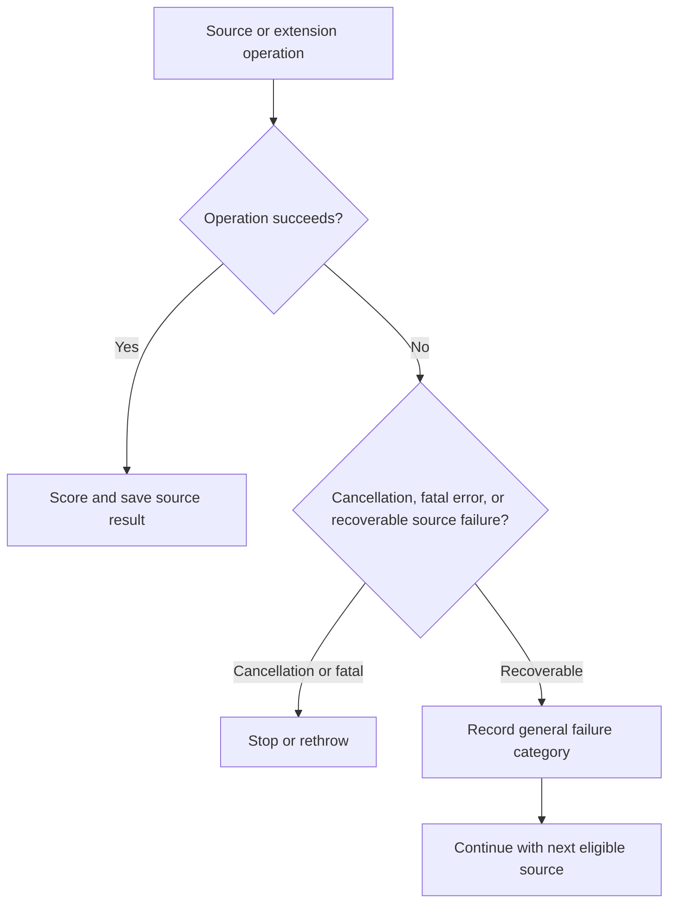
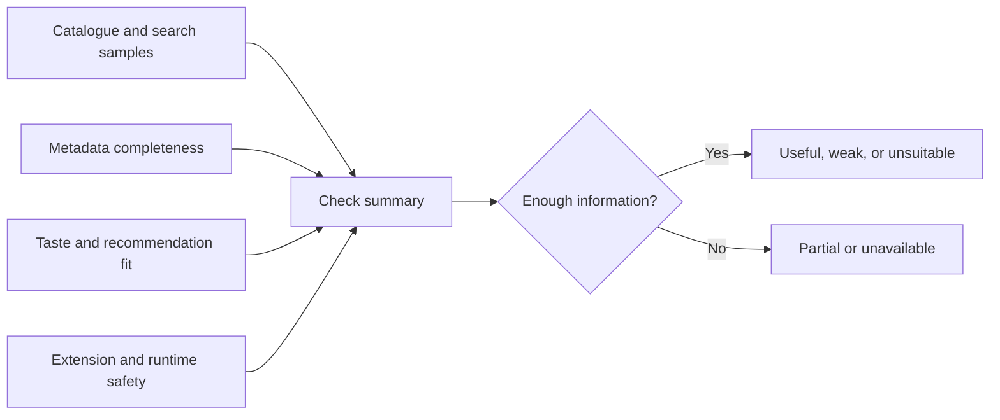

# Evaluating recommendation source quality

Source Evaluation checks whether an installed source can provide useful recommendations. It saves a short result and explanation instead of raw errors.

## Where you find it

Open **Recommendation settings**, then select **Source Evaluation**. The screen shows readiness, progress, completed results, and actions to continue or reassess when the inputs have changed.

## What an evaluation means

An evaluation is a bounded observation of what an installed source can provide to recommendation features. It considers supported catalogue pages, search compatibility, metadata completeness, response quality, and whether enough useful candidates remain after the reader's settings are applied. It is not a permanent judgment about the source and does not alter the extension or its catalogue.

The saved result contains a verdict, confidence, timestamp, and short category-based explanation. Raw URLs, source responses, exception objects, and private manga context are not used as display text. When an extension or preference changes in a way that invalidates the old result, the screen marks it for reassessment instead of silently treating an old result as current.

## Progress and result states

| State | Meaning | Available action |
| --- | --- | --- |
| Ready | Eligible sources have not yet been evaluated under the current inputs. | Start a bounded run. |
| Running | The current queue is being processed and progress is saved. | Leave the screen or cancel. |
| Partial | Some sources completed while others were skipped or failed. | Review categories and continue independent work. |
| Completed | The selected queue reached a result. | Reassess when inputs change. |
| Failed | The operation itself could not continue. | Retry after the stated condition changes. |

Closing the screen does not manufacture completion. Continuation starts from saved progress, and reassessment replaces a result only when its recorded inputs no longer match the current ones.

## Taste and source-quality diagnostics

Management and diagnostics complements evaluation with reader-owned signals. It summarizes rating counts, the support behind preferred or blocked tag suggestions, metadata coverage, enrichment, confidence, and source-quality history. A suggestion requires repeated support from rated manga; one isolated rating does not silently become a broad tag rule.

Source-quality marks describe the catalogue as a recommendation input, separate from rating an individual manga. A reader can lower or exclude a poor or overly explicit source while preserving its past evaluation history, show excluded sources again, or clear all quality marks through an explicit recovery action. Public summaries remain aggregate and do not expose sampled tags or source-specific raw content.

## Evaluation overview

The app checks only the selected number of sources at a time, and it can continue after you close the screen.

## Evaluate one source

Catalogue quality and recommendation-search compatibility are separate signals. A source can succeed at one and fail at the other.

## Continue or reassess

Changing filters or installed extensions does not silently mix old and new evaluation assumptions.

## Failure isolation

Recoverable failures remain local to one source. Cancellation is never converted into a successful result.

## From checks to a result

The screen reports the result and its confidence with summary categories instead of requests, credentials, or raw error text.

## Implementation reference

| Responsibility | Source |
| --- | --- |
| Own evaluation state, queueing, continuation, cancellation, and reassessment | [`SourceEvaluationScreenModel`](../../../app/src/main/java/exh/recs/evaluation/SourceEvaluationScreenModel.kt) |
| Render progress, result summaries, warnings, and available actions | [`SourceEvaluationScreen`](../../../app/src/main/java/exh/recs/evaluation/SourceEvaluationScreen.kt) |
| Present taste diagnostics and management actions | [`RecommendationDiagnosticsSettingsScreen`](../../../app/src/main/java/exh/recs/settings/RecommendationDiagnosticsSettingsScreen.kt) |
| Present saved source-quality observations | [`QualitySignalHistoryScreen`](../../../app/src/main/java/exh/recs/settings/QualitySignalHistoryScreen.kt) |
| Isolate extension calls used during evaluation | [`SourceRuntime`](../../../app/src/main/java/eu/kanade/tachiyomi/source/SourceRuntime.kt) |

The screen model saves structured outcomes. The screen converts those outcomes into short explanations rather than displaying raw exception text or request details.
