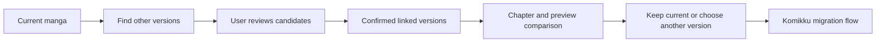
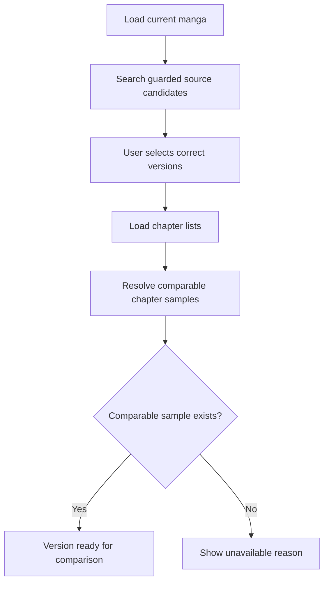
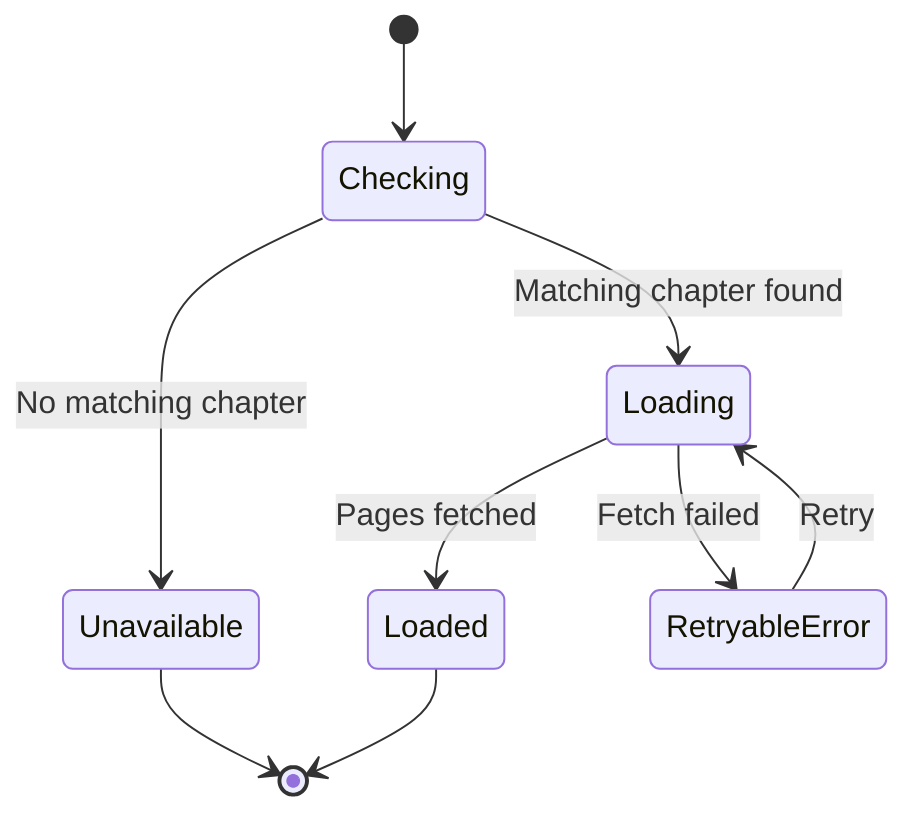
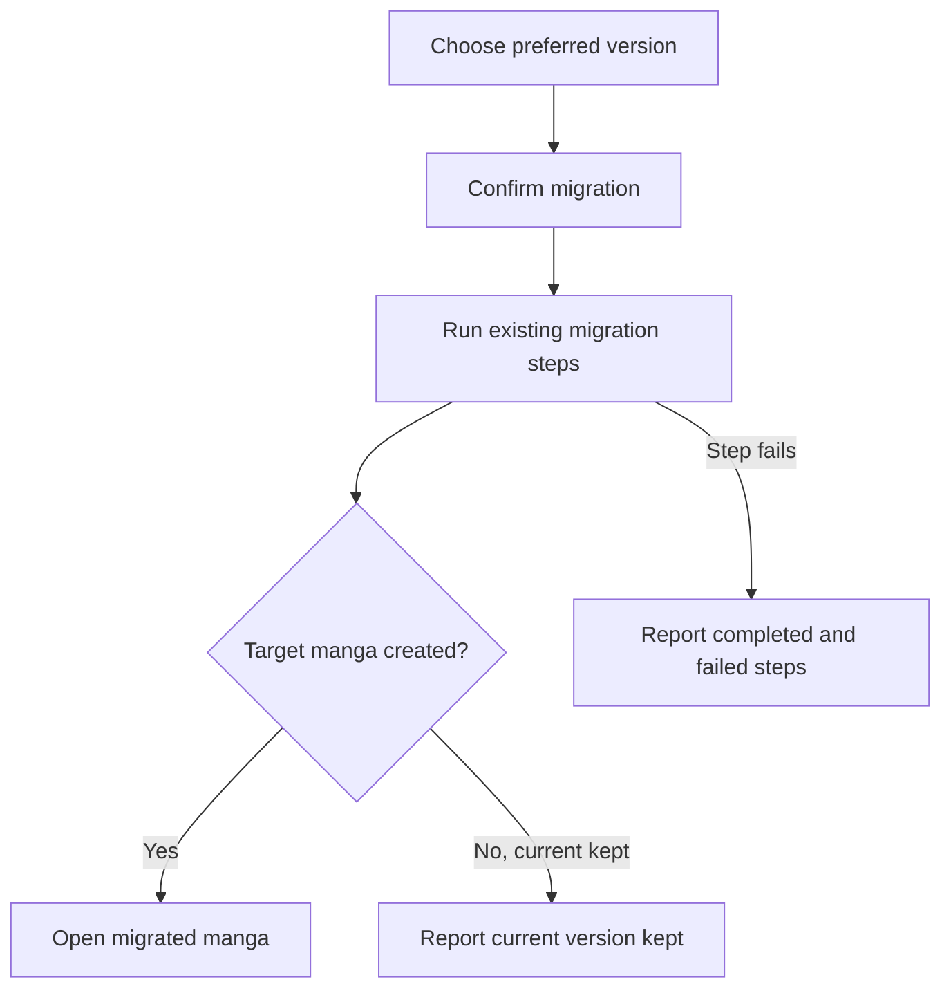

# Finding and comparing manga versions

KMK can find the same manga on other sources, let the reader confirm which results are genuinely related, and compare chapter availability and page previews before any migration begins. Matching and comparison are deliberately separate from migration: reviewing another version never changes the library by itself.

## Where you find it

Open a manga and choose **Find other versions** from its actions. After compatible versions are linked and enough comparison data exists, **Best Version** can compare them before handing an accepted change to Komikku's migration flow.

## What the workflow helps you decide

The matching screen answers “are these the same manga?” The Best Version screen answers “which confirmed version is more useful to me?” Keeping those questions separate prevents a search result from becoming trusted merely because its title looks similar. The reader can inspect candidates, reject mismatches, compare chapter samples, retry an individual preview, and keep the current version without starting migration.

| Step | Reader decision | What changes |
| --- | --- | --- |
| Find other versions | Select only genuine matches | Confirmed links are saved; the library entry is unchanged. |
| Choose chapters | Pick comparable samples when automatic matching is insufficient | Comparison state changes; no manga is migrated. |
| Review previews | Compare availability and page rendering | Preview results are temporary and independent per source. |
| Confirm another version | Accept the existing Komikku migration prompt | Komikku's migration workflow performs the library change. |

## What the comparison looks like

| Chapter selection | Preview comparison |
| --- | --- |
|  |  |

Evaluation Mode replaces source identities with neutral labels in these public examples. The chapter controls and preview panels remain visible because they are the behavior being explained.

## Matching and comparison overview

The user confirms matches before they become linked versions.

## Prepare comparable versions

A missing chapter or preview is displayed as unavailable; it is not treated as a failed migration.

Automatic chapter matching is a convenience, not an assertion that two releases are identical. When numbering or availability differs, the screen keeps the decision visible and lets the reader choose a better sample. A failure from one source is attached to that source instead of collapsing the whole comparison.

## Preview state

Each linked version tracks its own preview. If one preview fails, the other comparisons remain visible.

## Migration result

The result clearly separates a successful migration, a decision to keep the current version, and a failure. It does not promise to undo changes that already finished outside this step.

## Data, privacy, and recovery

Confirmed links and the chosen primary version are app data and can be included in supported backups. Fetched previews are working data for the comparison and are not presented as a permanent copy of reader content. Evaluation Mode changes visible source labels only; it does not change the identifiers used for matching or migration. If migration reports a partial result, the app describes the completed and failed steps rather than claiming a complete rollback.

## Implementation reference

| Responsibility | Source |
| --- | --- |
| Present matching versions and selection across sources | [`CrossExtensionMatchScreen`](../../../app/src/main/java/exh/recs/matching/CrossExtensionMatchScreen.kt) |
| Prepare comparable candidates and own Best Version state | [`BestVersionCompareScreenModel`](../../../app/src/main/java/exh/recs/bestversion/BestVersionCompareScreenModel.kt) |
| Continue through Komikku's established migration workflow | [`migrating` package](../../../app/src/main/java/eu/kanade/tachiyomi/ui/browse/migration/manga/) |

KMK owns matching, linking, and comparison. When the reader chooses another version, the existing Komikku migration flow remains responsible for the actual library migration.
