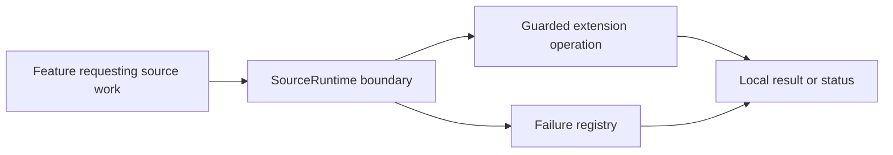
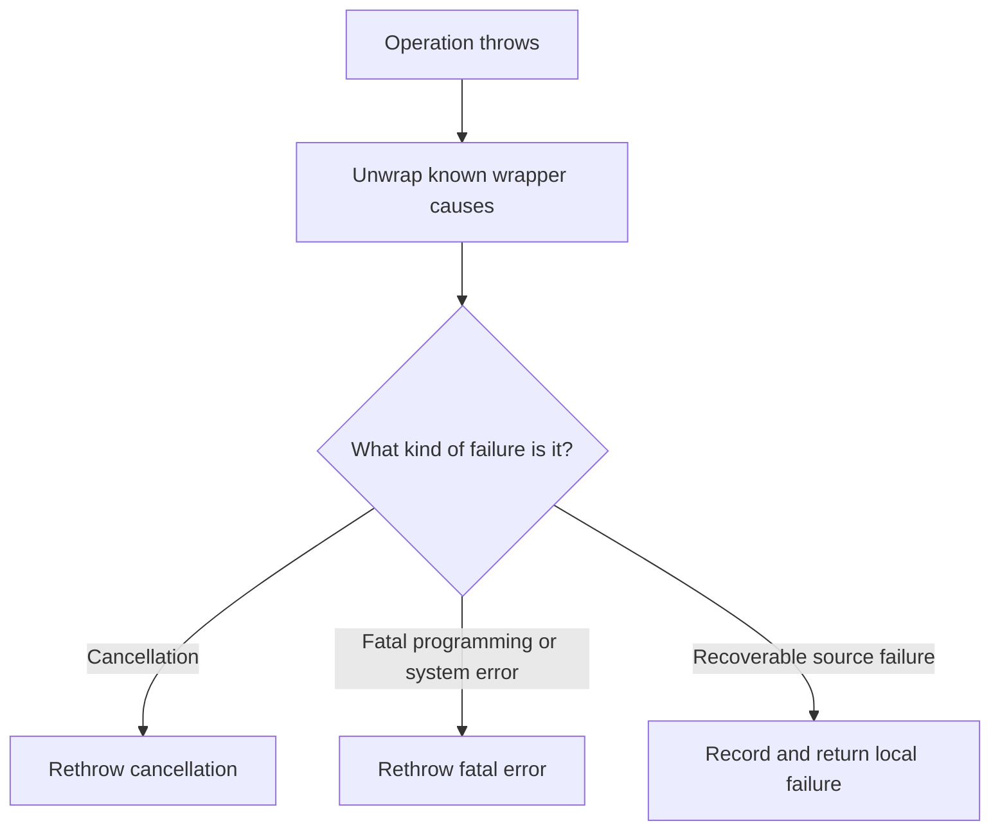
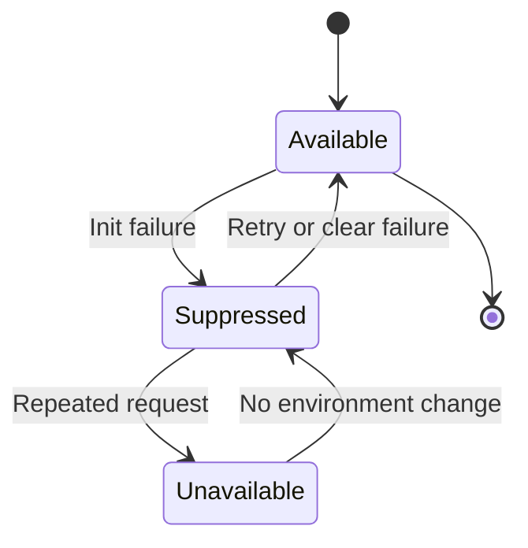
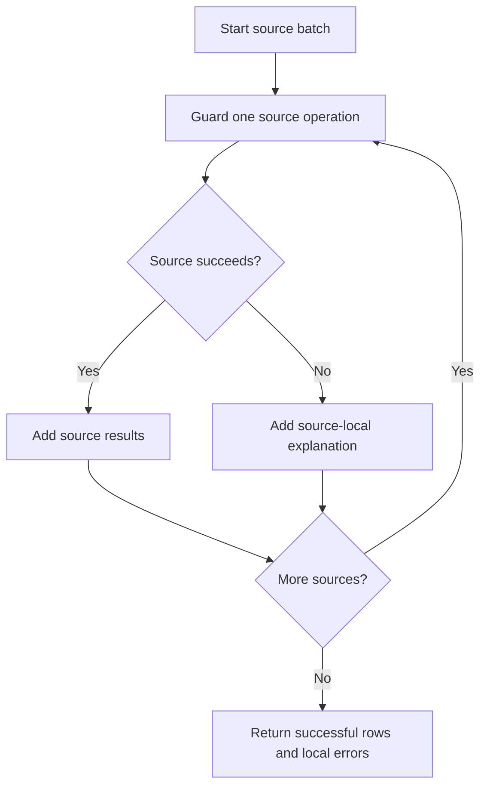

# Handling source and extension failures

The source runtime is the boundary between KMK features and installed extensions. It keeps one extension failure from breaking unrelated work.

## Where it applies

This is not a separate screen. For You, Source Evaluation, Sources to try, matching, and other source-backed features use the boundary whenever they call an installed extension.

## Why the boundary exists

Installed extensions are independent components with their own network behavior, parsing, and update lifecycle. A timeout, malformed response, missing class, or incompatible package from one extension must not crash a page that is also using unrelated sources. KMK routes source work through a shared runtime that classifies the outcome, keeps diagnostics bounded, and returns a feature-level status that the screen can explain.

Cancellation is never converted into an ordinary failure or an empty success. Retry is limited to conditions that can plausibly change, and temporary suppression applies only to the affected operation or source. Credentials, raw URLs, response bodies, exception objects, and manga identifiers are excluded from user-facing diagnostics.

## What readers should expect

In a multi-source feature, successful rows remain available when another source fails. A failed source can show a short category and a retry or reassessment action. If the extension itself is incompatible, extension management identifies that package without preventing other installed packages from loading.

## Runtime boundary

Feature screens receive a result they can explain instead of handling raw extension failures directly.

## Failure classification

Cancellation and fatal errors are not disguised as empty or successful source results.

## Temporary suppression and retry

Temporary suppression prevents repeated expensive initialization failures while leaving a clear retry path.

## Batch isolation

The final batch state can contain both useful results and honest per-source failures.

## Implementation reference

| Responsibility | Source |
| --- | --- |
| Run extension work with cancellation preservation and failure isolation | [`SourceRuntime`](../../../app/src/main/java/eu/kanade/tachiyomi/source/SourceRuntime.kt) |
| Consume guarded source results for For You | [`BrowsePersonalRecommendationsScreenModel`](../../../app/src/main/java/exh/recs/BrowsePersonalRecommendationsScreenModel.kt) |
| Consume guarded source results for evaluation | [`SourceEvaluationScreenModel`](../../../app/src/main/java/exh/recs/evaluation/SourceEvaluationScreenModel.kt) |

Callers receive a success, a classified source-local failure, or cancellation. They can therefore keep useful rows while explaining which source work did not complete.
