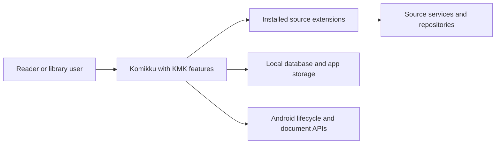
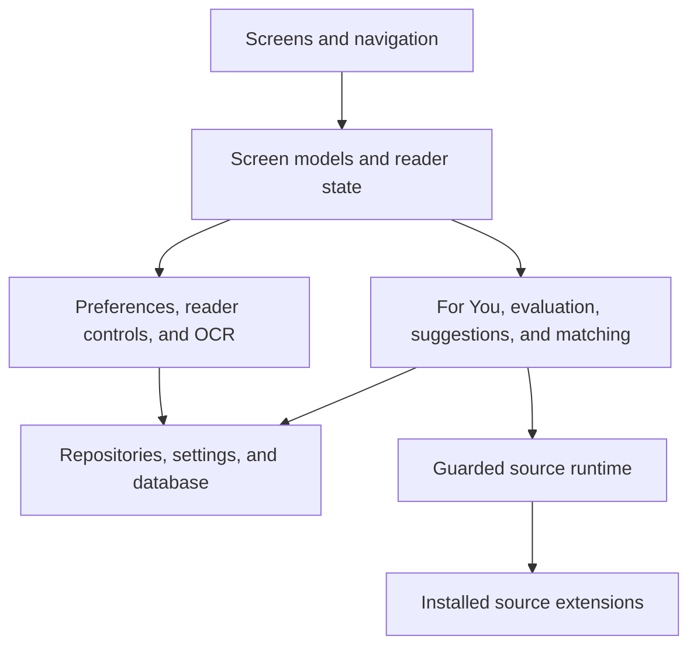
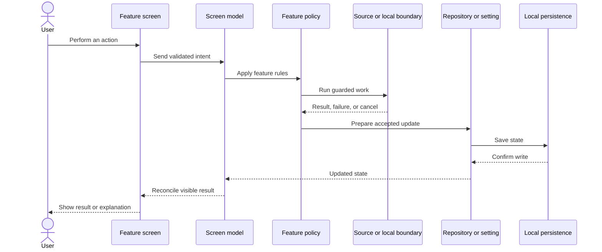
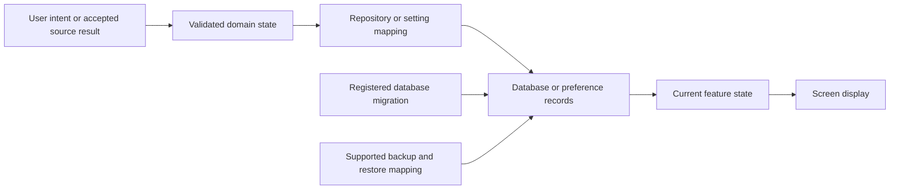
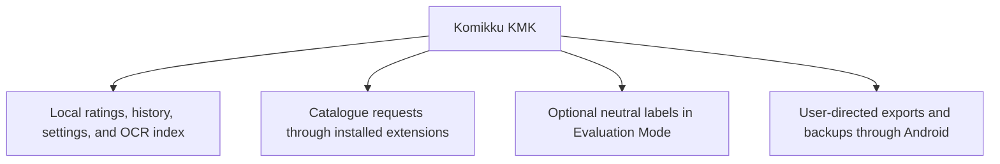

# How KMK features work together

These diagrams show how the feature pages share the app, save data, and keep private information within the boundaries chosen by the user.

## What this page covers

This overview connects the feature-specific pages. It shows which work belongs to Komikku screens and screen models, which work crosses into installed extensions or Android, and which state remains in local repositories, settings, and the database.

KMK is an extension of Komikku, not a parallel application inside it. Existing Komikku screens, navigation, database ownership, workers, backup framework, extension manager, reader, and Android integrations remain responsible for their established behavior. KMK adds focused policies and presentation around recommendation discovery, cross-source decisions, reversible preferences, local OCR, and optional reader controls.

## A practical way to read the architecture

- **Screens and screen models** own visible state, navigation, loading, retry, and lifecycle behavior.
- **Interactors and policies** decide eligibility, ranking, validation, and transitions without depending on presentation details.
- **Repositories and preferences** save durable local state through established app storage.
- **Runtime boundaries** isolate extension and network failures and preserve cancellation.
- **Android-owned flows** remain responsible for package installation, document selection, and other system-mediated actions.
- **Documentation references** connect each user-facing route to its main implementation owner.

This separation allows a recommendation policy to change without rewriting Browse, or a new reader action to reuse the existing manga and chapter models instead of duplicating them.

## In-app change history

KMK maintains its own What's New history because the fork's feature releases do not replace Komikku's upstream release notes. The current version family opens expanded, older families collapse behind short summaries, and the complete historical entries remain available. Acknowledging the screen records only the latest KMK feature version seen; it does not suppress Komikku's separate update information.

## System context

KMK runs inside the Android app and uses installed extensions. It does not add a separate KMK server.

## Responsibilities

Screens decide what to display, policy classes make feature decisions, and repositories or settings save data that must survive a restart.

## User action to saved result

The visible result follows confirmed state. A failed or cancelled write does not become a successful screen message.

## Persistence and migration

New stored data uses registered migrations and explicit backup behavior where the feature supports backup and restore.

## Privacy boundaries

KMK has no separate recommendation account or server. Local preference and reading data stays in the app unless the user explicitly includes supported data in a backup or export. Evaluation Mode affects only what is displayed; it does not redirect requests or change which source or manga an action targets.

## Implementation reference

| Layer | Representative source |
| --- | --- |
| Android entry point and app navigation | [`MainActivity`](../../../app/src/main/java/eu/kanade/tachiyomi/ui/main/MainActivity.kt) |
| Recommendation screen ownership | [`BrowsePersonalRecommendationsScreenModel`](../../../app/src/main/java/exh/recs/BrowsePersonalRecommendationsScreenModel.kt) |
| Reader ownership | [`ReaderViewModel`](../../../app/src/main/java/eu/kanade/tachiyomi/ui/reader/ReaderViewModel.kt) |
| Guarded extension boundary | [`SourceRuntime`](../../../app/src/main/java/eu/kanade/tachiyomi/source/SourceRuntime.kt) |
| Local persistence | Database schema and migrations under [`data`](../../../data/) together with focused repositories such as [`OcrIndexRepository`](../../../app/src/main/java/exh/ocr/OcrIndexRepository.kt) |

These links are representative ownership points, not a complete class inventory. The [feature and code map](../feature-and-code-map.md) provides the direct owner for each public feature.
