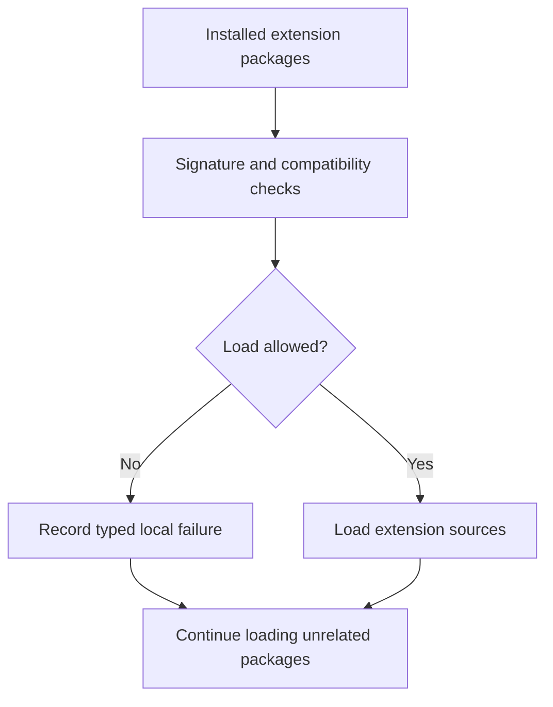
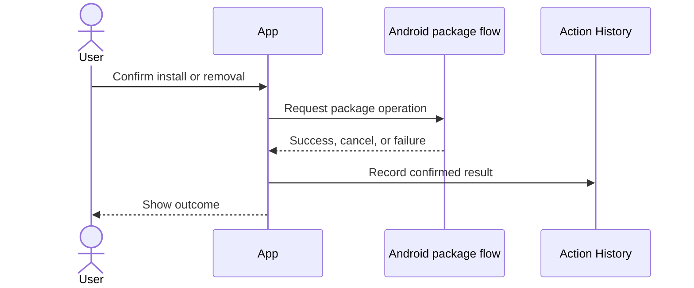
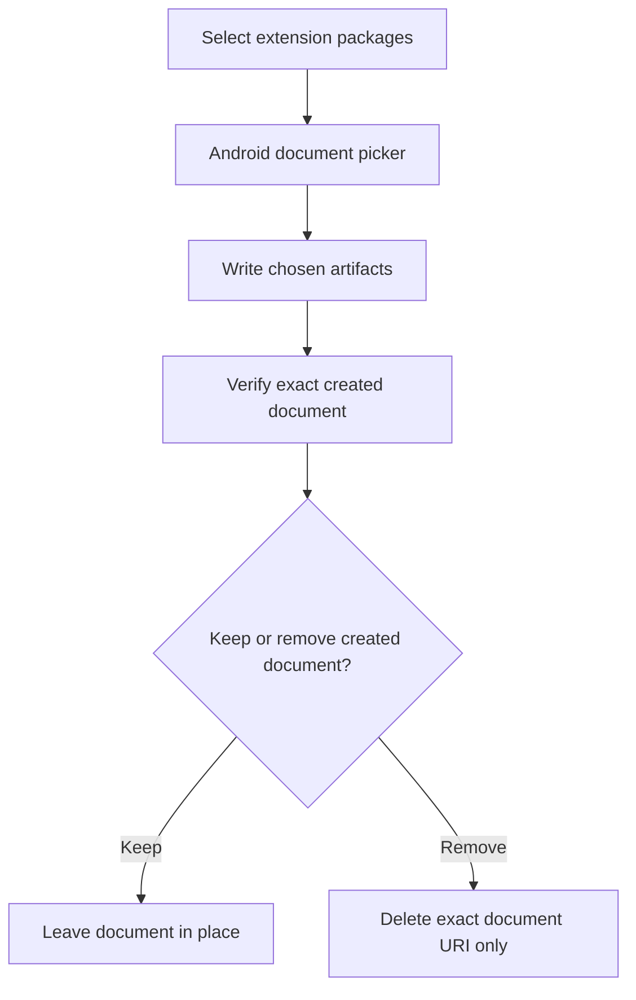
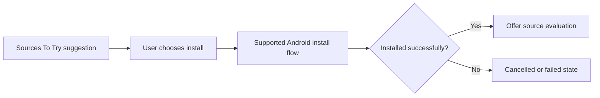

# Managing and isolating extensions

Extension management keeps loading, installation, removal, and export inside Komikku's established extension and Android package boundaries. Failures are local to the affected extension or action.

## Where you find it

Open **Browse > Extensions** for installed and available extension actions. Sources to try can lead to the same supported Android installation flow after the reader selects a suggestion.

## Responsibilities across the flow

Komikku discovers extension packages and exposes their sources. KMK adds stronger isolation and integrates suggested sources, evaluation, Action History disclosures, and exact-artifact export cleanup without replacing Android's package or document interfaces. Install and removal remain explicit actions mediated by Android; a suggestion is never treated as consent.

| Operation | System owner | KMK responsibility |
| --- | --- | --- |
| Load installed package | Komikku extension manager | Isolate incompatible or failing packages from unrelated extensions. |
| Install or remove | Android package flow | Request the operation, preserve cancellation, and report the confirmed result. |
| Export package files | Android document APIs | Write selected artifacts and remember the exact created document. |
| Evaluate a new source | Source Evaluation | Start only after installation is confirmed and the reader chooses to proceed. |

Installed package names, repositories, and configured sources can identify a user's setup. The workflow does not require sharing a personal extension list.

## Load isolation

If one package is incompatible, the app reports that package's problem and continues loading the others.

## Install and remove

The app records only a confirmed Android result. Cancellation and ordinary failure remain distinct outcomes.

## Exported-file cleanup

The app remembers the exact document returned by Android and never searches a folder by filename when cleaning up.

## Continue to Source Evaluation

Sources To Try can open Android's installation flow. The source is offered for evaluation only after Android confirms that installation succeeded.

## Implementation reference

| Responsibility | Source |
| --- | --- |
| Discover, load, trust, and expose installed extensions | [`ExtensionManager`](../../../app/src/main/java/eu/kanade/tachiyomi/extension/ExtensionManager.kt) |
| Use Android-mediated install and uninstall operations | [`installer` package](../../../app/src/main/java/eu/kanade/tachiyomi/extension/installer/) |
| Export selected packages and verify exact-file cleanup | [`ExtensionApkExporter`](../../../app/src/main/java/eu/kanade/tachiyomi/extension/util/ExtensionApkExporter.kt) |

KMK does not silently install a suggested source or remove unrelated files. Consent, Android's result, and the exact artifact returned by the operation define the boundary.
