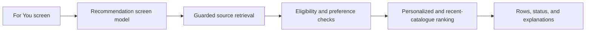
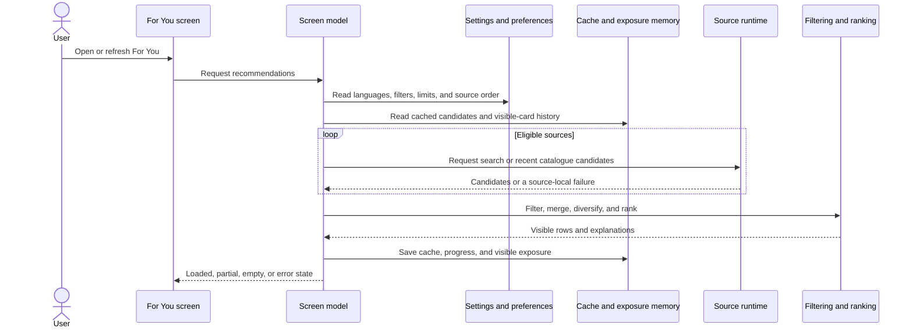
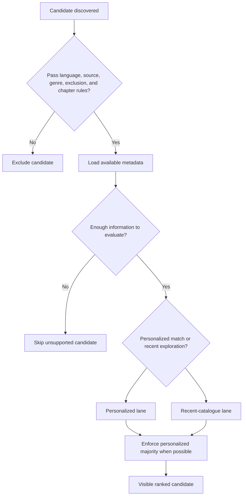
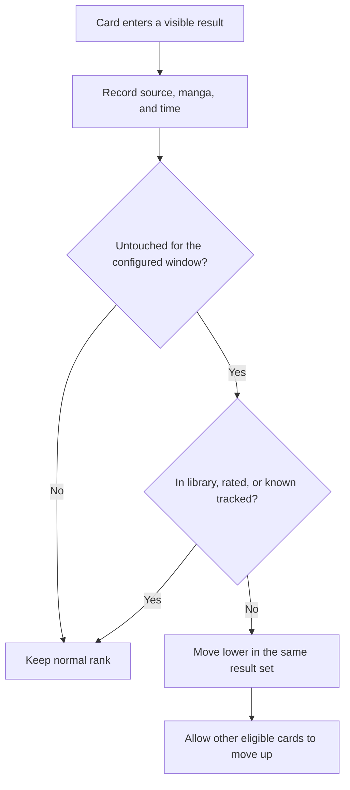

# Personalized recommendations and discovery

For You gathers recommendations from eligible installed sources, applies the reader's filters and preferences, adds a controlled amount of recent discovery, and rotates repeatedly shown untouched manga lower in the same result set. The diagrams below explain each stage; the text after them explains what the stage means in the app.

## Where you find it

Open **Browse**, then select **For You**. The page contains topic shortcuts followed by recommendation rows for the sources that are eligible under the current settings.

## What For You is designed to do

For You is not a single popularity list. It combines candidates from the reader's chosen sources, removes anything that violates a hard rule, separates personalized matches from recent-catalogue exploration, and builds a bounded row from the candidates that actually survived. Personalized results remain the majority when enough are available; recent discovery adds variety without bypassing blocked genres, languages, source rules, or the minimum-chapter requirement.

The page also remembers when an untouched title was visibly presented. After the configured exposure window, that title moves lower instead of disappearing. A manga in the library, a rated manga, or a tracked manga is exempt from this untouched-title rotation because the reader has already expressed an ongoing relationship with it.

## What you see on the page

- Topic shortcuts provide fast entry points into broad recommendation groups.
- Each source row reports a loaded, empty, partial, or recoverable-error state independently.
- Manga cards retain the normal Komikku interaction model: opening a result leads to its manga page rather than performing a hidden preference write.
- Evaluation Mode can replace source labels for a public screenshot without changing the candidates, saved source identifiers, or requests.

The result is deterministic where safety and preference rules must be strict, but deliberately varied where several acceptable candidates could occupy the same visible position.

## Top Picks, selection, and sharing

Top Picks combines the strongest currently available matches into a focused list without removing the per-source rows that explain where broader discovery came from. Long-pressing a For You card enters selection mode. The selection bar can apply a preference or clear one across the chosen manga, while single-item actions can open the manga or continue into version comparison.

Top Picks, an individual source row, or a rated collection can also be exported as a recommendation bundle. Import opens a review screen first: the bundle is parsed, versioned, validated, and resolved against available sources before any library action is offered. Unresolved or malformed entries remain visible as such; they are not silently attached to another source or manga. Adding reviewed entries to the library is a separate, explicit step.

## Recommendations from a group

Rated and linked-version groups can seed a recommendation search using the combined group rather than one manga alone. Results load progressively by source with a configurable initial preview size. Concurrency and timeouts are bounded, navigating away cancels active work, and a slow or failing extension affects its own row rather than the complete group result.

## Feature overview

The screen model coordinates the work. Source failures are contained before candidates reach filtering and ranking.

## Retrieval and display

Each source is handled independently. One failing source can produce a row-level explanation without discarding successful rows.

## Candidate eligibility

Recent-catalogue entries add variety but never bypass the normal safety and preference rules.

## Exposure-aware refresh

Exposure memory changes ordering only. It does not delete manga or override library, preference, or verified tracking state.

## Implementation reference

| Responsibility | Source |
| --- | --- |
| Own screen state, source work, refresh, and visible exposure recording | [`BrowsePersonalRecommendationsScreenModel`](../../../app/src/main/java/exh/recs/BrowsePersonalRecommendationsScreenModel.kt) |
| Render recommendation rows and loaded, partial, empty, and error states | [`BrowsePersonalRecommendationsTab`](../../../app/src/main/java/exh/recs/BrowsePersonalRecommendationsTab.kt) |
| Present the combined Top Picks view | [`TopPicksScreen`](../../../app/src/main/java/exh/recs/TopPicksScreen.kt) |
| Validate, export, import, resolve, and review recommendation bundles | [`share` package](../../../app/src/main/java/exh/recs/share/) |
| Coordinate bounded, progressive group recommendation previews | [`GroupPreviewLoadCoordinator`](../../../app/src/main/java/exh/recs/GroupPreviewLoadCoordinator.kt) |
| Apply exposure-aware display ordering and tracked-state safety | [`RecommendationDisplayReranker`](../../../app/src/main/java/exh/recs/RecommendationDisplayReranker.kt) |
| Merge personalized and recent-discovery candidates | [`RecommendationCandidateMemoryRanker`](../../../app/src/main/java/exh/recs/memory/RecommendationCandidateMemoryRanker.kt) |

The screen model coordinates the feature. The policy files keep filtering and ordering rules testable without requiring a rendered Android screen.
