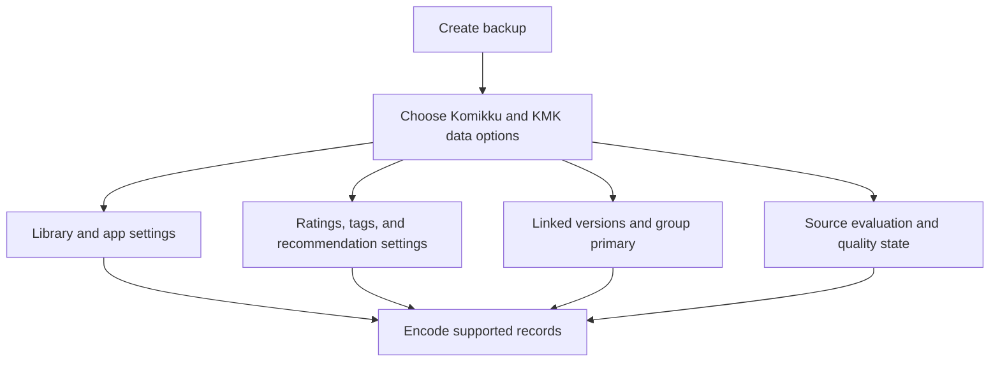
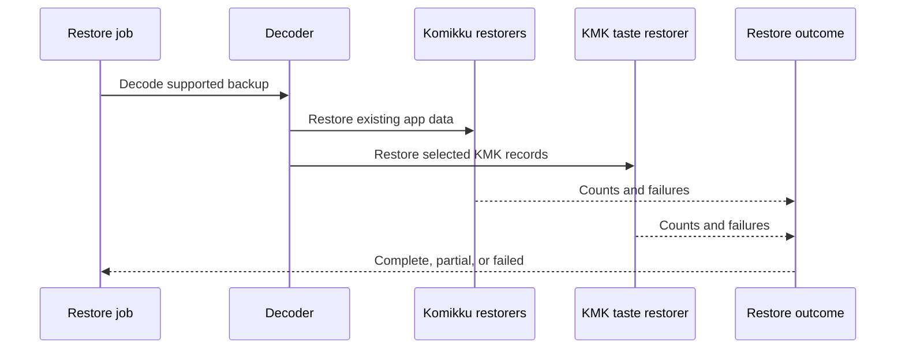
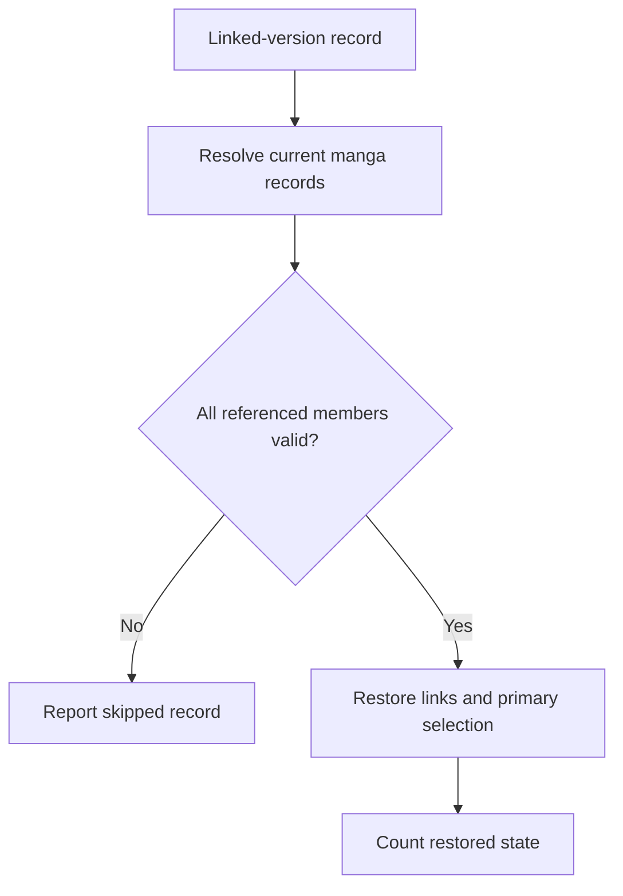
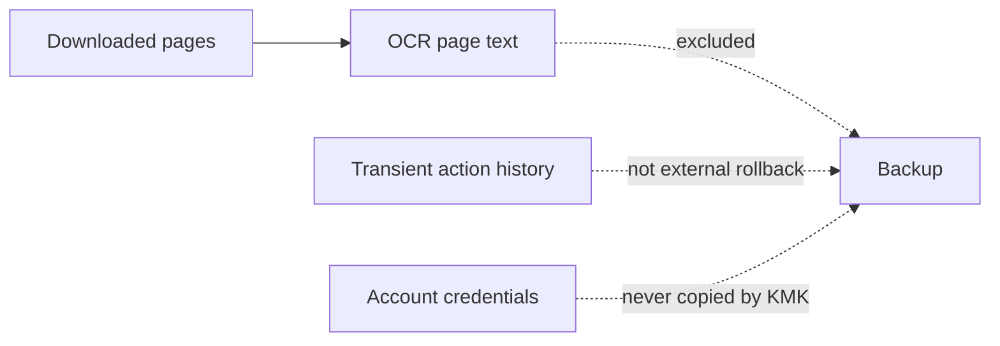

# Preserving KMK data in Komikku backups

KMK extends Komikku's established backup format with supported recommendation preferences, ratings, links, and source-quality data. The flow remains user-directed and reports partial restoration instead of presenting an incomplete restore as fully successful.

## Where you find it

Open **Settings > Data and storage**, then use Komikku's backup or restore actions. KMK data appears inside the supported backup categories rather than through a separate backup screen.

## What KMK adds to a backup

Komikku remains the owner of archive creation, destination selection, scheduling, decoding, and the overall restore report. KMK contributes supported records that would otherwise make recommendation and cross-source behavior feel reset after a restore: manga preferences, recommendation settings, linked-version groups and primary choices, source-quality state, and source-evaluation results.

The reader chooses which supported categories to include. KMK does not create a hidden second archive, copy credentials, or claim that app backup can reverse remote tracker or server-side changes.

## How to interpret a restore result

A restore can be complete, partial, cancelled, or failed. Counts from Komikku and KMK are combined into the same report, while category-specific failures remain attributable. A malformed or stale linked-version reference is skipped and reported rather than attached to the wrong manga. Cancellation remains cancellation even if earlier records were already restored.

## Privacy and storage wording

Settings summaries describe the selected storage location generically. Raw Storage Access Framework paths, provider identifiers, manga names, and backup contents are not used as ordinary summary text. A separate warning explains what a backup can contain while the destination itself remains hidden.

## Backup selection

KMK data uses the existing backup format and appears as clear backup options. It does not create a second kind of archive.

## How restore is divided

Komikku and KMK both report into the same restore result, so a partial restore cannot be shown as complete.

## Conflict-safe group restoration

Linked-version state is restored only after current records resolve consistently. Invalid references are skipped and reported.

## Deliberate exclusions

The KMK backup leaves out data that can be rebuilt or belongs to an outside service.

## Implementation reference

| Responsibility | Source |
| --- | --- |
| Build Komikku backup content | [`BackupCreator`](../../../app/src/main/java/eu/kanade/tachiyomi/data/backup/create/BackupCreator.kt) |
| Add supported KMK taste and recommendation data | [`TasteBackupCreator`](../../../app/src/main/java/eu/kanade/tachiyomi/data/backup/create/creators/TasteBackupCreator.kt) |
| Restore supported KMK data and report conflicts | [`TasteRestorer`](../../../app/src/main/java/eu/kanade/tachiyomi/data/backup/restore/restorers/TasteRestorer.kt) |
| Coordinate the complete restore operation | [`BackupRestorer`](../../../app/src/main/java/eu/kanade/tachiyomi/data/backup/restore/BackupRestorer.kt) |

OCR text, credentials, transient action history, and outside-service state are deliberately excluded. They are either regenerable, security-sensitive, or not owned by the app backup.
