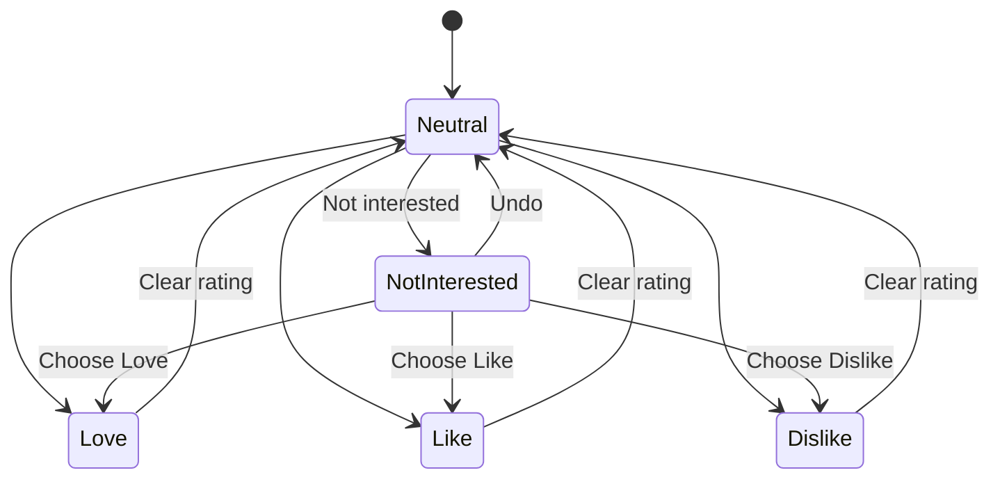
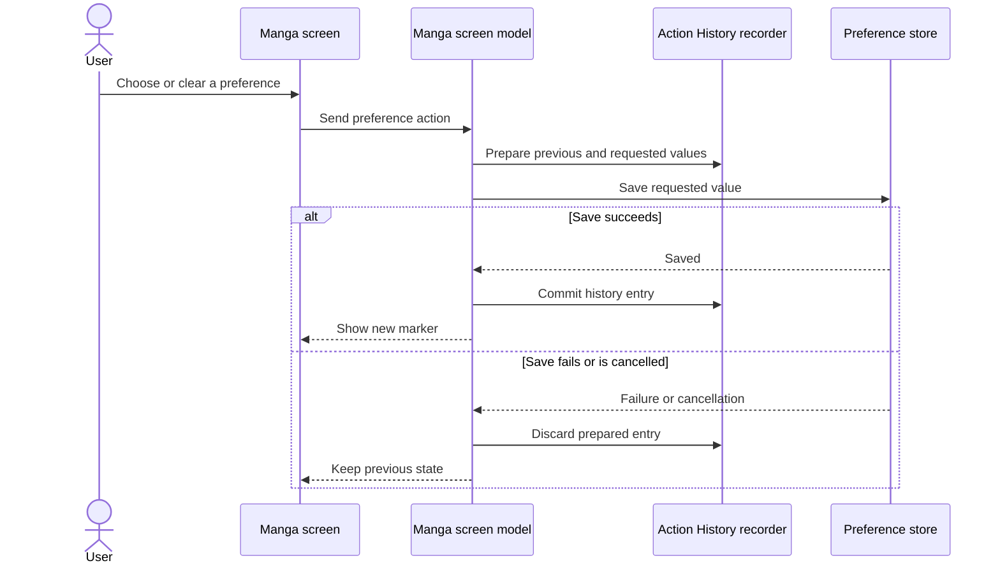
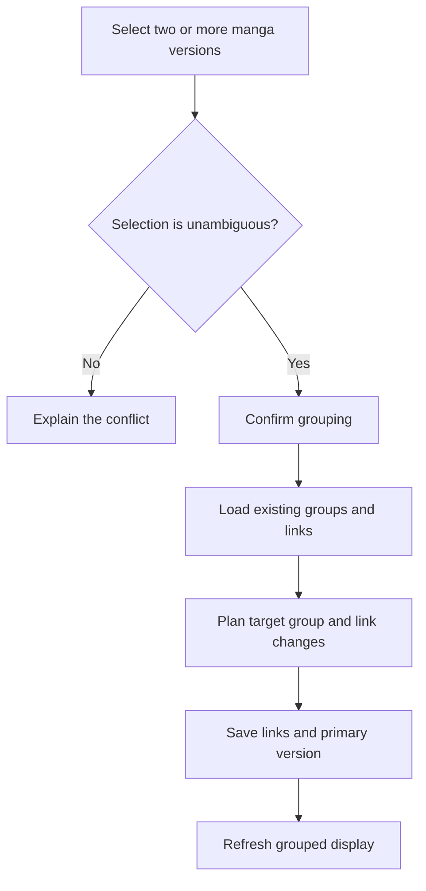
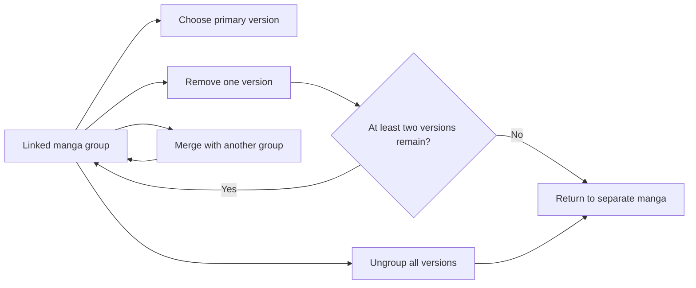
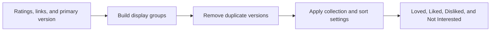

# Rating manga and managing linked versions

These diagrams cover Love, Like, Dislike, Not Interested, linked versions, group maintenance, and reversible preference changes.

## Where you find it

Use the preference action on a manga page to choose Love, Like, Dislike, or Not Interested. The For You menu opens the corresponding collections, while linked-version actions can apply a preference to selected matching versions.

## One preference model, four visible choices

Love, Like, Dislike, and Not Interested are peers in the manga preference interface. Each has a distinct label, icon, selected treatment, collection, and reversible transition. Not Interested is not hidden as an unrelated “seen” flag: selecting it replaces the neutral Rate affordance, clearing it is explicit, and selecting another rating performs one coherent preference change.

The collections help the reader review past choices. A manga belongs to the collection matching its current preference, while linked versions remain separate records unless the reader deliberately applies a choice to additional versions.

## What Action History can restore

Before a supported local preference write, KMK records the previous value. The history entry is committed only after the write succeeds. Undo first checks that the current value still matches the action being reversed; if another change occurred later, the app reports a conflict instead of overwriting the newer choice.

Actions owned by Android, a remote tracker, or another outside service are not described as fully reversible local actions. The history screen distinguishes those boundaries rather than presenting every event as if the app could restore it.

## Linked-version behavior

Linked versions group manga that the reader has confirmed as related. The group can identify a primary version for display and comparison, but grouping does not merge source records or erase their separate chapter lists. Adding, removing, or changing the primary member validates the group before saving so an invalid reference is not silently retained.

## Preference states

Not Interested is saved in the same way as Love, Like, and Dislike. Replacing it with another preference is recorded as one change.

## Reversible preference write

History is committed only after storage succeeds. Cancellation does not become a successful action.

## Create or merge a group

The app asks for confirmation before combining separate versions or existing groups.

## Maintain a group

Removing a version does not silently leave an invalid one-item group.

## Grouped display

Collections come from the saved preferences and linked versions, so they stay consistent across screens.

## Implementation reference

| Responsibility | Source |
| --- | --- |
| Define the visible Love, Like, Dislike, and Not Interested peer states | [`MangaPreferencePresentationPolicy`](../../../app/src/main/java/exh/recs/loved/MangaPreferencePresentationPolicy.kt) |
| Apply preference changes from the manga screen | [`MangaScreenModel`](../../../app/src/main/java/eu/kanade/tachiyomi/ui/manga/MangaScreenModel.kt) |
| Record reversible local changes before and after a successful write | [`EvaluationModeJournalRecorder`](../../../app/src/main/java/exh/util/EvaluationModeJournalRecorder.kt) |
| Restore a supported change only when the current value still matches | [`EvaluationModeUndoService`](../../../app/src/main/java/exh/util/EvaluationModeUndoService.kt) |

Not Interested is treated as a visible preference alongside the three rating levels. It has its own collection and marker, participates in cross-version actions, and uses the same conflict-aware undo boundary.
