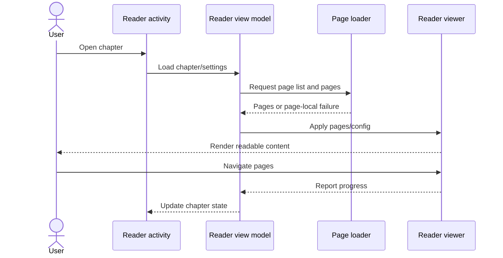
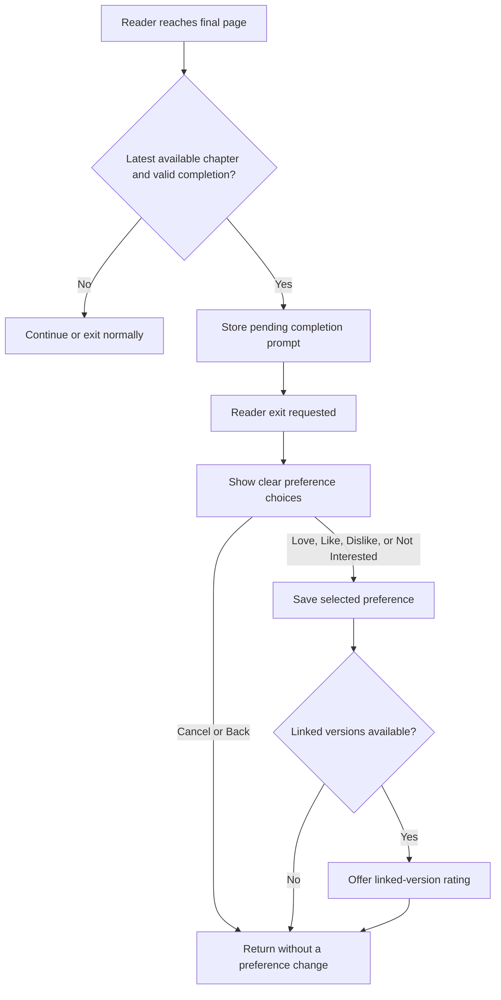
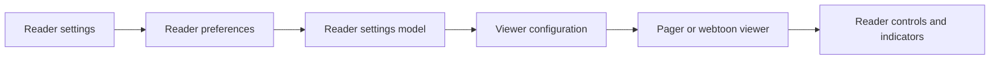
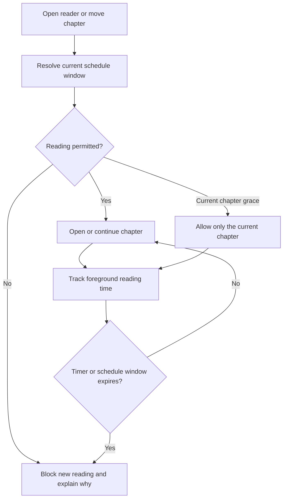
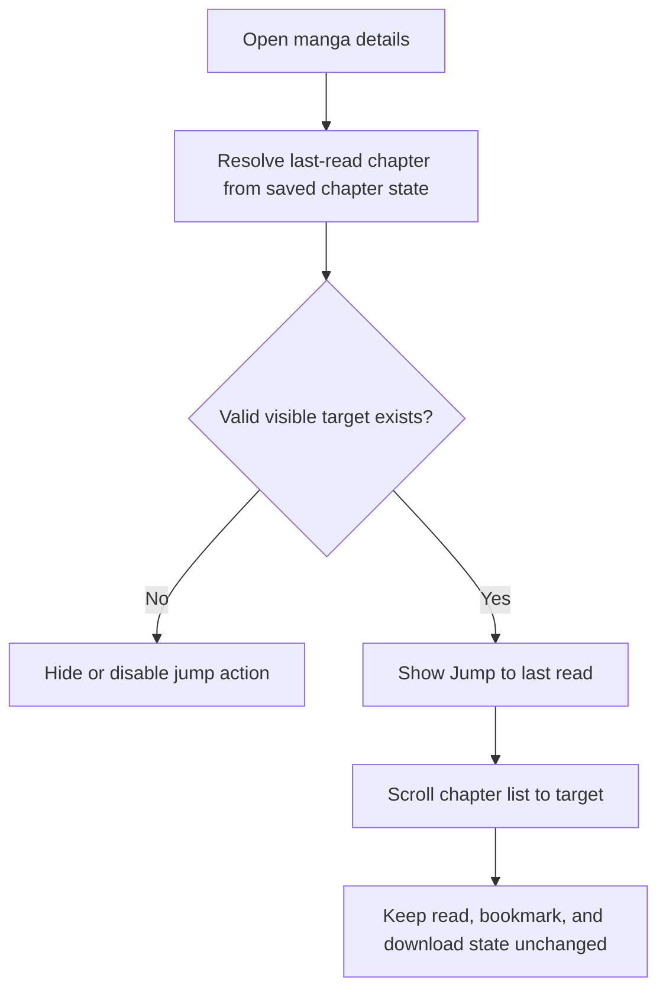

# Reading schedule, completion, and chapter navigation

These diagrams cover chapter loading, completion preferences, the optional schedule and timer, and Jump to last read.

## Where you find it

Reader timer and schedule controls appear in the reader and under **Settings > Reader**. The completion preference appears after leaving the final available chapter when enabled. **Jump to last read** appears in the manga toolbar when the chapter list contains a valid read-position target.

## What changes and what stays familiar

KMK adds optional controls around Komikku's existing reader rather than replacing its page loader, viewers, progress updates, or chapter navigation. When every KMK option is disabled, ordinary reader behavior remains unchanged. Schedule and timer checks produce visible, dismissible states and preserve back navigation; they do not rewrite chapter progress to enforce a restriction.

The schedule entry in the reader links to the same configuration owned by **Settings > Reader**. This makes the feature discoverable at the moment it matters while avoiding a second set of schedule preferences. The configuration uses the app's standard settings rows, switches, time controls, theme, localization, and accessibility semantics.

## Completion and rating behavior

After the final available chapter, the optional completion prompt clearly separates **Not now** from the primary action that opens rating choices. Accepting the offer must open the intended rating flow, including linked versions when available; dismissing or pressing back exits without writing a preference. A preference is saved only after the reader selects one.

## Jump to last read

On manga with long chapter lists, the toolbar action resolves the best available read-position target and scrolls to it. The action changes only the list position. It does not mark a chapter read, alter progress, open the reader automatically, or guess when no valid target exists. If the current sort or filter excludes the target, the action remains unavailable instead of scrolling to an unrelated chapter.

## Chapter reading sequence

A page failure stays with that page load, while reading progress continues through Komikku's existing reader flow.

## Completion preference

The prompt appears after reader exit, not over the final page. Cancel and confirmation remain separate actions.

## Reader settings flow

Optional KMK controls extend the existing settings and viewer configuration rather than replacing them.

## Timer and schedule enforcement

Alternate chapter navigation cannot bypass a restriction. The schedule remains local and off by default.

## Jump to last read

Jump to last read changes only the list position. It does not open a chapter or modify reading history.

## Implementation reference

| Responsibility | Source |
| --- | --- |
| Own reader loading, progress, completion, timer, and schedule state | [`ReaderViewModel`](../../../app/src/main/java/eu/kanade/tachiyomi/ui/reader/ReaderViewModel.kt) |
| Present reader controls and deferred completion prompts | [`ReaderActivity`](../../../app/src/main/java/eu/kanade/tachiyomi/ui/reader/ReaderActivity.kt) |
| Show the manga-page Jump to last read action | [`MangaToolbar`](../../../app/src/main/java/eu/kanade/presentation/manga/components/MangaToolbar.kt) |
| Resolve the target chapter without changing chapter state | [`MangaScreenModel`](../../../app/src/main/java/eu/kanade/tachiyomi/ui/manga/MangaScreenModel.kt) |

The schedule and timer remain optional. The jump action appears only when the current chapter list contains a valid last-read target, and using it changes list position only.
