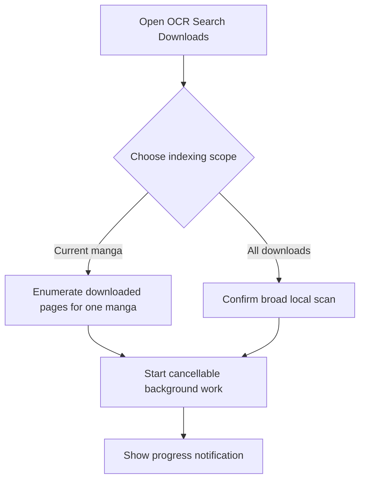
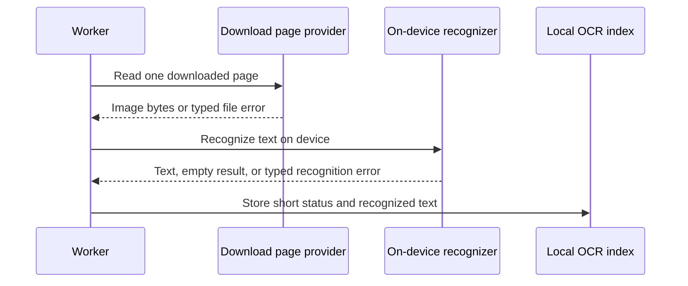
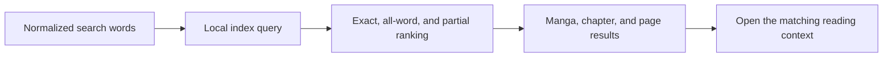
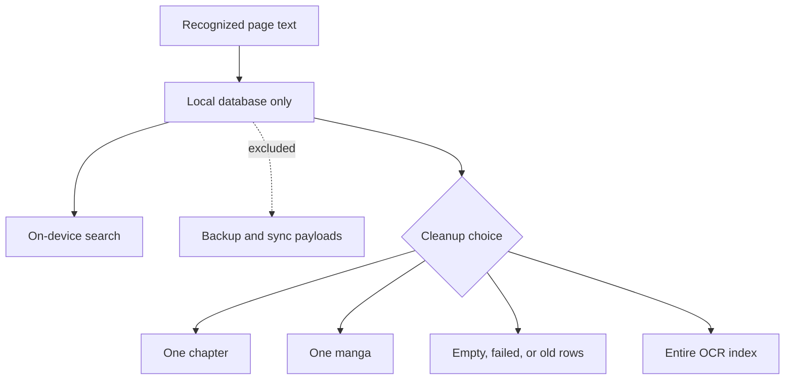

# OCR search for downloads

OCR Search Downloads builds a local text index from downloaded pages, then lets the reader search that text and return to the matching manga, chapter, and page context.

## Where you find it

Open **OCR Search Downloads** from the app's search tools. Index controls choose the current manga or all downloaded manga; result and cleanup controls stay within the same feature.

## What OCR Search Downloads is for

Ordinary manga search can find titles and metadata, but it cannot find a phrase that appears inside a downloaded page. OCR Search Downloads creates a local, regenerable index for that use case. The reader chooses the scope, watches bounded background progress, searches recognized words, and opens the matching manga, chapter, and page context.

Only downloaded pages are candidates. The feature does not crawl remote chapters, upload page images, or treat an empty recognition result as a successful text match. A page can be indexed, empty, unreadable, missing, or failed, and those states remain distinguishable for retry and cleanup.

## Work, cancellation, and results

Indexing is performed as cancellable background work because a large download library can take time and battery. Cancelling stops future page work without relabeling the operation as success. Completed rows remain usable, so a partial run can still support search and can later continue or be cleared deliberately.

Search normalizes the query and ranks stronger all-word matches above partial matches. Opening a result resolves current manga and chapter records before navigating; stale index rows do not justify opening an unrelated page.

## Public screenshot status

No current OCR results-screen capture exists in the reviewed image set. This is a capture gap, not a restriction on showing OCR results. A future screenshot may include recognized page text, manga or chapter context, and reading position when those details help explain the feature. It must hide source identity and must still omit account information, device identifiers, raw URLs, local storage paths, notifications, and unrelated apps.

## Entry and indexing

The broad scan requires confirmation because it can use significant time, storage, CPU, and battery. Both scopes use the same cancellable worker path.

## Page processing

Each page receives a success, empty, or clear failure status. Diagnostics do not include raw error messages or page identities.

## Search and navigation

Search gives stronger word matches a higher position and keeps enough page information to open the correct place in the reader.

## Privacy and cleanup

The index is local and regenerable. Cleanup changes only index rows and does not delete the downloaded page files.

## Implementation reference

| Responsibility | Source |
| --- | --- |
| Own index, search, cancellation, result, and cleanup state | [`OcrSearchScreenModel`](../../../app/src/main/java/exh/ocr/OcrSearchScreenModel.kt) |
| Present indexing progress, search results, and cleanup choices | [`OcrSearchScreen`](../../../app/src/main/java/exh/ocr/OcrSearchScreen.kt) |
| Store and query searchable page records locally | [`OcrIndexRepository`](../../../app/src/main/java/exh/ocr/OcrIndexRepository.kt) |

Recognized text remains on the device and is excluded from KMK backup and sync. Cleanup removes index records, not manga pages or downloaded files.
