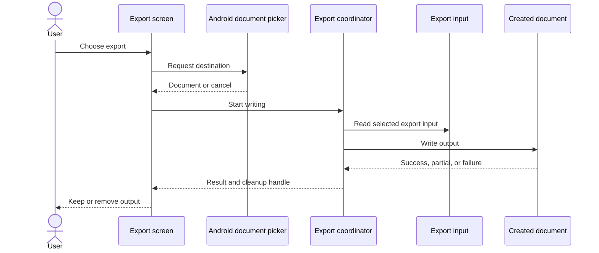
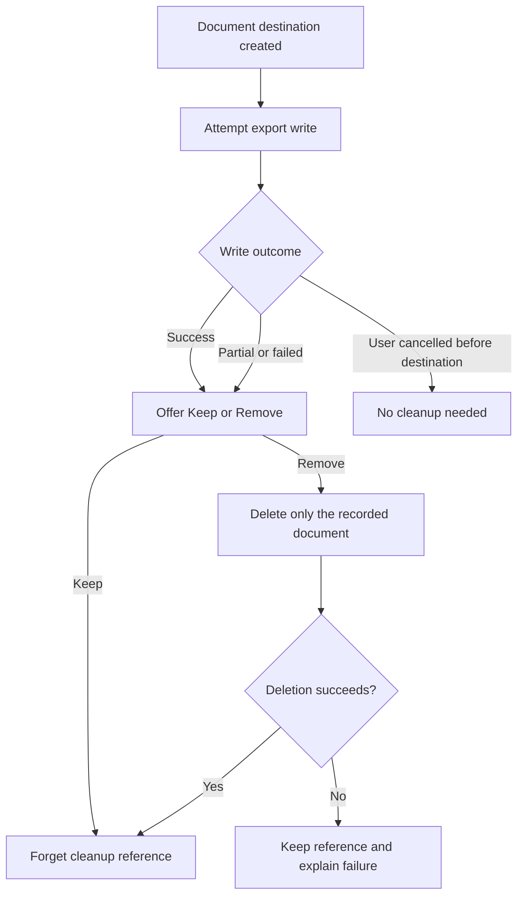
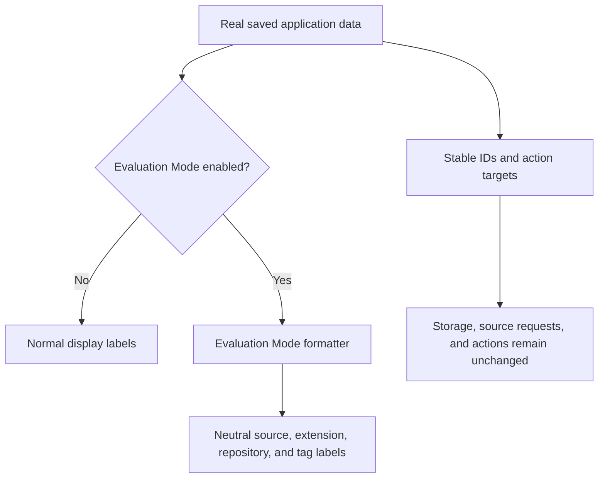
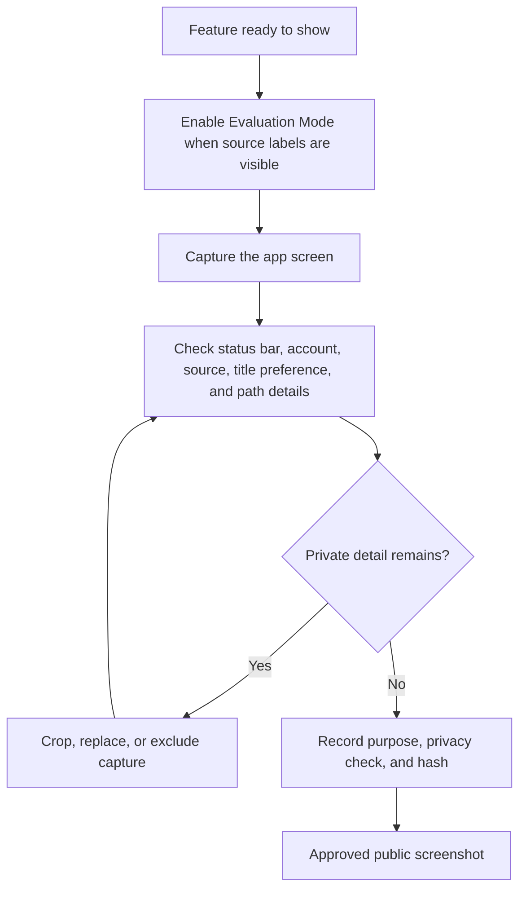

# Sharing screenshots and exported files safely

These diagrams explain how the app creates and cleans up exported files, hides source names in Evaluation Mode, and decides which screenshots are safe to publish.

## Where you find it

Evaluation Mode is available from KMK's advanced or diagnostic controls and affects supported labels throughout the app. Export actions remain next to the feature or extension data they export and use Android's document picker for the destination.

## Two separate safety tools

Evaluation Mode is a presentation aid for screenshots. It replaces supported source, repository, and similar identity-bearing labels with stable neutral text while leaving saved identifiers, network requests, candidate selection, and actions unchanged. It does not anonymize manga artwork, titles, reader pages, account screens, status bars, notifications, or Android system UI, so every public image still requires review.

Export cleanup solves a different problem. After Android creates a document and the export succeeds, KMK can offer to remove that exact returned document. It does not search the destination folder by a guessed filename, recursively clean storage, or remove an earlier file that merely looks similar.

## Recommendation and extension exports

For You and Top Picks can create a versioned recommendation bundle for sharing or later review. Import validates the structure and resolves source references before showing a review screen; importing the file alone does not add manga to the library. Extension export can write one package or a selected group as an archive, and deliberately excludes ratings, history, account information, and other app data.

Both export families use Android's document APIs and the same exact-artifact cleanup rule. Cancellation before document creation, a partial write, successful completion, keeping the file, removing it, and cleanup failure remain separate outcomes.

## Public-image review checklist

A publishable image must show the intended loaded state, be cropped to the app, use Evaluation Mode where source identities may appear, and omit device identifiers, account details, local paths, raw URLs, notifications, private reading history, and unrelated apps. Empty, loading, debug-only, or outdated sample screens are not substitutes for a current feature state. Approved image files and their SHA-256 hashes are listed in the [technical screenshot manifest](../technical-reference/screenshot-manifest.xml).

## Export sequence

Android creates the destination before the app writes to it. The app therefore keeps an exact reference for cleanup after failed or partial writes.

## Clean up the created file

Cleanup never searches a folder or deletes unrelated files.

## What Evaluation Mode changes

Evaluation Mode changes visible labels only. It helps with screenshots but does not create a separate set of app data.

## Review a screenshot

Only screenshots that pass the documented privacy check are included in the public guide.

## Implementation reference

| Responsibility | Source |
| --- | --- |
| Replace identity-bearing labels at presentation time | [`EvaluationModeFormatter`](../../../app/src/main/java/exh/util/EvaluationModeFormatter.kt) |
| Export a versioned recommendation bundle | [`RecommendationBundleExporter`](../../../app/src/main/java/exh/recs/share/RecommendationBundleExporter.kt) |
| Validate and review an imported recommendation bundle | [`RecommendationBundleImportScreen`](../../../app/src/main/java/exh/recs/share/RecommendationBundleImportScreen.kt) |
| Export only the chosen extension packages | [`ExtensionApkExporter`](../../../app/src/main/java/eu/kanade/tachiyomi/extension/util/ExtensionApkExporter.kt) |
| Record reviewed public screenshots and hashes | [`screenshot-manifest.xml`](../technical-reference/screenshot-manifest.xml) |

Evaluation Mode affects labels only. It does not replace saved IDs, alter requests, redirect an action, or make an otherwise unsafe screenshot publishable. Export cleanup is limited to the exact document returned by the current Android document operation.
