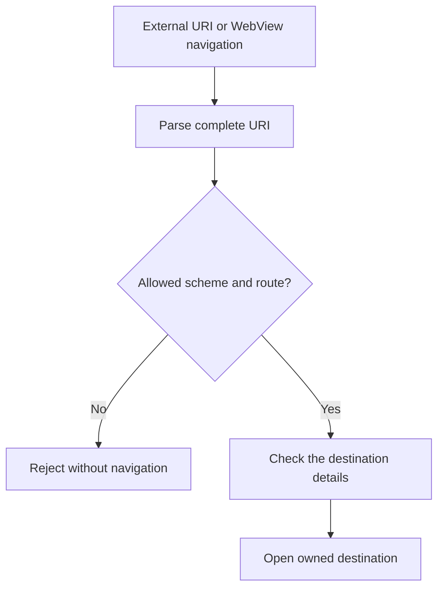
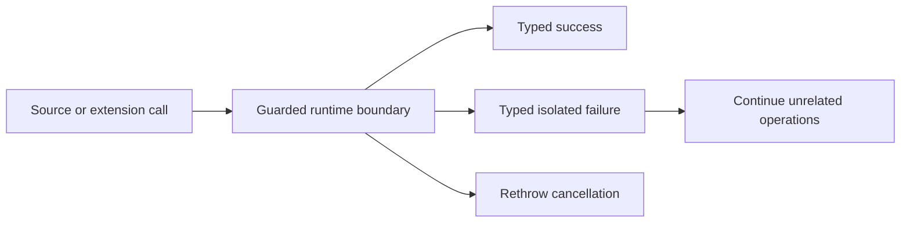
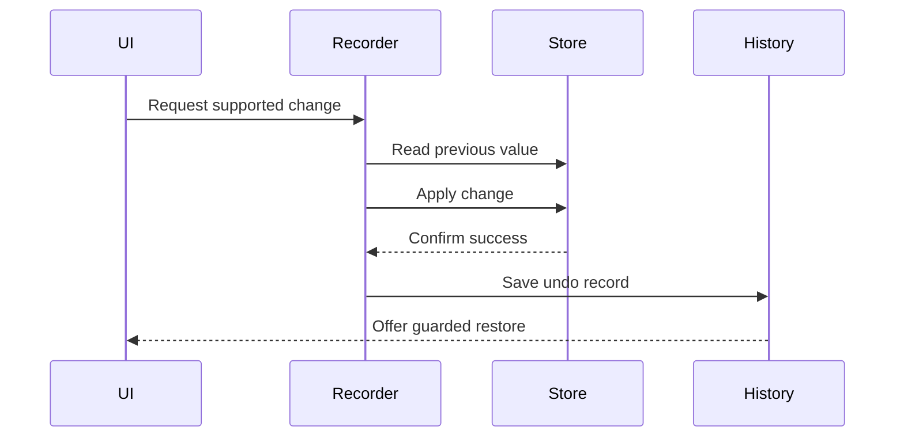
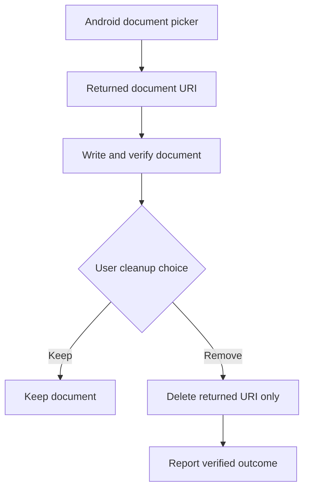

# Validating links, actions, and file cleanup

These flows show where KMK accepts outside input, calls extensions, changes local state, and creates documents. Each boundary has an explicit accepted, rejected, cancelled, failed, or verified result.

## Where it applies

These boundaries are shared infrastructure rather than one destination. They apply when the app opens an outside link, calls an extension, records a reversible local action, or creates and removes a document.

## The shared rule

Every boundary validates the value it actually intends to use, limits the operation to that value, and reports a typed outcome. A string that resembles a link is not navigation permission. A history record is not permission to overwrite newer state. A filename is not proof that a document belongs to the current export. These checks live in the owning call path rather than in explanatory UI text alone.

## Outcomes remain distinguishable

Success, ordinary failure, cancellation, malformed input, conflict, and unavailable state have different meanings and remain different results. This matters for both safety and recovery: retrying a temporary source failure can be reasonable, while retrying a rejected deep link or overwriting a conflict would not be.

User-facing diagnostics use short categories and next steps. Raw URLs, document references, account data, source responses, exception objects, and private manga context stay out of visible messages and public screenshots.

## Navigation validation

Malformed values and scheme-prefix lookalikes do not reach application routes.

## Failure isolation

Cancelling an action stops it normally. Other failures stay with the action that caused them.

## Reversible local change

The app does not add an undo record when a change fails. Undo also refuses to overwrite a newer value.

## Clean up one document

Cleanup removes only the document created by the current action. It never searches and clears a whole folder.

## Implementation reference

| Responsibility | Source |
| --- | --- |
| Validate and normalize incoming deep-link intents | [`DeepLinkIntentSanitizer`](../../../app/src/main/java/eu/kanade/tachiyomi/ui/deeplink/DeepLinkIntentSanitizer.kt) |
| Isolate extension failures and preserve cancellation | [`SourceRuntime`](../../../app/src/main/java/eu/kanade/tachiyomi/source/SourceRuntime.kt) |
| Record and restore supported conflict-safe local actions | [`EvaluationModeUndoService`](../../../app/src/main/java/exh/util/EvaluationModeUndoService.kt) |
| Limit export cleanup to the returned document | [`ExtensionApkExporter`](../../../app/src/main/java/eu/kanade/tachiyomi/extension/util/ExtensionApkExporter.kt) |

The public [security policy](../../../SECURITY.md) describes responsible reporting. It intentionally does not publish hostile payloads, credentials, private routes, or device-specific reports.
