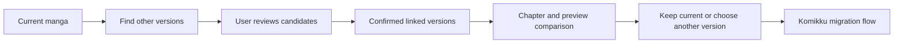
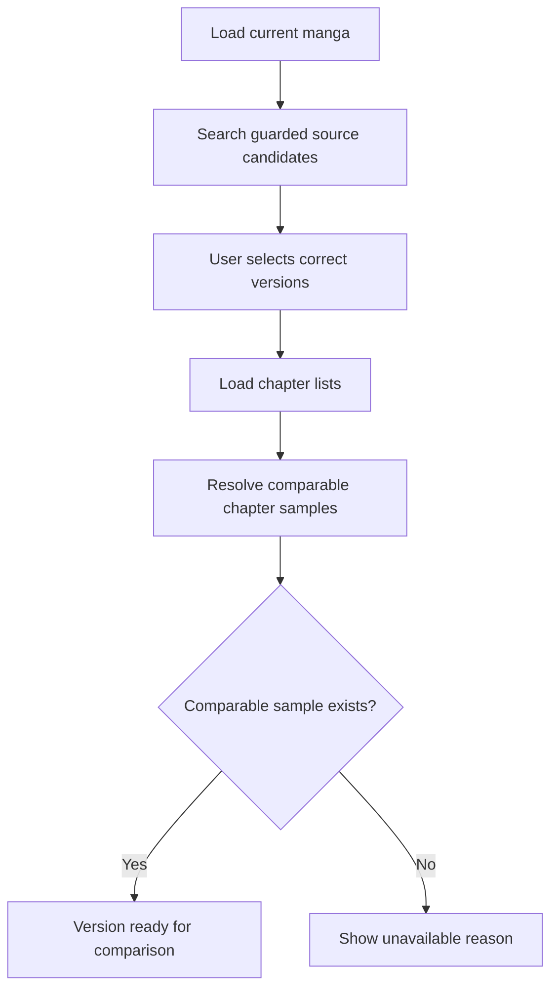
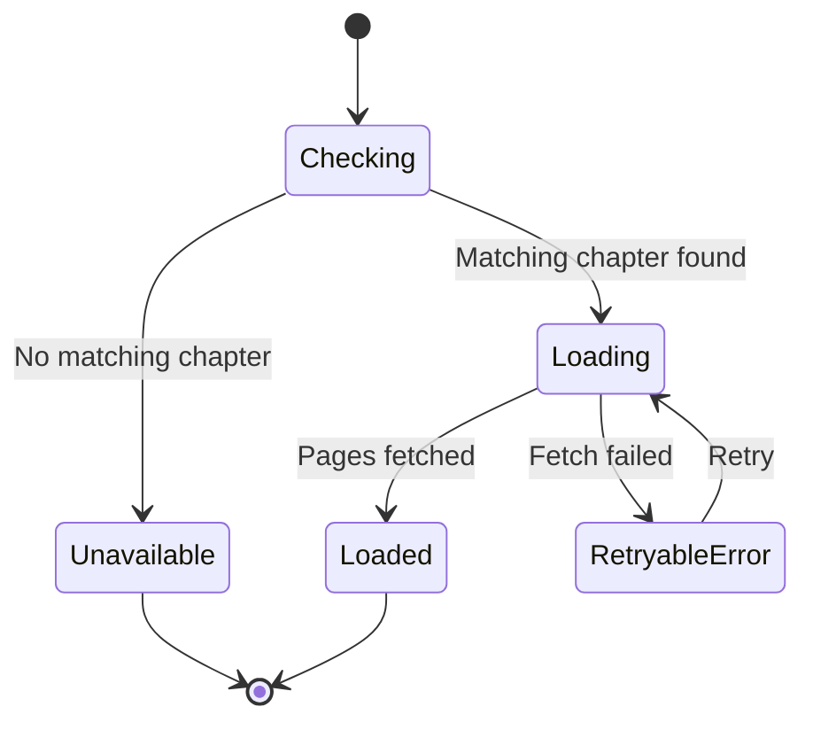
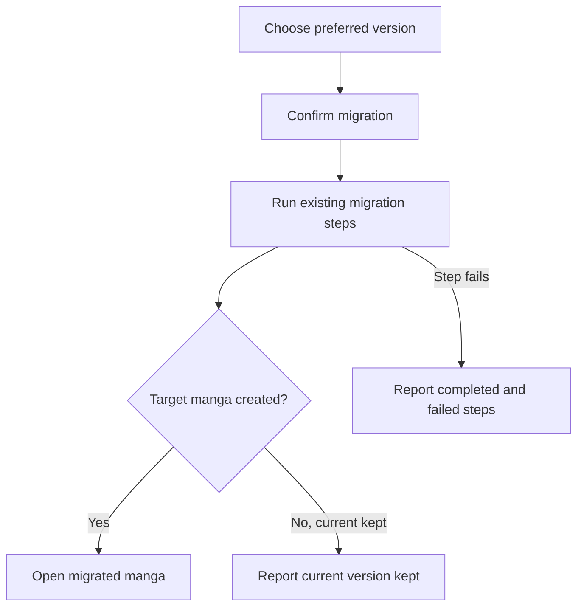

# Cross-source matching and Best Version

These diagrams follow a manga from cross-source matching through comparison and the existing Komikku migration flow.

## Where you find it

Open a manga and choose **Find other versions** from its actions. After compatible versions are linked and enough comparison data exists, **Best Version** can compare them before handing an accepted change to Komikku's migration flow.

## Matching and comparison overview

The user confirms matches before they become linked versions.

## Prepare comparable versions

A missing chapter or preview is displayed as unavailable; it is not treated as a failed migration.

## Preview state

Each linked version tracks its own preview. If one preview fails, the other comparisons remain visible.

## Migration result

The result clearly separates a successful migration, a decision to keep the current version, and a failure. It does not promise to undo changes that already finished outside this step.

## Implementation reference

| Responsibility | Source |
| --- | --- |
| Present matching versions and selection across sources | [`CrossExtensionMatchScreen`](../../../app/src/main/java/exh/recs/matching/CrossExtensionMatchScreen.kt) |
| Prepare comparable candidates and own Best Version state | [`BestVersionCompareScreenModel`](../../../app/src/main/java/exh/recs/bestversion/BestVersionCompareScreenModel.kt) |
| Continue through Komikku's established migration workflow | [`migrating` package](../../../app/src/main/java/eu/kanade/tachiyomi/ui/browse/migration/manga/) |

KMK owns matching, linking, and comparison. When the reader chooses another version, the existing Komikku migration flow remains responsible for the actual library migration.
