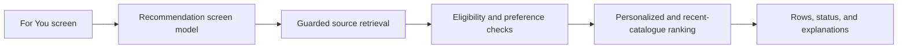
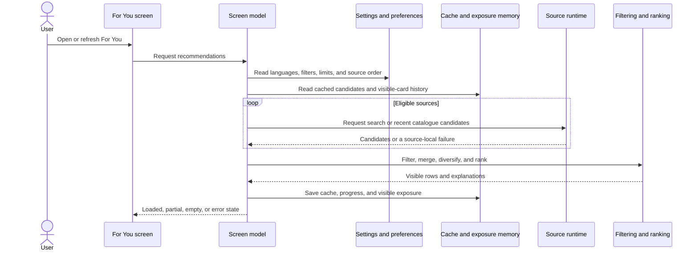
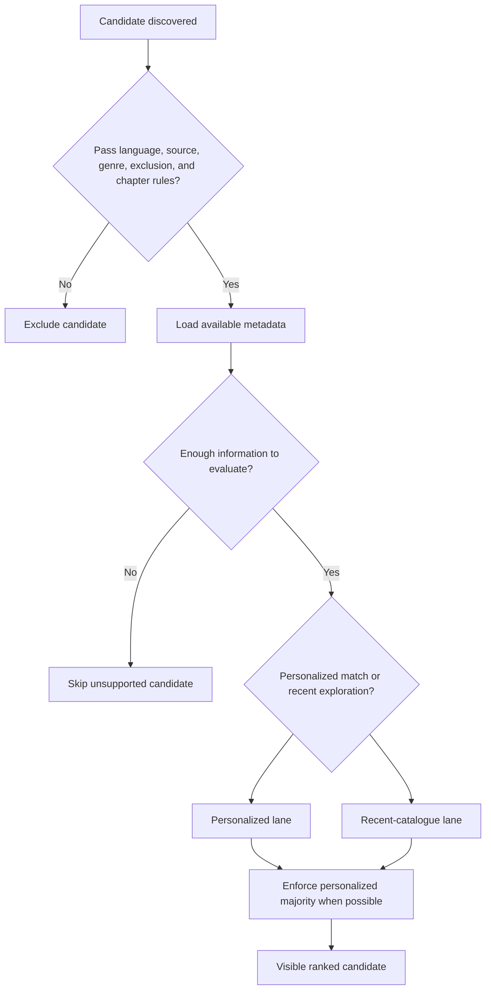
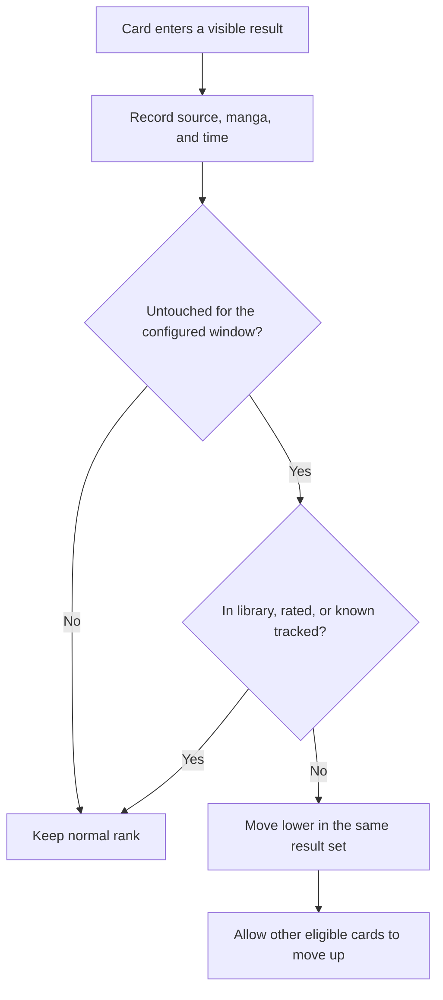

# For You

For You gathers recommendations from eligible installed sources, applies the reader's filters and preferences, adds a controlled amount of recent discovery, and rotates repeatedly shown untouched manga lower in the same result set. The diagrams below explain each stage; the text after them explains what the stage means in the app.

## Where you find it

Open **Browse**, then select **For You**. The page contains topic shortcuts followed by recommendation rows for the sources that are eligible under the current settings.

## Feature overview

The screen model coordinates the work. Source failures are contained before candidates reach filtering and ranking.

## Retrieval and display

Each source is handled independently. One failing source can produce a row-level explanation without discarding successful rows.

## Candidate eligibility

Recent-catalogue entries add variety but never bypass the normal safety and preference rules.

## Exposure-aware refresh

Exposure memory changes ordering only. It does not delete manga or override library, preference, or verified tracking state.

## Implementation reference

| Responsibility | Source |
| --- | --- |
| Own screen state, source work, refresh, and visible exposure recording | [`BrowsePersonalRecommendationsScreenModel`](../../../app/src/main/java/exh/recs/BrowsePersonalRecommendationsScreenModel.kt) |
| Render recommendation rows and loaded, partial, empty, and error states | [`BrowsePersonalRecommendationsTab`](../../../app/src/main/java/exh/recs/BrowsePersonalRecommendationsTab.kt) |
| Apply exposure-aware display ordering and tracked-state safety | [`RecommendationDisplayReranker`](../../../app/src/main/java/exh/recs/RecommendationDisplayReranker.kt) |
| Merge personalized and recent-discovery candidates | [`RecommendationCandidateMemoryRanker`](../../../app/src/main/java/exh/recs/memory/RecommendationCandidateMemoryRanker.kt) |

The screen model coordinates the feature. The policy files keep filtering and ordering rules testable without requiring a rendered Android screen.
