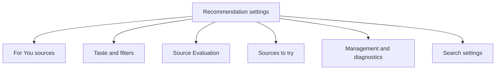
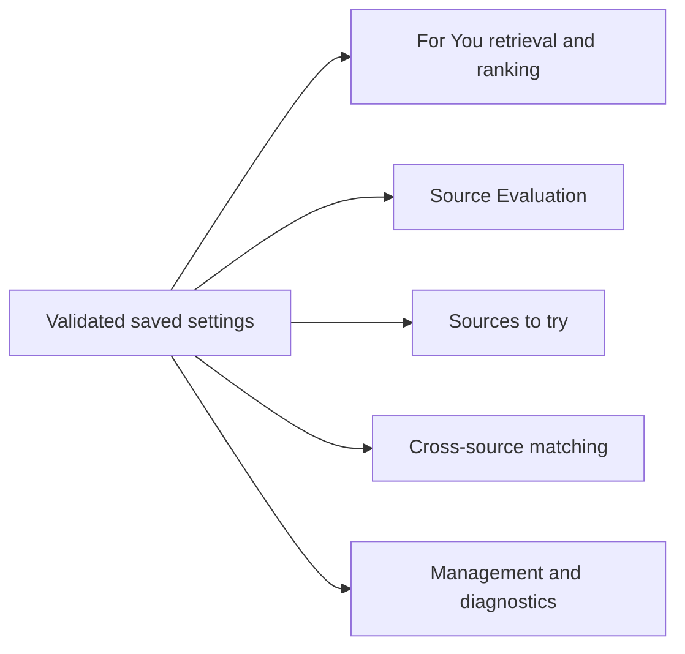
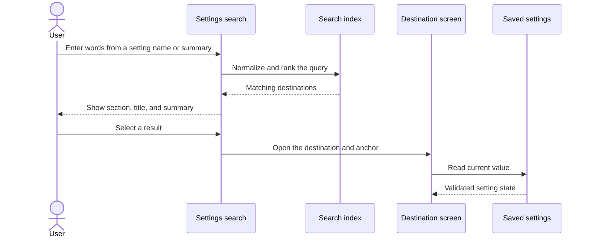
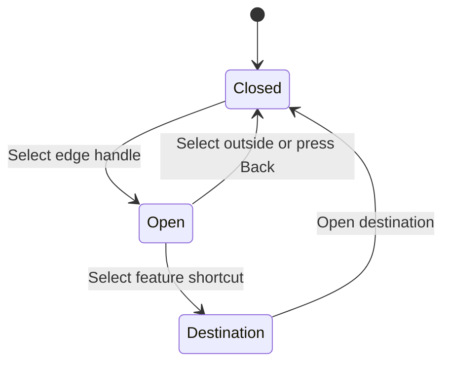

# Recommendation settings

Recommendation settings use the same lists, sections, search, and navigation patterns as the rest of Komikku.

## Where you find it

Open For You and select its settings action. On tablets, the quick-access panel reaches the same five destinations: For You sources, Taste and filters, Source Evaluation, Sources to try, and Management and diagnostics.

## Navigation map

The five visual sections group related controls and keep the first page short enough to scan.

## Settings affect features

Values are checked before use. Invalid stored numbers fall back to safe limits instead of reaching feature policies unchanged.

## Search for a setting

Search results explain both the setting and the section that contains it.

## Quick-access panel

The tablet quick-access panel provides the same destinations as the main settings index. Its handle and rows use stable touch targets and dismiss through normal Back behavior.

## Implementation reference

| Responsibility | Source |
| --- | --- |
| Build the five-section settings index and route each row | [`RecommendationSettingsIndexScreen`](../../../app/src/main/java/exh/recs/settings/RecommendationSettingsIndexScreen.kt) |
| Present For You source, taste, filter, discovery, and management settings | [`settings` package](../../../app/src/main/java/exh/recs/settings/) |
| Save recommendation preferences through Komikku's preference system | [`SourcePreferences`](../../../app/src/main/java/eu/kanade/domain/source/service/SourcePreferences.kt) and [`RecommendationsSettingsScreenModel`](../../../app/src/main/java/exh/recs/settings/RecommendationsSettingsScreenModel.kt) |

The index follows Komikku's existing settings components, so theme, localization, search, accessibility, and Back behavior remain consistent with the rest of the app.
