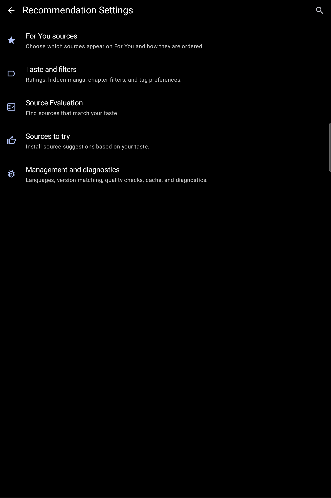
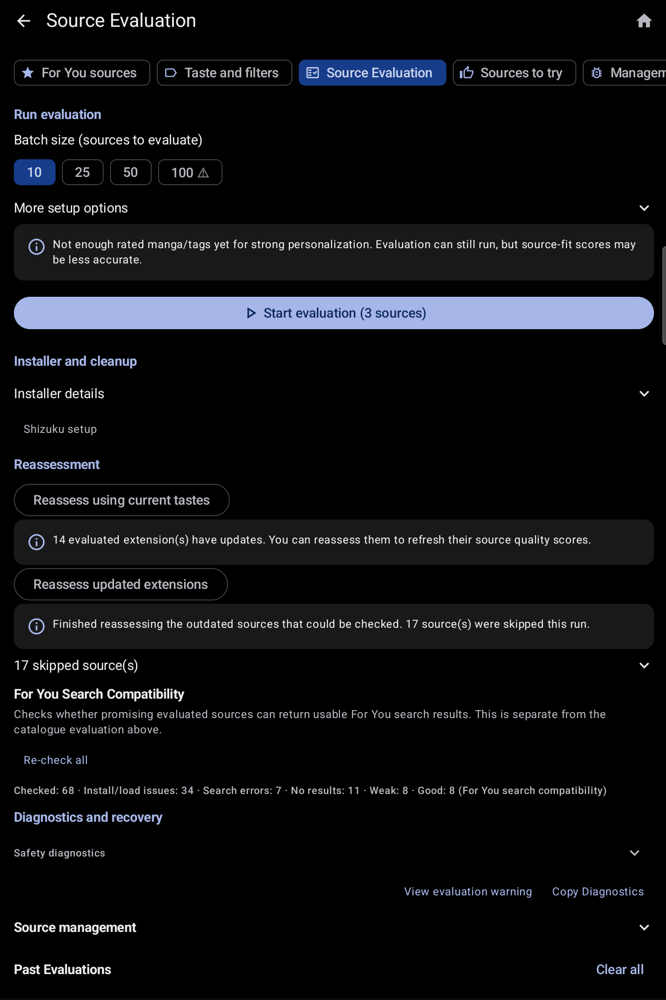
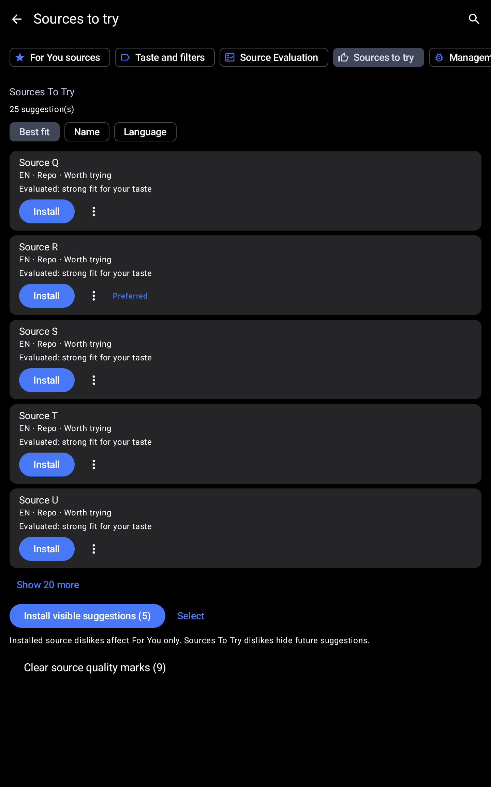
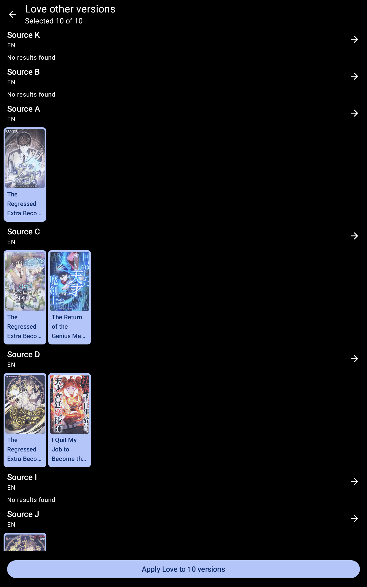
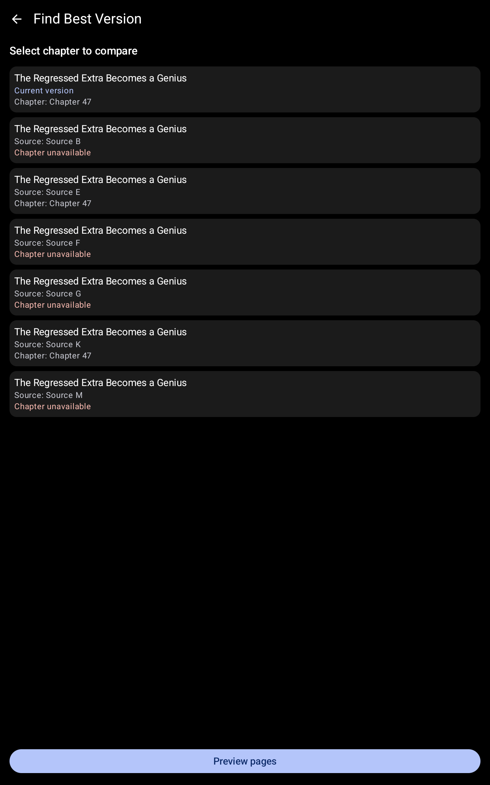
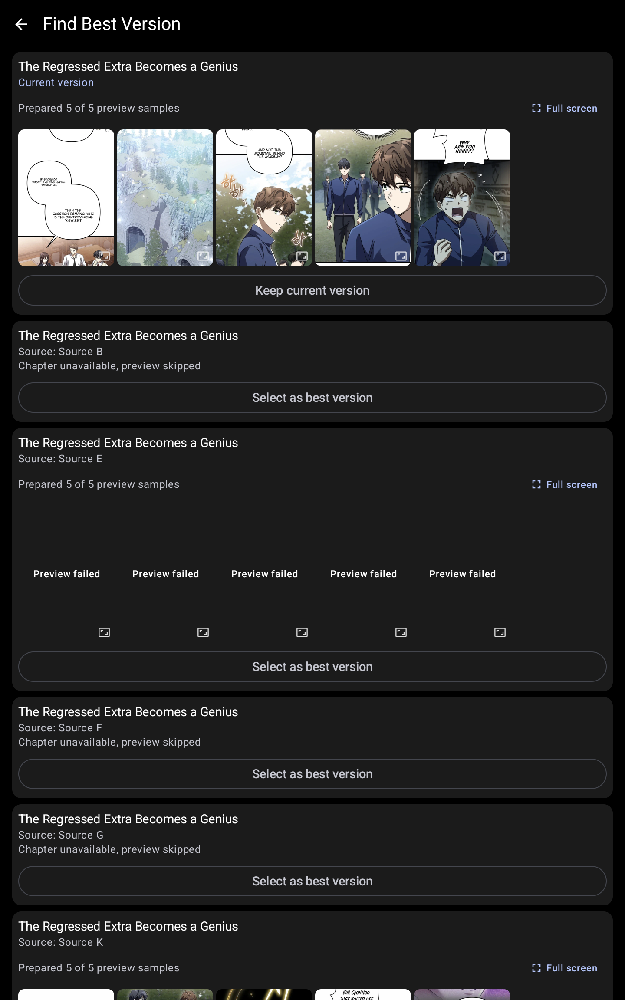
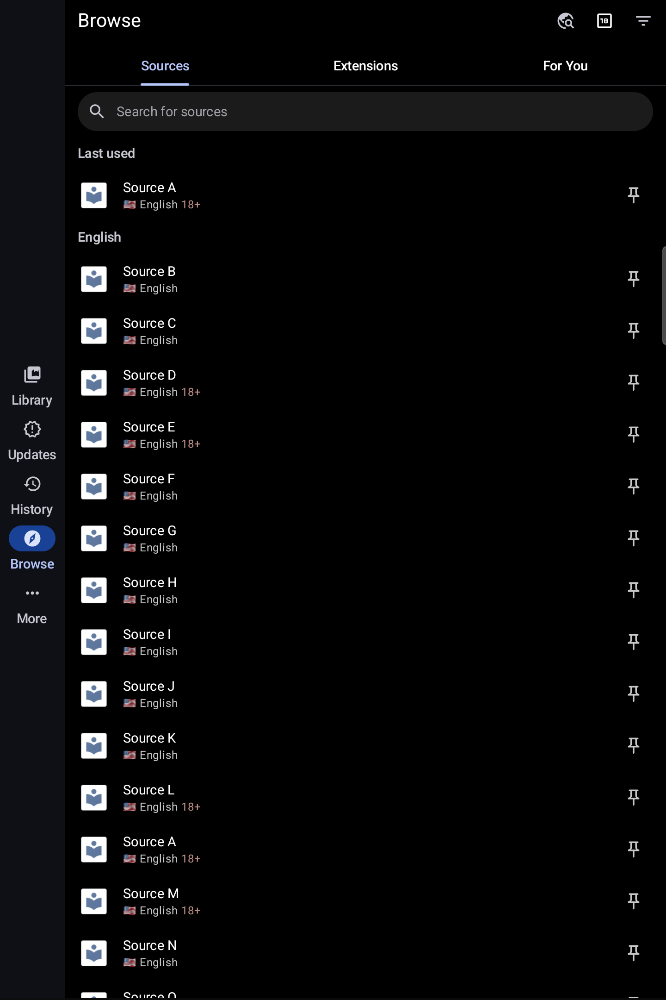

# KMK user guide

This guide explains how to find and use KMK features. Each section starts with the actions to take, then explains the result and any important limitation. Screenshots appear where a reviewed capture can show the feature without exposing private activity. For routes that depend on manga, chapter, source, account, or storage details, the linked feature explanation describes the flow instead. The [screenshot coverage table](visual-guide/README.md#screenshot-coverage) records every decision.

## For You

1. Open **Browse**.
2. Select the **For You** tab.
3. Wait for the recommendations to finish loading. Each row comes from a source that passed your settings and shows its strongest matching tags.
4. Select a manga card to open its details, or select the arrow at the end of a row to see more results from that source.
5. Use refresh after changing ratings, filters, source order, or discovery settings.

*For You in Evaluation Mode. The recommendations stay visible while source names are hidden.*

Before displaying a manga, For You checks your language, blocked genres and tags, source settings, exclusions, and minimum chapter count. Personalized matches remain the majority when enough are available. A smaller selection from each source's recent catalogue can add variety, but it must pass the same checks. If you repeatedly leave a visible card untouched for the configured number of days, the app moves it lower instead of removing it.

If one source fails, results from other sources remain available. When the page is empty or incomplete, read the message on the affected row; the whole app has not necessarily failed.

### Top Picks and bulk actions

1. Open **Top Picks** from For You to review the strongest combined matches.
2. Long-press a manga card to enter selection mode, then tap additional cards to include them.
3. Apply Love, Like, Dislike, Not Interested, or Clear Rating from the selection bar. With one card selected, version comparison and Open are also available.
4. Read the completion message before leaving selection mode. Supported local changes also appear in Action History.

### Recommendation bundles

1. From the For You overflow menu, choose **Export Top Picks** to create a versioned recommendation bundle through Android's document picker. Source-row and rated-collection export actions create the same reviewed bundle format for their current list.
2. To import one, open **Settings > Data and storage > Import recommendation bundle** and choose the JSON file.
3. Review resolved, missing-source, ambiguous, unsupported, and already-in-library entries on the import screen.
4. Select the ready entries you want, then confirm the separate library-add action.

Opening a bundle never adds manga automatically. Invalid structure and unresolved sources remain visible instead of being guessed.

### Group recommendations

1. Open a Loved, Liked, Disliked, or linked-version collection.
2. Open an item's menu and choose its recommendation action, or select a confirmed group and choose **See group recommendations**.
3. Review the progressive source rows. A row can time out or fail without removing results from another source.
4. Open a source row to continue beyond its configured initial preview.

## Recommendation settings

1. From For You, select the settings icon.
2. Choose one of the five sections: **For You sources**, **Taste and filters**, **Source Evaluation**, **Sources to try**, or **Management and diagnostics**.
3. Change a setting with the switches, choices, and dialogs used elsewhere in Komikku.
4. Return to For You and refresh when the screen asks for recommendation regeneration.

*The main settings page keeps related controls together instead of placing every option in one long list.*

You can configure:

- Source order and languages.
- Blocked genres and tags.
- Minimum chapters and result limits.
- The share of recent-catalogue results.
- How long visible cards keep their position.
- Evaluation, matching, quality checks, cache, and diagnostics.
- Search across individual settings and use the quick-access row or For You side panel to move between sections.
- Review taste diagnostics, rating-derived tag suggestions, source-quality history, and explicit recovery actions.

The app checks stored values before using them and replaces invalid values with safe limits.

*Management and diagnostics keeps maintenance tools, saved-data controls, and short status summaries in one place.*

## Ratings and Not Interested

See [Ratings and linked versions](feature-guides/rating-manga-and-managing-linked-versions.md) for the saved-state and undo flow.

*Choose the matching versions that should share the Not Interested preference.*

1. Open a manga.
2. Use the preference action to choose **Love**, **Like**, **Dislike**, or **Not interested**.
3. The main preference button changes to show your choice. Choosing Love, Like, or Dislike while Not Interested is active replaces Not Interested in one saved change.
4. Use **Clear rating** or **Undo not interested** to return to neutral.
5. Open the corresponding Loved, Liked, Disliked, or Not Interested collection from the For You menu to review those entries.

When Action History is available in Evaluation Mode, supported changes include the value that existed before the change. You can reverse bulk For You actions from Action History. The short confirmation message shown after a bulk action does not currently include its own **Undo** button.

## Source Evaluation

1. Open **Recommendation Settings** and select **Source Evaluation**.
2. Choose how many sources to evaluate at once and review any warning.
3. Select **Start evaluation**.
4. You can leave the screen while evaluation continues.
5. Review completed, skipped, weak, failed, or partial outcomes.
6. Use reassessment when installed extensions change or when the app reports stale evaluation data.

*Source Evaluation can show useful progress and partial results without displaying raw source errors.*

Source Evaluation checks whether a source is suitable; For You separately checks whether it can retrieve recommendations. Diagnostics show short categories and counts instead of raw errors, requests, credentials, or account details.

## Sources to try

See [Sources to try and source priority](feature-guides/finding-and-prioritizing-sources.md) for suggestion, filtering, and installation handoff states.

*Sort source suggestions by fit, name, or language before choosing an installation action.*

1. Open **Recommendation Settings** and select **Sources to try**.
2. Review compatible non-installed source suggestions based on your taste and source evaluations.
3. Choose a suggestion to open Android's normal extension installation screen.
4. Return to evaluation or For You after installation if the new source needs assessment.

If the extension list, package, or network response is unavailable, the app shows an unavailable or failed state. Test-only sample data is not included in release builds.

## Find other versions and Best Version

See [Finding and comparing manga versions](feature-guides/finding-and-comparing-manga-versions.md) for search, linking, comparison, and migration handoff.

*Review the matches found across sources and keep only the versions that belong together.*

1. Open a manga and choose **Find other versions** from its actions.
2. Review versions found through other sources and deselect incorrect matches.
3. Confirm the versions that should be linked or grouped.
4. Open **Best Version** when multiple linked versions have enough comparable information.
5. Choose comparable chapter samples when automatic matching needs help.
6. Review page previews. A missing preview affects only that version.
7. Keep the current version or continue to Komikku's migration confirmation.

| Choose chapter samples | Compare previews |
| --- | --- |
|  |  |

Comparison does not alter the library. A library change begins only after you select another version and confirm the established migration flow.

If you cancel a search, or one source fails, versions you already accepted remain selected. Migration shows which steps succeeded and which failed. It does not claim to reverse changes that already finished or happened outside the app.

## Reader controls

See [Reading schedule, completion, and chapter navigation](feature-guides/reading-schedule-completion-and-chapter-navigation.md) for schedule checks, completion prompts, linked-version ratings, and Jump to last read.

### Jump to last read

1. Open a manga with chapter progress.
2. Select **Jump to last read** in the manga toolbar.
3. The chapter list scrolls to the resolved last-read position without changing read state.

The action is unavailable when no valid read position exists.

### Reading schedule

1. Open **Settings**, then **Reader**.
2. Configure the optional reading schedule, mode, weekdays, and time windows.
3. The reader evaluates the local schedule when it opens and when it returns to the foreground.

The schedule is off by default. If you open the reader during a restricted time, reading is blocked immediately. If the restriction begins while you are reading, the visible grace message explains whether you may finish the current chapter. Switching chapters cannot bypass the restriction.

### Completion rating

When you finish the latest available chapter, the reader waits until you exit before asking for a preference. Choose one or skip the prompt. If linked versions exist, the next screen can offer to rate those versions before returning to normal navigation.

## Evaluation Mode and Action History

See [Evaluation Mode and exports](feature-guides/sharing-screenshots-and-exported-files-safely.md) for presentation privacy and [Ratings and linked versions](feature-guides/rating-manga-and-managing-linked-versions.md) for reversible actions.

Evaluation Mode replaces source names and other identifying labels with neutral text for review and screenshots. It does not change saved data, actions, source requests, or network behavior.

*Browse keeps its normal layout and navigation while Evaluation Mode hides source names.*

Open **Action History** to review supported reversible actions. If the same value changed again after the original action, the app refuses to undo it instead of overwriting newer data. Some outside actions, such as updates sent to a tracking service, can be listed but cannot be reversed locally.

## Export and cleanup

See [Evaluation Mode and exports](feature-guides/sharing-screenshots-and-exported-files-safely.md) for chooser, cancellation, success, and exact-file cleanup states.

Extension, recommendation, and library exports use Android's document picker. Choose the destination through the system UI. After a successful supported export, the app can offer to keep or remove exactly the document it just created. Cancellation leaves no success claim, and cleanup never scans or deletes unrelated storage.

## OCR search for downloads

See [Searching downloaded pages with OCR](feature-guides/searching-downloaded-pages-with-ocr.md) for indexing, cancellation, search, and cleanup.

1. Open **OCR Search Downloads** from the app's search tools.
2. Choose the current manga or all downloaded manga, then start indexing.
3. Keep the app available while the background notification reports progress, or cancel the job from the provided action.
4. Search the recognized text and select a result to return to its manga, chapter, and page context.
5. Use the result menu or index controls to clear one chapter, one manga, failed rows, old-version rows, or the entire index.

Recognition runs on the device. The extracted text stays in the local database, is excluded from backup and sync payloads, and can be removed without deleting downloaded pages. It works best with Latin-script text; stylized or non-Latin pages may produce incomplete results.

## Backup and restore

See [Backup and restore](feature-guides/preserving-kmk-data-in-backups.md) for selection, encoding, partial restore, and failure handling.

KMK adds supported ratings, recommendation preferences, source evaluations, linked-version state, and source-quality signals to Komikku's normal backup flow. Select the matching backup options when creating or restoring a backup. A partial restore reports what could not be restored instead of treating the entire operation as successful.

OCR text is deliberately excluded from backup because it can be regenerated from local downloads. This does not prevent reviewed documentation from showing OCR text or reading context when source identity and other private fields are hidden. Action History is also not a promise that outside services or installed packages can be rolled back.

## Extension operations

See [Extension management](feature-guides/managing-and-isolating-extensions.md) for isolation, consent, installation, removal, export, and cleanup.

Extension installation and removal continue through Android's supported package flows. KMK isolates known unsafe or incompatible extension failures so one package does not prevent unrelated sources from loading. Extension export uses Android's document picker and acts only on packages selected by the user. After export, cleanup is limited to the exact document created by that operation.

## Privacy and troubleshooting

- Turn on Evaluation Mode before sharing screenshots that would otherwise show source names.
- Review screenshots for title preferences, account state, reader pages, notifications, status bars, and document paths.
- Review a diagnostic summary before publishing it; do not publish raw errors or logs.
- A source-specific error should be retried or reassessed independently; it should not require clearing app data.
- Backup and restore protect supported local app data, but they are not a substitute for reversing tracker writes, extension installation, or other external effects.
